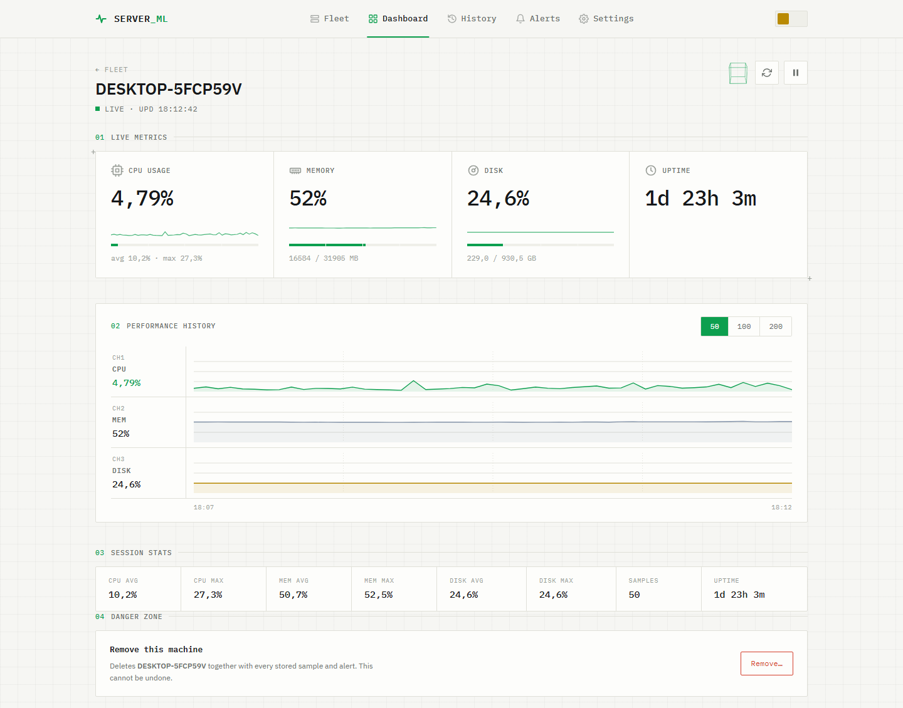
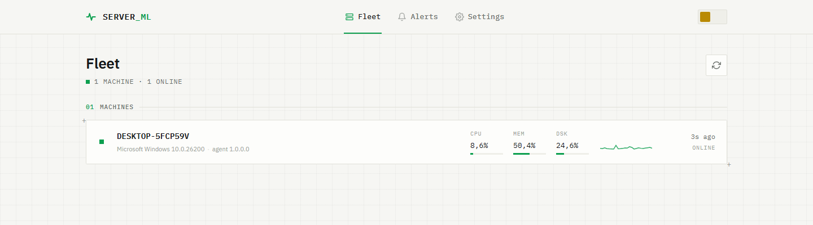
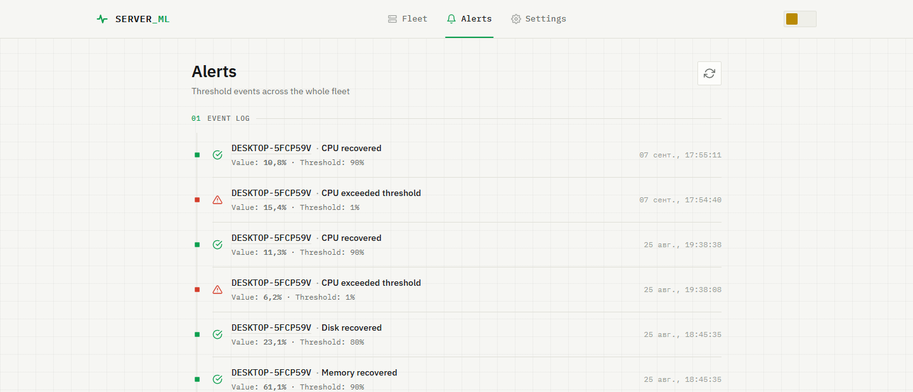
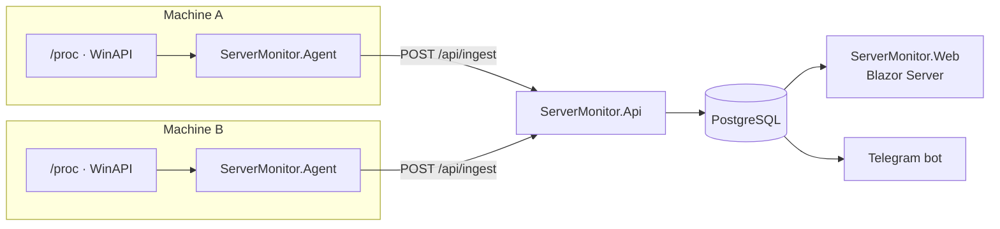

# ServerMonitor

[](https://github.com/SoftGene/ServerMonitor/actions/workflows/build.yml)

Self-hosted monitoring for a small fleet of machines. A lightweight agent runs on every server
you want to watch and pushes CPU, memory, disk and uptime readings to a central API; a Blazor
dashboard shows the fleet, and a Telegram bot reports when a threshold is crossed.

Built as a learning project, then taken far enough to actually run on my own server.



---

## What it does

- **Watches many machines.** Each one runs `ServerMonitor.Agent`, registers itself once with a
  shared enrollment token, and afterwards authenticates with its own API key.
- **Survives network outages.** The agent buffers readings in memory while the server is
  unreachable and sends the backlog once it returns, retrying with an exponential backoff
  capped at five minutes.
- **Shows the fleet at a glance.** Machines that have gone quiet are dimmed and marked, so a
  frozen reading is never mistaken for a live one.
- **Alerts on thresholds.** CPU, memory and disk have configurable limits; alerting fires once
  on the way up and once on the way back down, and needs several consecutive breaches so a
  single spike stays quiet.
- **Notices when a machine goes quiet.** A configurable silence threshold turns into an alert
  when an agent stops reporting, and another when it comes back. Rule checking is independent
  of delivery, so events are recorded even with no Telegram configured.
- **Requires a sign-in.** The UI is behind a username and password stored as a PBKDF2 hash, and
  the API answers nothing but agent ingest without a service key. A forgotten password is reset
  from the server with a console command.
- **Runs on Linux and Windows.** Readings come from `/proc` on Linux and from Win32 API calls
  through P/Invoke on Windows.
- **Ships as containers.** `docker compose up -d` brings up the database, the API and the
  dashboard, and exposes `/healthz` for an external uptime check.

### Fleet



### Alerts



---

## Architecture



Collection is deliberately a separate assembly from persistence: the agent references
`ServerMonitor.Collection` only, so it ships without EF Core, the Postgres driver or the
Telegram client.

| Project | Role |
|---------|------|
| `ServerMonitor.Domain` | Entities and domain rules. No dependencies at all. |
| `ServerMonitor.Collection` | Reading metrics off a machine. |
| `ServerMonitor.Agent` | The program installed on each watched machine. |
| `ServerMonitor.Infrastructure` | EF Core, migrations, API keys, Telegram. |
| `ServerMonitor.Api` | HTTP API: ingest, registration, reads. |
| `ServerMonitor.Web` | Blazor Server UI. Talks to the API over HTTP only. |
| `ServerMonitor.Tests` | xUnit tests. |

**Stack:** .NET 10 · ASP.NET Core · Blazor Server · EF Core 10 · PostgreSQL 17 · xUnit ·
Telegram.Bot · Docker

No UI framework: the interface is hand-written CSS, and the charts are inline SVG.

---

## Quick start

The whole server — database, API and dashboard — in one command. Docker is the only
prerequisite.

```bash
cp .env.example .env
```

Fill in the three secrets it asks for, generating the two random ones with:

```bash
openssl rand -hex 32
```

Then:

```bash
docker compose up -d
```

The dashboard is at `http://localhost:5298`. The first visit asks you to create an account;
registration closes afterwards. Migrations are applied automatically on startup, so there is no
separate database step.

To watch a machine, install the agent on it — see [Adding a machine](#adding-a-machine).

> The agent is deliberately not part of the compose file. In a container it would measure the
> container rather than the host: memory capped by the cgroup, disk being an image layer. The
> numbers would look plausible and be wrong.

---

## Running from source

For working on the code rather than just running it.

### Prerequisites

- [.NET 10 SDK](https://dotnet.microsoft.com/download)
- Docker (for PostgreSQL)

### 1. Database

```bash
cp .env.example .env
```

Put a password in `.env`, then:

```bash
docker compose up -d postgres
```

### 2. Secrets

The API needs a connection string and an enrollment token. Neither belongs in a tracked file,
so both go into [User Secrets](https://learn.microsoft.com/aspnet/core/security/app-secrets):

```bash
dotnet user-secrets set "ConnectionStrings:DefaultConnection" "Host=localhost;Port=5432;Database=servermonitor;Username=monitor;Password=<your password>" --project ServerMonitor.Api
```

Generate an enrollment token and give it to the API:

```bash
openssl rand -hex 32 | tr -d '\r\n'
```

```bash
dotnet user-secrets set "Agents:EnrollmentToken" "<the token>" --project ServerMonitor.Api
```

The API and the web app also share a service key, without which the API answers no read
request:

```bash
dotnet user-secrets set "Api:ServiceKey" "<another random string>" --project ServerMonitor.Api
dotnet user-secrets set "ApiSettings:ServiceKey" "<the same string>" --project ServerMonitor.Web
```

Telegram is optional. Without it the bot stays disabled:

```bash
dotnet user-secrets set "Telegram:BotToken" "<token from @BotFather>" --project ServerMonitor.Api
dotnet user-secrets set "Telegram:ChatId" "<your chat id>" --project ServerMonitor.Api
```

### 3. Schema

```bash
dotnet ef database update --project ServerMonitor.Infrastructure --startup-project ServerMonitor.Api
```

### 4. Start

Three processes, in this order:

```bash
dotnet run --project ServerMonitor.Api
```

```bash
dotnet run --project ServerMonitor.Web
```

```bash
dotnet run --project ServerMonitor.Agent
```

The UI is at `http://localhost:5298`, the API at `https://localhost:7212`, and its OpenAPI
reference at `https://localhost:7212/scalar/v1`.

---

## Adding a machine

Publish the agent and copy it to the machine you want to watch:

```bash
dotnet publish ServerMonitor.Agent -c Release -r linux-x64 --self-contained false -o ./agent-publish
```

Point it at your API and give it the same enrollment token — environment variables work
anywhere, which matters for systemd units and containers:

```bash
Agent__ServerUrl=https://monitor.example.com Agent__EnrollmentToken=<the token> ./ServerMonitor.Agent
```

On first run the agent exchanges the enrollment token for its own API key and writes it to
`agent-state.json` next to the binary (mode `0600` on Unix). That file is what keeps a restart
from registering the machine twice, so keep it.

Other settings, all optional:

| Setting | Default | Meaning |
|---------|---------|---------|
| `Agent__CollectIntervalSeconds` | `5` | How often to take a reading |
| `Agent__BufferCapacity` | `720` | Readings kept while the server is unreachable (~1 hour) |
| `Agent__MaxRetryDelaySeconds` | `300` | Ceiling for the retry backoff |

---

## Tests

```bash
dotnet test
```

Two kinds, and the split is on purpose.

**Unit tests** cover the decisions: when an alert should fire, when the backoff should give up,
how a threshold is compared. These take no dependencies and run in milliseconds.

**Integration tests** start the real API against a real PostgreSQL in a throwaway container
([Testcontainers](https://testcontainers.com/)) and talk to it over HTTP. They cover what a unit
test structurally cannot see, because none of it exists in a unit test: foreign keys, cascade
deletes, unique indexes, the service-key filter, the order of middleware. Both of the defects
this project shipped silently were of exactly that kind — correct C# that the database rejected.

Docker has to be running for those; without it they fail rather than skip, which is the honest
outcome. The container is shared by the whole collection and the suite finishes in a few seconds.

Two collector tests read real `/proc` and take a second of wall time, so they are opt-in:

```bash
SERVERMONITOR_RUN_COLLECTOR_TESTS=1 dotnet test
```

---

## Documentation

`docs/guide/` is a chapter-by-chapter walkthrough of this codebase — what every layer does and
why it was built that way, down to language details. It is written in Russian, as a study
companion rather than product documentation, and writing it is what surfaced most of the bugs
that have since been fixed.

`docs/superpowers/` holds the design specs and implementation plans each stage was built from.

---

## Status and limits

It runs, it keeps history, and it has been watching a real machine for weeks. It is not
production software yet, and the gaps are deliberate rather than unknown:

- **The enrollment token never expires**, agent keys cannot be rotated, and neither can the
  service key without editing both configurations.
- **Accounts have no roles**, and deleting one does not end a session that is already open.
- **Data is kept forever.** A reading every five seconds adds up; there is no retention policy.
- **The agent's buffer is in memory**, so a restart during an outage loses what it held.
- **Nothing watches the monitor itself.** If the central API dies, no alert goes out — a
  system cannot report its own death. `/healthz` is there for an external uptime service to
  poll; pointing one at it is left to whoever deploys this.
- **One offline threshold for the whole fleet**, and alerts have no severity levels.

Roadmap: data retention, then whatever running it for real turns up.

---

## A note on the name

The repository started out as `SeverMonitor` — a typo, missing an `r`. It has been corrected
in stages, because renaming a project folder touches paths in every `.csproj` that references
it as well as the solution file, and that deserved its own commit rather than riding along
with a feature.

A detail worth keeping from it: a project's file name and its folder name are not required to
match, so the build ran happily with the mismatch for a month. A compiler will never point out
this kind of mistake.
