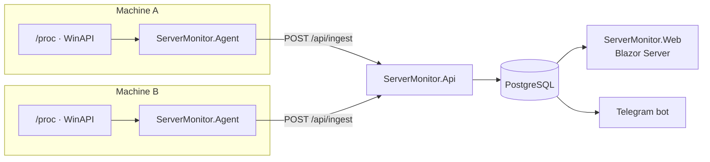

# ServerMonitor

[](https://github.com/SoftGene/ServerMonitor/actions/workflows/build.yml)

Self-hosted monitoring for a small fleet of machines. A lightweight agent runs on every server
you want to watch and pushes CPU, memory, disk and uptime readings to a central API; a Blazor
dashboard shows the fleet, and a Telegram bot reports when a threshold is crossed.

Built as a learning project, then taken far enough to actually run on my own server.


---

## What it does

- **Watches many machines.** Each one runs `ServerMonitor.Agent`, registers itself once with a
  shared enrollment token, and afterwards authenticates with its own API key.
- **Survives network outages.** The agent buffers readings in memory while the server is
  unreachable and sends the backlog once it returns, retrying with an exponential backoff
  capped at five minutes.
- **Shows the fleet at a glance.** Machines that have gone quiet are dimmed and marked, so a
  frozen reading is never mistaken for a live one.
- **Alerts at two levels.** CPU, memory and disk each have a warning and a critical threshold.
  Going up a level takes several consecutive readings, so a single spike stays quiet; easing
  back down is reported at once. A value that jumps straight to critical raises one alert,
  not a warning and a critical a moment apart.
- **Notices when a machine goes quiet.** A silence threshold — fleet-wide, with an override for
  any machine expected to sleep — turns into an alert when an agent stops reporting, and another
  when it comes back. Rule checking is independent of delivery, so events are recorded even with
  no Telegram configured.
- **Requires a sign-in.** The UI is behind a username and password stored as a PBKDF2 hash, and
  the API answers nothing but agent ingest without a service key. A forgotten password is reset
  from the server with a console command, and doing so ends every session that account had open —
  as does deleting the account.
- **Runs on Linux and Windows.** Readings come from `/proc` on Linux and from Win32 API calls
  through P/Invoke on Windows.
- **Keeps the shape of a year without keeping a year of rows.** Every finished hour is reduced
  to one summary row — average, peak and sample count — before the raw readings age out, so a
  trend from months ago still reads while the table stops growing.
- **Installs in one command.** A script sets up the whole server on Ubuntu, and the dashboard hands
  out a ready command for every new machine, Linux or Windows. Underneath, the server is three
  containers and a `/healthz` endpoint for an external uptime check.

### Fleet


### Alerts


---

## Architecture



Collection is deliberately a separate assembly from persistence: the agent references
`ServerMonitor.Collection` only, so it ships without EF Core, the Postgres driver or the
Telegram client.

| Project | Role |
|---------|------|
| `ServerMonitor.Domain` | Entities and domain rules. No dependencies at all. |
| `ServerMonitor.Collection` | Reading metrics off a machine. |
| `ServerMonitor.Agent` | The program installed on each watched machine. |
| `ServerMonitor.Infrastructure` | EF Core, migrations, API keys, Telegram. |
| `ServerMonitor.Api` | HTTP API: ingest, registration, reads. |
| `ServerMonitor.Web` | Blazor Server UI. Talks to the API over HTTP only. |
| `ServerMonitor.Tests` | xUnit tests. |

**Stack:** .NET 10 · ASP.NET Core · Blazor Server · EF Core 10 · PostgreSQL 17 · xUnit ·
Telegram.Bot · Docker

No UI framework: the interface is hand-written CSS, and the charts are inline SVG.

---

## Install

On an Ubuntu server, one command sets up everything: Docker if it is missing, the database, the
API, the dashboard, and an agent watching the server itself.

```bash
curl -fsSL https://raw.githubusercontent.com/SoftGene/ServerMonitor/master/deploy/install.sh | sudo bash
```

It generates the secrets, builds and starts the containers, and finishes by printing the
dashboard's address. Open it and create the account: the first visit asks for one, and
registration closes afterwards.

**To watch another machine,** choose **Add a machine** on the dashboard and run the command it
shows on that machine. There is one for Linux and one for Windows, with this server's address and
token already in them.

**To update,** run the install command again. The code is pulled and rebuilt; the data and the
secrets stay.

The script is written for Ubuntu Server and should work on any apt-based system. Anywhere else, see
[Installing by hand](#installing-by-hand).

> The agent is deliberately not part of the compose file. In a container it would measure the
> container rather than the host: memory capped by the cgroup, disk being an image layer. The
> numbers would look plausible and be wrong.

---

## Telegram alerts

Optional. Without Telegram every alert is still recorded and shown on the Alerts page.

1. In Telegram, message [@BotFather](https://t.me/BotFather), send `/newbot` and follow its
   prompts. It gives you a token that looks like `123456789:AAE...`.
2. Give the token to the server. The installer asks for it on its first run; at any time later:

   ```bash
   sudo bash /opt/servermonitor/deploy/install.sh --telegram-token '<the token>'
   ```

3. Send your new bot any message. It replies with your chat ID: until a chat is configured, that
   is the only thing it answers.
4. Tell the server the ID:

   ```bash
   sudo bash /opt/servermonitor/deploy/install.sh --telegram-chat-id <your chat ID>
   ```

The bot announces itself in that chat and reports alerts there from then on. It answers `/status`
with the state of the fleet, and only in that chat: a bot is public, and anyone else who finds it
gets no reply.

For a group rather than a private chat, add the bot to the group and send `/start` there. The
group's ID starts with a minus sign.

---

## Running it on a server

A few things worth knowing once other machines on the network start talking to it.

**Addresses.** The dashboard is at `http://<server-ip>:5298`, and agents on other machines report to
`http://<server-ip>:7212`. Both are plain HTTP: fine on a network you trust, and a reason to put a
reverse proxy with TLS in front before exposing it any further. Behind a proxy, set
`PUBLIC_API_URL` in `.env`, so the **Add a machine** commands point at the address agents can
actually reach.

**The database is not published to the network.** It is bound to `127.0.0.1` only, and the reason
is worth knowing: Docker writes its own firewall rules for the ports it publishes, so a `ufw` rule
on the host does not close a port compose has opened. The binding is what actually closes it.

**Sign-ins survive a rebuild.** The key ring that encrypts cookies is kept on a volume, so
`docker compose up -d --build` does not sign everyone out.

**Where things are.** The installer puts the server in `/opt/servermonitor`. Its `.env` holds the
generated secrets, readable by root alone, and deserves a copy somewhere safe: the database
password in it is the only one that opens the existing database. Compose commands run from that
folder, with `sudo`:

```bash
cd /opt/servermonitor
sudo docker compose ps
```

**A forgotten password** is reset from the server, which also ends every session that account has
open:

```bash
cd /opt/servermonitor
sudo docker compose run --rm api reset-password <username>
```

**The data** lives in the `postgres_data` volume and survives updates and rebuilds.
`docker compose down -v` does not keep it: the `-v` deletes volumes.

---

## Installing by hand

Anywhere with Docker, without the install script:

```bash
git clone https://github.com/SoftGene/ServerMonitor.git
cd ServerMonitor
cp .env.example .env
```

Fill in the three secrets it asks for, generating the random ones with:

```bash
openssl rand -hex 32
```

Then:

```bash
docker compose up -d
```

The dashboard is at `http://localhost:5298`. Migrations are applied automatically on startup, so
there is no separate database step. To update, `git pull` and then `docker compose up -d --build`.

---

## Running from source

For working on the code rather than just running it.

### Prerequisites

- [.NET 10 SDK](https://dotnet.microsoft.com/download)
- Docker (for PostgreSQL)

### 1. Database

```bash
cp .env.example .env
```

Put a password in `.env`, then:

```bash
docker compose up -d postgres
```

### 2. Secrets

The API needs a connection string and an enrollment token. Neither belongs in a tracked file,
so both go into [User Secrets](https://learn.microsoft.com/aspnet/core/security/app-secrets):

```bash
dotnet user-secrets set "ConnectionStrings:DefaultConnection" "Host=localhost;Port=5432;Database=servermonitor;Username=monitor;Password=<your password>" --project ServerMonitor.Api
```

Generate an enrollment token and give it to the API:

```bash
openssl rand -hex 32 | tr -d '\r\n'
```

```bash
dotnet user-secrets set "Agents:EnrollmentToken" "<the token>" --project ServerMonitor.Api
```

The API and the web app also share a service key, without which the API answers no read
request:

```bash
dotnet user-secrets set "Api:ServiceKey" "<another random string>" --project ServerMonitor.Api
dotnet user-secrets set "ApiSettings:ServiceKey" "<the same string>" --project ServerMonitor.Web
```

Telegram is optional. Without a token the bot stays disabled; with a token and no chat ID it
answers any message with the sender's chat ID and nothing else:

```bash
dotnet user-secrets set "Telegram:BotToken" "<token from @BotFather>" --project ServerMonitor.Api
dotnet user-secrets set "Telegram:ChatId" "<your chat id>" --project ServerMonitor.Api
```

### 3. Schema

```bash
dotnet ef database update --project ServerMonitor.Infrastructure --startup-project ServerMonitor.Api
```

### 4. Start

Three processes, in this order:

```bash
dotnet run --project ServerMonitor.Api
```

```bash
dotnet run --project ServerMonitor.Web
```

```bash
dotnet run --project ServerMonitor.Agent
```

The UI is at `http://localhost:5298`, the API at `https://localhost:7212`, and its OpenAPI
reference at `https://localhost:7212/scalar/v1`.

---

## Adding a machine

**Add a machine** on the dashboard is the easy way. What its commands do, for doing it differently:

### On Linux

`deploy/agent/install.sh` downloads a self-contained agent from the latest release, so the machine
needs no .NET, checks it against the release's checksums, installs it as a systemd service under its
own user, and waits until the agent has actually registered rather than merely started.

```bash
curl -fsSL https://raw.githubusercontent.com/SoftGene/ServerMonitor/master/deploy/agent/install.sh | sudo bash -s -- --url http://<server-ip>:7212 --token <token>
```

The token is `ENROLLMENT_TOKEN` in the server's `.env`. Running it again upgrades in place and keeps
the machine's identity. An unreachable server is retried; a refused token stops the service instead
of retrying forever, and `systemctl status servermonitor-agent` says why. `--uninstall` removes the
agent, `--from-source` builds it from a clone instead of downloading it, and `--help` lists the rest.

### On Windows

`deploy/agent/install.ps1` does the same from PowerShell opened as Administrator. It installs the
agent under Program Files, readable only by SYSTEM and Administrators, and registers a scheduled task
that starts it at boot:

```powershell
& ([scriptblock]::Create((Invoke-RestMethod 'https://raw.githubusercontent.com/SoftGene/ServerMonitor/master/deploy/agent/install.ps1'))) -Url 'http://<server-ip>:7212' -Token '<token>'
```

It runs as a script block rather than a downloaded file, so the execution policy needs no
loosening. `-Uninstall` removes the agent again.

### By hand

Download the agent for your platform from
[Releases](https://github.com/SoftGene/ServerMonitor/releases), or publish it yourself:

```bash
dotnet publish ServerMonitor.Agent -c Release -r linux-x64 --self-contained false -o ./agent-publish
```

Point it at your API and give it the same enrollment token — environment variables work
anywhere, which matters for systemd units and containers:

```bash
Agent__ServerUrl=https://monitor.example.com Agent__EnrollmentToken=<the token> ./ServerMonitor.Agent
```

On first run the agent exchanges the enrollment token for its own API key and writes it to
`agent-state.json` next to the binary (mode `0600` on Unix). That file is what keeps a restart
from registering the machine twice, so keep it.

Readings it has not managed to deliver go to `agent-buffer.json` beside it, so an outage and a
restart together are not the same as data loss. It holds no secrets, and deleting it costs only
whatever had not been sent yet.

Other settings, all optional:

| Setting | Default | Meaning |
|---------|---------|---------|
| `Agent__CollectIntervalSeconds` | `5` | How often to take a reading |
| `Agent__BufferCapacity` | `720` | Readings kept while the server is unreachable (~1 hour) |
| `Agent__MaxRetryDelaySeconds` | `300` | Ceiling for the retry backoff |

---

## How long data is kept

A reading every five seconds per machine is about seventeen thousand rows a day each. By default
the server keeps **30 days** of them.

Ageing out is not the same as being forgotten. Once an hour, every finished hour of readings is
reduced to a single row — the average, the peak and how many readings it was built from — and only
then is the raw data deleted. A year of those summaries is 8,760 rows per machine against six
million, and the **Trend** page reads them, so a chart from ten months ago costs the same as one
from yesterday.

The order is the whole design, and it is not interchangeable: summarise, then delete. The other
way round is silent, permanent loss, because deleting rows nothing summarised succeeds exactly as
quietly as deleting rows something did.

What that trade actually costs: a year ago you can see that memory sat near 80% all week and that
one hour peaked at 97%. You cannot see the individual reading at 14:32 on that Tuesday. Detail is
what gets old; shape is what stays useful.

| Setting | Default | Meaning |
|---------|---------|---------|
| `Retention__SnapshotDays` | `30` | Days of readings to keep. `0` keeps everything |
| `Retention__SweepIntervalHours` | `1` | How often summaries are built and old rows deleted |
| `Retention__BatchSize` | `10000` | Rows removed per statement |

With Docker, set `RETENTION_DAYS` in `.env`.

This is configuration rather than a control on the settings page, and that is deliberate. Changing
an alert threshold is reversible — the old number can be typed back. Deleting three months of
history is not, and a button that destroys data should not sit beside one that changes a number.
It is also a question about disk, which belongs to whoever runs the instance rather than to
whoever reads the graphs.

`0` means "keep everything", never "everything is older than zero days". A setting that governs a
destructive action reads, when it is missing or nonsensical, as the option that does nothing.

Alerts are not swept, and neither are the hourly summaries. Both are small, and both are the
record of what actually happened.

---

## Rate limits

Two endpoints accept a secret from a caller who has not proved anything yet, so both can be
guessed at. Login already counts failures per username; nothing counted attempts at the enrollment
token, which is a single shared value that never expires.

| Setting | Default | Applies to |
|---------|---------|------------|
| `RateLimits__EnrollmentPerHour` | `10` | `POST /api/agents/register` |
| `RateLimits__CredentialsPerMinute` | `20` | `POST /api/auth/login` |

Partitioned by remote address, which is imperfect on purpose: one NAT shares a bucket and an
attacker with many addresses gets many buckets. It still turns an unbounded guessing rate into a
bounded one, and the per-username throttle covers the case it misses — a different username every
attempt, which leaves every counter at one.

Ingest is deliberately not limited. An agent already holds a key it was issued, and throttling it
would only drop readings from machines that are behaving.

Raise `EnrollmentPerHour` while rolling out a fleet; a machine registers once in its life.

---

## Releases

The installers download the agent from the latest GitHub release, so publishing one is what carries
a change in the agent to the machines being watched. Tag a commit on master that the build has
passed:

```bash
git tag v1.0.0
git push origin v1.0.0
```

The release workflow builds self-contained agents for `linux-x64`, `linux-arm64` and `win-x64` and
publishes them with a `SHA256SUMS` file, which the installers check downloads against. A tag with a
suffix, such as `v1.1.0-rc.1`, becomes a pre-release, and installers skip it. Every pull request
builds the same packages, so a change that breaks packaging fails in review rather than on release
day. Until a first release exists, `deploy/install.sh` builds the server's own agent from source.

---

## Tests

```bash
dotnet test
```

Two kinds, and the split is on purpose.

**Unit tests** cover the decisions: when an alert should fire, when the backoff should give up,
how a threshold is compared. These take no dependencies and run in milliseconds.

**Integration tests** start the real API against a real PostgreSQL in a throwaway container
([Testcontainers](https://testcontainers.com/)) and talk to it over HTTP. They cover what a unit
test structurally cannot see, because none of it exists in a unit test: foreign keys, cascade
deletes, unique indexes, the service-key filter, the order of middleware. Both of the defects
this project shipped silently were of exactly that kind — correct C# that the database rejected.

Docker has to be running for those; without it they fail rather than skip, which is the honest
outcome. The container is shared by the whole collection and the suite finishes in a few seconds.

Two collector tests read real `/proc` and take a second of wall time, so they are opt-in:

```bash
SERVERMONITOR_RUN_COLLECTOR_TESTS=1 dotnet test
```

The install scripts are checked on every pull request as well: shellcheck for the shell scripts,
PSScriptAnalyzer for the PowerShell one.

---

## Status and limits

It runs, it keeps history, and it has been watching a real machine for weeks. It is not
production software yet, and the gaps are deliberate rather than unknown:

- **The enrollment token never expires**, and every account can read it on the **Add a machine**
  page. Agent keys cannot be rotated, and neither can the service key without editing both
  configurations. Guessing the token is rate limited, which bounds the attack without removing it.
- **Accounts have no roles.** Every account can do everything, and splitting permissions is a
  separate job worth doing once there is a reason for it.
- **Summaries are hourly and that is the only resolution.** A real time-series database keeps
  several tiers — minutes, then hours, then days. Here there is one, so a two-year chart is
  17,000 points.
- **Nothing is partitioned.** At real volume old data is dropped by the partition rather than
  deleted row by row, which is instant and returns the disk immediately.
- **The buffer is bounded, so a long enough outage still drops readings.** It survives a restart
  now, but an outage past the configured capacity discards the oldest to keep measuring.
- **Nothing watches the monitor itself.** If the central API dies, no alert goes out — a
  system cannot report its own death. `/healthz` is there for an external uptime service to
  poll; pointing one at it is left to whoever deploys this.
- **"Stale" is one minute of silence for every machine.** A laptop allowed to sleep for twelve
  hours raises no alert overnight, as intended, but is still drawn amber until it wakes.

Roadmap: whatever running it for real turns up.

---

## A note on the name

The repository started out as `SeverMonitor` — a typo, missing an `r`. It has been corrected
in stages, because renaming a project folder touches paths in every `.csproj` that references
it as well as the solution file, and that deserved its own commit rather than riding along
with a feature.

A detail worth keeping from it: a project's file name and its folder name are not required to
match, so the build ran happily with the mismatch for a month. A compiler will never point out
this kind of mistake.
