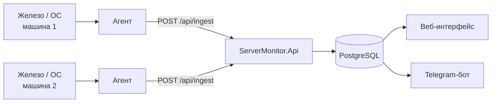
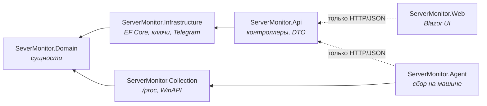
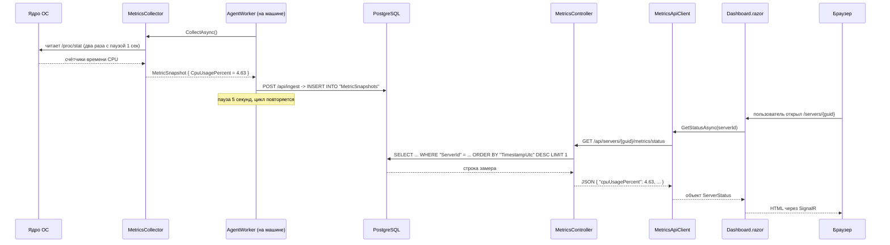

# Глава 00 — Карта проекта

Прежде чем разбирать код построчно, нужно понять географию: из чего состоит решение, кто
кого вызывает и куда течёт информация. Эта глава — карта, к которой можно возвращаться,
читая остальные.

---

## 1. Что вообще делает система

На каждой наблюдаемой машине стоит **агент** — маленькая программа, которая раз в 5 секунд
снимает загрузку процессора, занятую память, занятое место на диске и время работы с момента
загрузки. Замеры уходят по HTTP в центральный API, тот складывает их в базу. Веб-интерфейс
показывает парк машин и историю каждой, а Telegram-бот присылает сообщение, когда значение
превысило порог.



Обрати внимание: сбор, показ и оповещения **не связаны напрямую**. Их соединяет только база
данных. Веб-интерфейс не знает, кто и как положил туда числа, — он просто читает. Это не
случайность, а важное архитектурное свойство: любую из трёх частей можно остановить,
переписать или заменить, не трогая остальные.

---

## 2. Три слова, без которых дальше нельзя

**Проект (project)** — папка с файлом `.csproj` и исходниками. Единица компиляции: из
одного проекта получается **одна сборка**.

**Сборка (assembly)** — результат компиляции проекта, файл `.dll` (или `.exe`). Именно
сборки загружаются в память, когда программа работает. В папке `bin/Debug/net10.0/` лежат
собранные сборки — можно посмотреть.

**Решение (solution)** — файл, который перечисляет проекты, чтобы IDE и команда `dotnet
build` знали, что собирать вместе. У нас это `SeverMonitor.slnx` в корне.

Ещё понадобится:

**NuGet-пакет** — чужая библиотека, подключённая строчкой `<PackageReference>` в `.csproj`.
Например, `Npgsql.EntityFrameworkCore.PostgreSQL` — драйвер PostgreSQL. При сборке .NET
скачивает пакеты в локальный кэш (`~/.nuget/packages`) и подставляет их сборки.

**Пространство имён (namespace)** — «фамилия» для типов, чтобы одинаковые имена из разных
библиотек не сталкивались. У нас `ServerMonitor.Domain.Entities`, `ServerMonitor.Api.Controllers`
и так далее. Пространство имён — это **не** папка на диске, хотя по традиции их делают
совпадающими.

---

## 3. Проекты решения

| Проект | Тип | Что внутри | От кого зависит |
|--------|-----|------------|-----------------|
| `SeverMonitor.Domain` | библиотека | сущности: `Server`, `MetricSnapshot`, `Alert`, `AppSettings` | ни от кого |
| `ServerMonitor.Collection` | библиотека | снятие метрик с машины | Domain |
| `ServerMonitor.Agent` | консольное приложение | программа для наблюдаемой машины | Collection |
| `ServerMonitor.Infrastructure` | библиотека | доступ к БД, ключи агентов, Telegram-бот | Domain |
| `ServerMonitor.Api` | веб-приложение | HTTP API: контроллеры, DTO, точка запуска | Infrastructure |
| `ServerMonitor.Web` | веб-приложение | Blazor-интерфейс: страницы, компоненты, CSS | ни от кого |
| `ServerMonitor.Tests` | библиотека тестов | xUnit-тесты | Domain, Collection, Agent, Infrastructure |

Разделение `Collection` и `Agent` появилось на этапе агента — подробно в
[главе 10](10-agent-and-multiserver.md).

Разберём каждый.

### Domain — «что такое вещи в нашей предметной области»

Самый маленький и самый важный проект. Целиком — три файла по десять строк. Вот весь
[`MetricSnapshot.cs`](../../SeverMonitor.Domain/Entities/MetricSnapshot.cs):

```csharp
namespace ServerMonitor.Domain.Entities;

public class MetricSnapshot
{
    public int Id { get; set; }

    /// <summary>Машина, с которой снят замер.</summary>
    public int ServerId { get; set; }
    public DateTime TimestampUtc { get; set; }
    public double CpuUsagePercent { get; set; }
    public double MemoryUsedMb { get; set; }
    public double MemoryTotalMb { get; set; }
    public double DiskUsedGb { get; set; }
    public double DiskTotalGb { get; set; }
    public double UptimeSeconds { get; set; }
}
```

Здесь нет ни одного `using` чужой библиотеки, и в
[`ServerMonitor.Domain.csproj`](../../SeverMonitor.Domain/ServerMonitor.Domain.csproj) нет ни
одного `<PackageReference>` — проект не знает ни про базу данных, ни про HTTP, ни про
Telegram. Он знает только, что «замер метрик — это набор чисел с меткой времени».

> **Почему так.** Это ядро архитектуры, которую называют «чистой» (Clean Architecture) или
> «луковичной» (Onion). Смысл: понятия предметной области живут дольше, чем технологии.
> PostgreSQL можно заменить на MongoDB, Telegram — на почту, REST — на gRPC, а «замер
> метрик» останется тем же самым. Если бы в `MetricSnapshot` стояли атрибуты EF Core или
> JSON-сериализатора, то смена технологии заставила бы править ядро.

### Infrastructure — «как мы это делаем технически»

Здесь живёт всё, что общается с внешним миром:

- [`Data/AppDbContext.cs`](../../ServerMonitor.Infrastructure/Data/AppDbContext.cs) — мост к
  PostgreSQL через EF Core (глава 03).
- [`Agents/ApiKeyGenerator.cs`](../../ServerMonitor.Infrastructure/Agents/ApiKeyGenerator.cs) —
  генерация и проверка ключей агентов (глава 10).
- [`Migrations/`](../../ServerMonitor.Infrastructure/Migrations/) — сгенерированный код,
  создающий и меняющий таблицы в базе.
- [`Telegram/TelegramBotService.cs`](../../ServerMonitor.Infrastructure/Telegram/TelegramBotService.cs) —
  бот и проверка порогов (глава 07).

Именно в этом проекте собраны все NuGet-зависимости на технологии: EF Core, драйвер
Postgres, `Telegram.Bot`. Это осознанно: технологии сконцентрированы в одном слое.

### Api — «двери наружу»

Веб-приложение без интерфейса. Отдаёт JSON по HTTP и запускает фоновые сервисы.

- [`Program.cs`](../../ServerMonitor.Api/Program.cs) — точка входа: собирает приложение,
  регистрирует сервисы, запускает веб-сервер.
- [`Controllers/`](../../ServerMonitor.Api/Controllers/) — три контроллера: метрики, алерты,
  настройки. Контроллер — класс, чьи методы отвечают на HTTP-запросы.
- [`Dtos/`](../../ServerMonitor.Api/Dtos/) — классы «для передачи наружу» (глава 02).

Здесь же, в `Program.cs`, запускается единственный оставшийся фоновый сервис:

```csharp
// Метрики API больше не снимает: их присылают агенты через POST api/ingest.
builder.Services.AddHostedService<TelegramBotService>();
```

> **Как было раньше.** До этапа агента здесь же запускался `MetricsCollectorService`, и
> система мониторила ту машину, на которой запущен сам API. Это и было главным ограничением
> архитектуры — следить за парком было нельзя. Сбор вынесен в отдельного агента, см.
> [главу 10](10-agent-and-multiserver.md).

### Web — «то, что видит человек»

Blazor-приложение: страницы Dashboard, History, Alerts, Settings.

Загляни в [`ServerMonitor.Web.csproj`](../../ServerMonitor.Web/ServerMonitor.Web.csproj) —
там **нет ни одной строки `<ProjectReference>`**. Веб-интерфейс не подключает ни Domain, ни
Infrastructure, ни Api. У него есть собственные копии моделей в
[`Models/`](../../ServerMonitor.Web/Models/) — например, свой `ServerStatus`, повторяющий
поля серверного `ServerStatusDto`.

> **Почему так.** Единственная связь между Web и Api — **форма JSON**. Web отправляет
> HTTP-запрос и разбирает ответ. Это значит, что фронтенд можно переписать на React,
> запустить на другой машине или дать доступ третьей стороне — сервер не заметит разницы.
> Плата за это — дублирование классов: добавив поле в `ServerStatusDto`, нужно не забыть
> добавить его и в `Models/ServerStatus.cs`. В больших проектах эту проблему решают общим
> проектом контрактов или генерацией клиента из OpenAPI-описания.

---

## 4. Правило зависимостей

Стрелки в архитектуре направлены **внутрь**, к ядру:



Обрати внимание: от `Agent` нет стрелки в `Infrastructure`. Агенту не нужны ни EF Core, ни
драйвер Postgres — он не ходит в базу, он отправляет HTTP-запрос. Ради этого сбор и выделили
в отдельный проект `Collection`.

Правило простое: **внутренний слой ничего не знает о внешнем**. Domain не знает про
Infrastructure, Infrastructure не знает про Api. Проверяется это не на словах, а в файлах
`.csproj` — там перечислены `<ProjectReference>`. Компилятор не даст нарушить правило: если
попробовать обратиться из Domain к `AppDbContext`, код просто не соберётся.

Что это даёт на практике:

- **Тестируемость.** Логику Domain можно проверить без базы данных.
- **Заменяемость.** Ушли с PostgreSQL — правится один слой.
- **Понятность.** Ища, «где считается процент CPU», ты точно знаешь: не в Domain (там нет
  логики) и не в Web (он только показывает).

---

## 5. Путь одного числа

Самая полезная схема в этой главе. Проследим, как загрузка процессора попадает из ядра
операционной системы на экран браузера.



Разберём ключевые превращения — одно и то же число меняет форму пять раз:

1. **Счётчики ядра.** В `/proc/stat` лежат не проценты, а накопленные такты процессора.
   Сами по себе они бесполезны — нужна разница между двумя моментами. Отсюда пауза в
   секунду внутри сбора (глава 05).
2. **`MetricSnapshot`** — обычный объект C# в памяти. Здесь число уже проценты: `4.63`.
3. **Строка в таблице.** EF Core превращает объект в SQL-команду `INSERT`. Число становится
   значением колонки типа `double precision` (глава 03).
4. **`ServerStatusDto`** — контроллер читает строку и собирает объект для передачи наружу,
   попутно вычисляя проценты памяти и диска, которых в базе нет (в базе — гигабайты и
   мегабайты). Затем ASP.NET Core сериализует объект в JSON, меняя `CpuUsagePercent` на
   `cpuUsagePercent` — таково соглашение JSON (глава 02).
5. **`ServerStatus`** — на стороне Web JSON разбирается обратно в объект C#, уже другого
   класса, из другого проекта.
6. **Текст на экране** — Blazor подставляет число в разметку и отправляет готовый кусок
   HTML в браузер по постоянному соединению SignalR (глава 06).

Понимание этой цепочки закрывает половину вопросов «а где вообще это меняется?». Например:
проценты памяти считаются в контроллере, значит менять формулу нужно там, а не в коллекторе.

---

## 6. Два процесса, а не один

Важная деталь, которую легко упустить: `ServerMonitor.Api` и `ServerMonitor.Web` — это
**два отдельных приложения**, каждое со своим `Program.cs`, своим веб-сервером и своим
портом. Чтобы система работала, должны быть запущены оба (плюс PostgreSQL).

| Что | Порт (профиль https) | Файл настроек |
|-----|----------------------|---------------|
| API | `https://localhost:7212` | [`ServerMonitor.Api/Properties/launchSettings.json`](../../ServerMonitor.Api/Properties/launchSettings.json) |
| Web | `https://localhost:7047` | [`ServerMonitor.Web/Properties/launchSettings.json`](../../ServerMonitor.Web/Properties/launchSettings.json) |
| PostgreSQL | `5432` | строка подключения в `appsettings.json` API |

Адрес API прописан в настройках Web:

```json
"ApiSettings": { "BaseUrl": "https://localhost:7212" }
```

и читается при регистрации HTTP-клиента в
[`ServerMonitor.Web/Program.cs`](../../ServerMonitor.Web/Program.cs):

```csharp
builder.Services.AddHttpClient<MetricsApiClient>(client =>
{
    var baseUrl = builder.Configuration["ApiSettings:BaseUrl"]
        ?? throw new InvalidOperationException("ApiSettings:BaseUrl is not configured.");
    client.BaseAddress = new Uri(baseUrl);
});
```

Отсюда следует практический вывод: если открыть Dashboard, не запустив API, страница
покажет ошибку соединения — Web-приложение живо, но данных ему взять негде. Ровно это
происходило при отладке дизайна.

---

## 7. Дерево файлов

```
SeverMonitor.slnx                     решение: список проектов
│
├── SeverMonitor.Domain/              ← ядро, без зависимостей
│   └── Entities/                     MetricSnapshot, Alert, AppSettings
│
├── ServerMonitor.Collection/         ← снятие метрик с машины
│   ├── IMetricsCollector.cs
│   ├── MetricsCollector.cs           /proc в Linux, P/Invoke в Windows
│   ├── ProcParser.cs                 чистые функции разбора
│   └── CpuTimes.cs
│
├── ServerMonitor.Agent/              ← ставится на наблюдаемую машину
│   ├── AgentWorker.cs                цикл: снять, буферизовать, отправить
│   ├── AgentClient.cs                два HTTP-вызова к API
│   ├── MetricBuffer.cs               очередь на случай обрыва связи
│   ├── AgentState.cs                 сохранённые ServerId и ключ
│   └── AgentOptions.cs
│
├── ServerMonitor.Infrastructure/     ← технологии
│   ├── Data/AppDbContext.cs          мост к PostgreSQL
│   ├── Migrations/                   история изменений схемы БД
│   ├── Agents/ApiKeyGenerator.cs     ключи агентов
│   ├── Monitoring/MonitoringOptions.cs
│   └── Telegram/TelegramBotService.cs
│
├── ServerMonitor.Api/                ← HTTP API + фоновые сервисы
│   ├── Controllers/                  Servers, Metrics, Alerts, Settings,
│   │                                 Agents, Ingest
│   ├── Dtos/                         ServerStatusDto, MetricHistoryItemDto,
│   │                                 AlertDto, SettingsDto, PagedResult
│   ├── Properties/launchSettings.json
│   ├── appsettings.json              строка подключения, токен бота
│   └── Program.cs                    точка входа
│
├── ServerMonitor.Web/                ← Blazor-интерфейс
│   ├── Components/
│   │   ├── Layout/                   TopNav, MainLayout
│   │   ├── Pages/                    Fleet, Dashboard, History, Alerts, Settings
│   │   └── Shared/                   MetricCard, ThemeToggle
│   ├── Models/                       свои копии моделей под JSON
│   ├── Services/MetricsApiClient.cs  обёртка над HttpClient
│   ├── wwwroot/                      app.css, js/, статика
│   └── Program.cs                    точка входа
│
└── docs/                             спеки, планы и этот гайд
```

---

## 8. Шероховатости, которые стоит знать

Честный список того, что в проекте сделано неаккуратно. Ничего критичного, но знать полезно —
и на собеседовании такие вещи лучше называть самому.

- **Остатки опечатки в именах.** Изначально проект домена назывался `SeverMonitor.Domain`
  (пропущена буква `r`). Файл проекта уже переименован в `ServerMonitor.Domain.csproj`, но
  **папка** по-прежнему `SeverMonitor.Domain/`, и файл решения — `SeverMonitor.slnx`.
  Переименование папки задевает пути в `.csproj` и `.slnx`, поэтому делается отдельным
  аккуратным шагом. Обрати внимание: имя файла проекта и имя папки **не обязаны** совпадать —
  сборка это спокойно переживает, что мы и видим.
- **Дублирование моделей** между Api и Web — обсуждали выше, осознанная плата за
  независимость фронтенда.
- **API открыт всему миру.** Ни аутентификации, ни авторизации: любой, кто дотянется до
  порта, прочитает метрики и изменит пороги через `PUT /api/settings`. Для локального
  ноутбука терпимо, для реального сервера — нет. Это одна из задач следующих этапов.

---

## Что запомнить из главы

- Проект делится на четыре сборки; зависимости идут **внутрь**, к Domain, и это проверяется
  компилятором.
- Domain намеренно ничего не знает о технологиях, Infrastructure собирает их все у себя.
- Web связан с Api **только формой JSON** — прямых ссылок между проектами нет.
- Сбор, показ и оповещения общаются через базу данных, а не напрямую.
- Api и Web — два независимых процесса; для работы системы нужны оба и PostgreSQL.
- Сбор метрик живёт в отдельном агенте на каждой наблюдаемой машине, а API только принимает,
  хранит и отдаёт — см. [главу 10](10-agent-and-multiserver.md).

Дальше: [Глава 01 — C# и .NET](01-csharp-and-dotnet.md), где разбирается сам язык на
примерах из этого кода.
