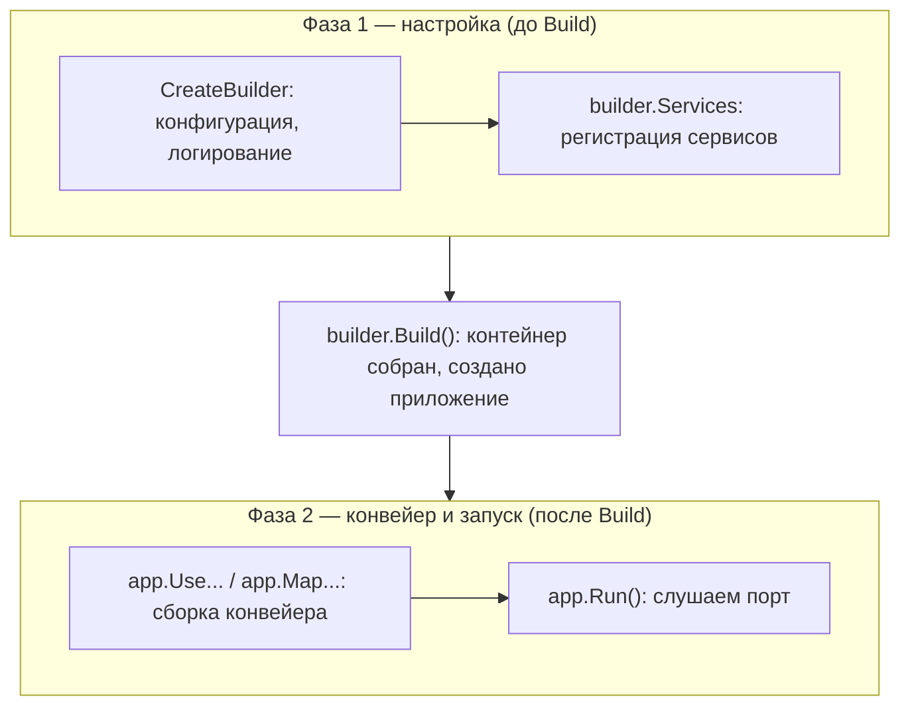
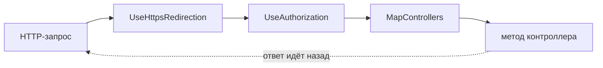
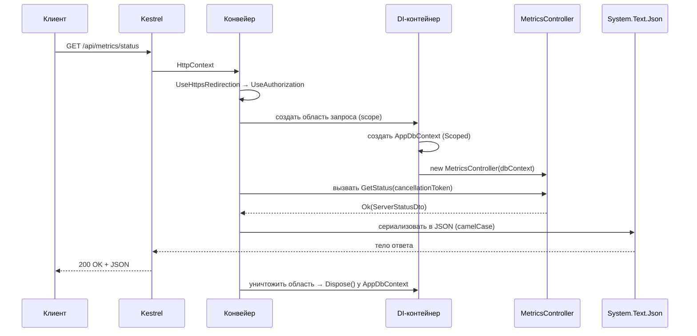

# Глава 02 — ASP.NET Core: от запуска до ответа

В этой главе разбирается, что происходит между моментом «пользователь открыл
`/api/metrics/status`» и моментом «браузер получил JSON». Три большие темы: запуск
приложения, контейнер зависимостей и конвейер обработки запроса.

Всё на примере [`ServerMonitor.Api`](../../ServerMonitor.Api/) — там это видно чище всего.

---

## Часть 1. Что такое ASP.NET Core

**ASP.NET Core** — фреймворк для веб-приложений на .NET. Он даёт готовыми:

- **веб-сервер** — принимает TCP-соединения, разбирает HTTP;
- **конвейер обработки** — цепочку компонентов, через которую проходит каждый запрос;
- **контейнер зависимостей** — механизм, который создаёт объекты и передаёт их туда, где нужны;
- **маршрутизацию** — сопоставление URL с методами твоих классов;
- **конфигурацию, логирование, фоновые сервисы**.

Встроенный веб-сервер называется **Kestrel**. Он кроссплатформенный и быстрый; именно он
слушает порт 7212, когда ты запускаешь API. В продакшене Kestrel часто ставят за обратным
прокси (nginx, IIS), но работать он может и напрямую.

Важное отличие от классического ASP.NET (без «Core»): приложение — это обычная консольная
программа с методом `Main`, которая внутри себя поднимает веб-сервер. Нет IIS как
обязательного хозяина процесса, нет `web.config` — есть `Program.cs`, `dotnet run` и
собственный исполняемый файл.

---

## Часть 2. `Program.cs` построчно

Весь [`ServerMonitor.Api/Program.cs`](../../ServerMonitor.Api/Program.cs) — полсотни строк, и
в них помещается всё приложение:

```csharp
var builder = WebApplication.CreateBuilder(args);

var connectionString = builder.Configuration.GetConnectionString("DefaultConnection");

if (string.IsNullOrWhiteSpace(connectionString))
{
    throw new InvalidOperationException(
        "Connection string 'DefaultConnection' is not configured. ...");
}

builder.Services.AddDbContext<AppDbContext>(options =>
    options.UseNpgsql(connectionString));

builder.Services.Configure<MonitoringOptions>(
    builder.Configuration.GetSection(MonitoringOptions.SectionName));

builder.Services.AddControllers();
builder.Services.AddOpenApi();
builder.Services.AddSingleton<IMetricsCollector, MetricsCollector>();
builder.Services.AddHostedService<MetricsCollectorService>();
builder.Services.AddHostedService<TelegramBotService>();

var app = builder.Build();

if (app.Environment.IsDevelopment())
{
    app.MapOpenApi();
    app.MapScalarApiReference();
}

app.UseHttpsRedirection();
app.UseAuthorization();
app.MapControllers();

app.Run();
```

### Где здесь `Main`

Его не видно, но он есть. Это **программа верхнего уровня** (top-level statements): C#
разрешает писать код файла напрямую, а компилятор сам заворачивает его в
`static void Main(string[] args)`. Переменная `args` доступна — это аргументы командной
строки.

### Две фазы: настройка и работа

Файл чётко делится строкой `var app = builder.Build();`:



Это разделение принципиально: **после `Build()` регистрировать сервисы уже нельзя** —
контейнер построен, попытка вызвать `builder.Services.Add...` бросит исключение. И наоборот,
до `Build()` нельзя настраивать конвейер: объекта `app` ещё не существует.

### `CreateBuilder` — что он делает бесплатно

Один вызов `WebApplication.CreateBuilder(args)` уже настраивает:

- **конфигурацию** — читает `appsettings.json`, затем `appsettings.{Environment}.json`,
  затем переменные окружения, затем аргументы командной строки (каждый следующий источник
  перекрывает предыдущий — подробности в главе 08);
- **логирование** — вывод в консоль и в отладчик;
- **веб-сервер Kestrel** и адреса из `launchSettings.json`;
- **окружение** — Development или Production, из переменной `ASPNETCORE_ENVIRONMENT`.

Отсюда работает вот эта строчка нашего кода:

```csharp
builder.Configuration.GetConnectionString("DefaultConnection")
```

`GetConnectionString("X")` — сокращение для `Configuration["ConnectionStrings:X"]`, то есть
чтение из `appsettings.json` секции:

```json
"ConnectionStrings": {
  "DefaultConnection": "Host=localhost;Database=servermonitor;..."
}
```

### `app.Run()` — блокирующий вызов

Последняя строка запускает сервер и **блокирует поток** до остановки приложения. Всё, что
написано после `app.Run()`, выполнится только при завершении работы. Это нормально: дальше
приложением управляют события, а не последовательный код.

---

## Часть 3. Внедрение зависимостей (DI)

Самая важная тема главы, и её почти всегда спрашивают на собеседовании.

### Проблема

Контроллеру нужен `AppDbContext`. Самый прямолинейный способ — создать его самому:

```csharp
public class MetricsController : ControllerBase
{
    private readonly AppDbContext _dbContext = new AppDbContext(/* а что сюда? */);
}
```

Проблемы видны сразу, стоит задуматься:

- откуда взять строку подключения — контроллеру пришлось бы лезть в конфигурацию;
- нельзя подменить контекст в тестах — он жёстко зашит в класс;
- время жизни объекта никто не контролирует: кто и когда его закроет?

### Решение: контейнер

**Контейнер внедрения зависимостей** (DI-контейнер) — это реестр: «когда кому-то понадобится
тип X, вот как его создать». Регистрация происходит в фазе 1, создание — по требованию.

Наш контроллер просто **просит** зависимость в конструкторе:

```csharp
public MetricsController(AppDbContext dbContext)
{
    _dbContext = dbContext;
}
```

и никогда не вызывает `new`. Когда приходит HTTP-запрос, ASP.NET Core создаёт контроллер сам:
смотрит на параметры конструктора, находит их в контейнере, создаёт и передаёт. Приём
называется **инверсией управления** (Inversion of Control, IoC): не ты берёшь зависимость,
а тебе её дают.

### Три времени жизни

Регистрируя сервис, ты выбираешь, как долго живёт созданный объект. Это главное решение при
регистрации, и ошибка здесь стоит дорого.

| Время жизни | Метод | Объект создаётся | В нашем коде |
|-------------|-------|------------------|--------------|
| **Singleton** | `AddSingleton` | один раз на всё приложение | `IMetricsCollector`, оба фоновых сервиса |
| **Scoped** | `AddScoped` | один раз на «область»; для веба — на HTTP-запрос | `AppDbContext` (через `AddDbContext`) |
| **Transient** | `AddTransient` | заново при каждом обращении к контейнеру | не используется |

Разберём наши два случая.

**Singleton — коллектор метрик:**

```csharp
builder.Services.AddSingleton<IMetricsCollector, MetricsCollector>();
```

Читается так: «когда попросят `IMetricsCollector`, дай единственный экземпляр
`MetricsCollector`». Это уместно, потому что коллектор **не хранит состояние** между
вызовами: получил запрос — прочитал `/proc` — вернул новый объект. Один экземпляр безопасно
обслуживает всех.

**Scoped — контекст базы данных:**

```csharp
builder.Services.AddDbContext<AppDbContext>(options =>
    options.UseNpgsql(...));
```

`AddDbContext` регистрирует контекст как **Scoped**. Для веб-приложения область (scope) —
это один HTTP-запрос: ASP.NET Core создаёт её в начале обработки и уничтожает в конце,
вызывая `Dispose()` у всех созданных в ней объектов.

> **Почему `AppDbContext` обязан быть Scoped.** Во-первых, он **не потокобезопасен**: два
> одновременных запроса, работающих с одним контекстом, получат ошибку или испорченные
> данные. Во-вторых, он **накапливает состояние** — отслеживает загруженные объекты (об этом
> в главе 03). Будь контекст синглтоном, он копил бы объекты всё время работы приложения:
> утечка памяти плюс устаревшие данные. Будь он Transient, каждый метод получал бы свой
> контекст, и изменения нельзя было бы сохранить одной транзакцией.

### Ловушка: захваченная зависимость

Из сказанного следует важное ограничение: **Singleton не может зависеть от Scoped**. Иначе
короткоживущий объект «застрянет» внутри долгоживущего и переживёт свою область — это
называется **захваченная зависимость** (captive dependency).

Именно поэтому наши фоновые сервисы (а они синглтоны) не принимают `AppDbContext` в
конструктор, а получают фабрику областей:

```csharp
public MetricsCollectorService(
    IServiceScopeFactory scopeFactory,   // ← а не AppDbContext
    IMetricsCollector collector,
    ILogger<MetricsCollectorService> logger)
```

и создают область вручную на каждой итерации цикла. Подробно — в главе 04; здесь важно
понять **почему** так пришлось сделать.

### Что регистрируется само

Не все зависимости нужно регистрировать руками. `ILogger<T>`, `IConfiguration`,
`IServiceScopeFactory` и десятки других уже лежат в контейнере — их положил туда
`CreateBuilder`. Поэтому `TelegramBotService` спокойно просит `IConfiguration` и `ILogger`,
хотя в `Program.cs` про них нет ни слова.

`AddControllers()` — часть той же механики: он регистрирует инфраструктуру MVC и находит в
сборке все классы-контроллеры.

---

## Часть 4. Конвейер middleware

### Что такое middleware

**Middleware** (промежуточный слой, «посредник») — компонент, через который проходит каждый
HTTP-запрос. Каждый посредник может: что-то сделать с запросом, передать его дальше по
цепочке, что-то сделать с ответом на обратном пути — или **не передавать дальше** и ответить
самостоятельно.

Конвейер устроен как матрёшка: запрос идёт внутрь, ответ возвращается наружу через те же
слои в обратном порядке.



### Наш конвейер

```csharp
app.UseHttpsRedirection();   // 1
app.UseAuthorization();      // 2
app.MapControllers();        // 3
```

1. **`UseHttpsRedirection`** — если запрос пришёл по HTTP, отвечает редиректом на HTTPS.
   Дальше по цепочке такой запрос не идёт.
2. **`UseAuthorization`** — проверяет права доступа.
3. **`MapControllers`** — конец цепочки: сопоставляет URL с методом контроллера и вызывает
   его.

### Порядок имеет значение

Это не список настроек, а последовательность выполнения. Поменяешь местами — изменится
поведение. Классический пример: если поставить `UseAuthorization()` **после**
`MapControllers()`, проверка прав не сработает — до неё не дойдёт очередь, ответ уже будет
сформирован.

> **Слабое место нашего API.** `app.UseAuthorization()` стоит, но в фазе настройки **нет**
> `builder.Services.AddAuthentication(...)`, и ни один эндпоинт не помечен атрибутом
> `[Authorize]`. Аутентификация — «кто ты», авторизация — «что тебе можно»; без первой вторая
> бессмысленна. Фактически эта строка сейчас не делает ничего, а API открыт полностью: любой,
> кто дотянется до порта, прочитает метрики и **изменит пороги** через `PUT /api/settings`.
> Для localhost терпимо, для реального сервера — нет. Это отдельный запланированный этап.

### Конвейер веб-интерфейса

Для сравнения — [`ServerMonitor.Web/Program.cs`](../../ServerMonitor.Web/Program.cs):

```csharp
if (!app.Environment.IsDevelopment())
{
    app.UseExceptionHandler("/Error", createScopeForErrors: true);
    app.UseHsts();
}
app.UseStatusCodePagesWithReExecute("/not-found", createScopeForStatusCodePages: true);
app.UseHttpsRedirection();
app.UseAntiforgery();
app.MapStaticAssets();
app.MapRazorComponents<App>()
    .AddInteractiveServerRenderMode();
```

Отличия и их смысл:

- **`UseExceptionHandler` только не в Development.** В разработке нужна подробная страница
  ошибки со стеком вызовов; в продакшене — аккуратная страница `/Error`, потому что стек
  вызовов показывать пользователю нельзя, это утечка информации о внутреннем устройстве.
- **`UseHsts`** — заголовок, который говорит браузеру «ходи ко мне только по HTTPS».
- **`UseStatusCodePagesWithReExecute("/not-found")`** — при ответе 404 повторно выполняет
  конвейер для указанного адреса, чтобы пользователь увидел нашу страницу, а не пустоту.
- **`UseAntiforgery`** — защита от CSRF (подделка запроса с чужого сайта), нужна формам Blazor.
- **`MapStaticAssets`** — отдача статики из `wwwroot`: наш `app.css`, скрипты, favicon.
- **`MapRazorComponents<App>()`** — конец цепочки для Blazor: вместо контроллеров запрос
  уходит в компоненты (глава 06).

---

## Часть 5. Контроллеры и маршрутизация

### Атрибуты класса

```csharp
[ApiController]
[Route("api/[controller]")]
public class MetricsController : ControllerBase
```

**`ControllerBase`** — базовый класс для API-контроллеров: даёт методы `Ok()`, `NotFound()`,
`BadRequest()` и доступ к `HttpContext`. Есть ещё `Controller` — он умеет возвращать HTML-
представления; нам это не нужно, поэтому берём облегчённый вариант.

**`[ApiController]`** включает набор удобств:

- автоматическая проверка модели: если привязка не удалась, клиент получит `400 Bad Request`
  без единой строчки твоего кода;
- параметры сложных типов по умолчанию читаются из тела запроса;
- ошибки оформляются по стандарту **ProblemDetails** (RFC 7807) — единый формат JSON с
  описанием проблемы.

**`[Route("api/[controller]")]`** задаёт базовый адрес. `[controller]` — **токен**, который
заменяется на имя класса без суффикса `Controller`: `MetricsController` → `metrics`. Отсюда
базовый путь `api/metrics`.

> Обрати внимание на побочный эффект: имя класса стало частью публичного контракта.
> Переименуешь класс — сменится адрес API и сломаются все клиенты. Явная строка
> `[Route("api/metrics")]` надёжнее, хотя и многословнее.

### Атрибуты методов

```csharp
[HttpGet("status")]
public async Task<ActionResult<ServerStatusDto>> GetStatus(CancellationToken cancellationToken)
```

`[HttpGet("status")]` — это метод HTTP **GET** плюс добавка к базовому пути. Итог:
`GET /api/metrics/status`.

Полная карта эндпоинтов проекта:

| Метод и путь | Обработчик | Что возвращает |
|--------------|-----------|----------------|
| `GET /api/metrics/status` | `MetricsController.GetStatus` | `ServerStatusDto` |
| `GET /api/metrics/history?count=50` | `GetHistory` | `List<MetricHistoryItemDto>` |
| `GET /api/metrics/history/paged?page=&pageSize=&sortBy=&sortDir=&from=&to=` | `GetHistoryPaged` | `PagedResult<MetricHistoryItemDto>` |
| `GET /api/alerts?count=50` | `AlertsController.GetAlerts` | `List<AlertDto>` |
| `GET /api/settings` | `SettingsController.GetSettings` | `SettingsDto` |
| `PUT /api/settings` | `SettingsController.UpdateSettings` | ничего, `204 No Content` |

В этом списке когда-то был ещё `GET /api/metrics/latest` — он отдавал наружу сущность базы
данных. Эндпоинт удалён; почему так вышло и чем он был плох, разобрано ниже и в
[главе 09](09-fixing-the-defects.md).

### Привязка модели

**Привязка модели** (model binding) — превращение частей HTTP-запроса в параметры метода.
Фреймворк смотрит на тип и атрибут параметра и решает, откуда взять значение.

```csharp
public async Task<ActionResult<PagedResult<MetricHistoryItemDto>>> GetHistoryPaged(
    [FromQuery] int page = 1,
    [FromQuery] int pageSize = 20,
    [FromQuery] string sortBy = "timestamp",
    [FromQuery] string sortDir = "desc",
    [FromQuery] DateTime? from = null,
    [FromQuery] DateTime? to = null,
    CancellationToken cancellationToken = default)
```

- **`[FromQuery]`** — из строки запроса: `?page=2&pageSize=50`. Имя параметра совпадает с
  именем в URL.
- **Значения по умолчанию** (`= 1`, `= 20`) делают параметры необязательными: запрос без них
  тоже сработает.
- **`DateTime?`** — «может отсутствовать»: фильтр по датам необязателен.
- **`CancellationToken`** — особый случай: его не нужно ниоткуда привязывать, фреймворк сам
  подставляет токен текущего запроса (см. главу 01).

В `SettingsController` другой источник данных:

```csharp
public async Task<IActionResult> UpdateSettings([FromBody] SettingsDto dto, ...)
```

**`[FromBody]`** — разобрать тело запроса как JSON в объект `SettingsDto`. Именно так данные
формы Settings попадают на сервер.

### Возврат результата

```csharp
public async Task<ActionResult<ServerStatusDto>> GetStatus(...)
{
    var latest = await ...;
    if (latest is null)
        return NotFound("No metrics collected yet.");
    ...
    return Ok(dto);
}
```

`ActionResult<T>` — тип, позволяющий вернуть **или** данные типа `T`, **или** любой другой
HTTP-ответ. Методы-помощники из `ControllerBase`:

| Метод | Код | Когда использовать |
|-------|-----|--------------------|
| `Ok(значение)` | 200 | успех, есть что вернуть |
| `NoContent()` | 204 | успех, возвращать нечего (наш `PUT /api/settings`) |
| `BadRequest(сообщение)` | 400 | клиент прислал ерунду |
| `NotFound(сообщение)` | 404 | запрошенного не существует |

Пример осмысленной проверки из `GetHistory`:

```csharp
if (count < 1 || count > 1000)
{
    return BadRequest("Count must be between 1 and 1000.");
}
```

Верхняя граница здесь не формальность: без неё запрос `?count=10000000` заставил бы базу
отдать всё, что есть, и приложение могло бы задохнуться. **Ограничивать размер выборки,
которым управляет клиент, — обязательная практика.**

Любопытное расхождение в том же контроллере: `GetHistoryPaged` при плохих числах не ругается,
а молча их чинит:

```csharp
if (page < 1) page = 1;
if (pageSize < 1 || pageSize > 100) pageSize = 20;
```

Оба подхода имеют право на жизнь: «отвергнуть» честнее и помогает отладить клиента,
«починить» мягче для пользователя. Плохо только смешивать их в одном API без причины — а у
нас смешано.

---

## Часть 6. DTO: зачем нужен лишний класс

**DTO** (Data Transfer Object) — объект для передачи данных наружу. Наши DTO лежат в
[`ServerMonitor.Api/Dtos/`](../../ServerMonitor.Api/Dtos/).

Проще всего понять их смысл на сравнении. Вот как выглядел удалённый метод `GetLatest`:

```csharp
// так было — и так делать не надо
[HttpGet("latest")]
public async Task<ActionResult<MetricSnapshot>> GetLatest(CancellationToken cancellationToken)
{
    var latest = await _dbContext.MetricSnapshots
        .OrderByDescending(m => m.TimestampUtc)
        .FirstOrDefaultAsync(cancellationToken);
    ...
    return Ok(latest);
}
```

Он возвращал **сущность базы данных** прямо наружу. А действующий `GetStatus` собирает DTO:

```csharp
var dto = new ServerStatusDto
{
    TimeStampUtc = latest.TimestampUtc,
    CpuUsagePercent = latest.CpuUsagePercent,
    MemoryUsedMb = Math.Round(latest.MemoryUsedMb, 1),
    MemoryUsagePercent = latest.MemoryUsagePercent,
    ...
    Uptime = FormatUpTime(latest.UptimeSeconds),
};
return Ok(dto);
```

(`MemoryUsagePercent` у сущности — вычисляемое свойство: формула переехала в
[`MetricSnapshot`](../../SeverMonitor.Domain/Entities/MetricSnapshot.cs), чтобы не
дублироваться в контроллере и в боте. Подробности — в [главе 09](09-fixing-the-defects.md).)

Четыре причины, почему второй вариант правильный:

1. **Форма БД не равна форме API.** В базе лежат мегабайты и гигабайты, а интерфейсу нужны
   проценты. Их считает контроллер — таких колонок в базе нет.
2. **Лишние данные не утекают.** `Id` — деталь хранения, наружу он не нужен. В более
   серьёзных сущностях так утекают хеши паролей, служебные флаги, внутренние комментарии.
3. **Клиент не ломается от рефакторинга.** Переименуешь свойство сущности — при наличии DTO
   изменится только код его сборки. Без DTO меняется **контракт API**, и фронтенд молча
   перестаёт находить поле.
4. **Значения приходят готовыми к показу.** `Uptime` в DTO — уже строка `"3d 7h 12m"`, а не
   число секунд.

Заодно обрати внимание, что формула процента памяти живёт **в одном месте** — в сущности
`MetricSnapshot`. Фронтенд получает готовое число и ничего не пересчитывает. Это и есть цель:
правило вычисления не должно быть размазано по слоям.

> **Как это исправили.** `GetLatest` нарушал всё перечисленное: отдавал `MetricSnapshot` как
> есть. При этом его никто не вызывал — `MetricsApiClient` про него не знал, метод остался с
> ранних этапов, а всё, что он умел, покрывает `/status`. Выбор был между «завести DTO» и
> «удалить»; выбрали удалить, потому что неиспользуемый публичный эндпоинт — это лишняя
> поверхность API, которую придётся поддерживать. Разбор — в
> [главе 09](09-fixing-the-defects.md).

### Как объект превращается в JSON

Возврат `Ok(dto)` — это ещё не JSON. Сериализацией занимается встроенный
**`System.Text.Json`**, и по умолчанию он пишет имена в **camelCase**:

```csharp
public double CpuUsagePercent { get; set; }   // C#
```
```json
{ "cpuUsagePercent": 4.63 }
```

Обратное превращение на стороне Web происходит так же автоматически:

```csharp
await _httpClient.GetFromJsonAsync<ServerStatus>("api/metrics/status", cancellationToken);
```

Сопоставление имён при разборе **регистронезависимо**, поэтому `cpuUsagePercent` из JSON
спокойно ложится в свойство `CpuUsagePercent`. Именно на этом негласном соглашении и держится
связь двух проектов — общего кода между ними нет (глава 00).

---

## Часть 7. OpenAPI и Scalar

```csharp
builder.Services.AddOpenApi();       // фаза 1
...
if (app.Environment.IsDevelopment())
{
    app.MapOpenApi();                // отдаёт /openapi/v1.json
    app.MapScalarApiReference();     // отдаёт /scalar/v1 — страницу документации
}
```

**OpenAPI** — стандарт машинно-читаемого описания HTTP API: какие есть эндпоинты, какие у них
параметры, какие бывают ответы. ASP.NET Core генерирует это описание сам, изучая контроллеры
через рефлексию.

**Scalar** — библиотека, которая рисует по описанию удобную страницу: видно все эндпоинты, и
можно отправить пробный запрос прямо из браузера. Раньше эту роль обычно играл Swagger UI.
Запусти API и открой `https://localhost:7212/scalar/v1` — увидишь всё своё API.

Обрати внимание на `if (app.Environment.IsDevelopment())`: наружу описание не отдаётся.
Разумная осторожность — публиковать карту своих эндпоинтов без необходимости не стоит.

---

## Часть 8. Полный путь одного запроса

Соберём главу воедино. Что происходит при `GET /api/metrics/status`:



Главное, что стоит унести: **контроллер создаётся заново на каждый запрос**, вместе со своей
областью и своим `AppDbContext`, и всё это уничтожается сразу после ответа. Поэтому хранить
состояние в полях контроллера бессмысленно — следующий запрос получит другой объект.

---

## Что запомнить из главы

- `Program.cs` делится на две фазы: до `Build()` регистрируют сервисы, после — собирают
  конвейер. Перепутать нельзя.
- DI-контейнер создаёт объекты за тебя; контроллер только просит зависимости в конструкторе.
- Три времени жизни: Singleton (один на приложение), Scoped (один на запрос), Transient
  (каждый раз новый). `AppDbContext` обязан быть Scoped — он не потокобезопасен и копит
  состояние.
- Singleton не может зависеть от Scoped — отсюда `IServiceScopeFactory` в фоновых сервисах.
- Middleware — цепочка, где порядок вызовов определяет поведение.
- `[ApiController]` + `[Route("api/[controller]")]` + `[HttpGet("...")]` складываются в адрес
  эндпоинта.
- DTO отделяет форму хранения от формы API; эндпоинт `GetLatest`, нарушавший это правило,
  удалён.
- В нашем API стоит `UseAuthorization()` без аутентификации — защиты фактически нет.

Дальше: глава 03 — EF Core и PostgreSQL: как `AppDbContext` превращает объекты в строки
таблицы, что такое миграции и почему `IQueryable` — это не то же самое, что `IEnumerable`.
