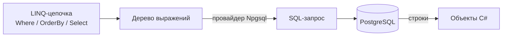

# Глава 03 — EF Core и PostgreSQL

Как объект C# оказывается строкой в таблице и обратно. Разбираем `AppDbContext`, миграции,
превращение LINQ в SQL и механизм отслеживания изменений — а заодно находим место, где наш
код скоро начнёт тормозить.

---

## Часть 1. Что такое ORM

**ORM** (Object-Relational Mapping, объектно-реляционное отображение) — библиотека, которая
переводит между двумя мирами: объектами в памяти программы и строками в реляционной базе.

Без ORM код выглядел бы так: составить строку SQL, открыть соединение, выполнить команду,
пройти по результату колонка за колонкой, руками сложить объект. Долго, многословно и легко
ошибиться (в том числе допустить SQL-инъекцию, склеивая запрос из строк).

**EF Core** (Entity Framework Core) — стандартная ORM для .NET. В нашем проекте она делает
три вещи:

1. Переводит LINQ-запросы в SQL.
2. Превращает строки результата в объекты сущностей и обратно.
3. Ведёт версионирование схемы базы через миграции.

Между EF Core и PostgreSQL стоит **провайдер** — пакет
`Npgsql.EntityFrameworkCore.PostgreSQL`. Он знает диалект именно этой СУБД: как писать
`LIMIT`, какие типы использовать, как работает автоинкремент. Заменив провайдер, тот же код
можно направить в SQL Server или SQLite.

---

## Часть 2. `AppDbContext` — точка входа в базу

[`AppDbContext.cs`](../../ServerMonitor.Infrastructure/Data/AppDbContext.cs) целиком:

```csharp
public class AppDbContext : DbContext
{
    public AppDbContext(DbContextOptions<AppDbContext> options)
        : base(options)
    {
    }

    public DbSet<MetricSnapshot> MetricSnapshots => Set<MetricSnapshot>();
    public DbSet<Alert> Alerts => Set<Alert>();
    public DbSet<AppSettings> AppSettings => Set<AppSettings>();

    protected override void OnModelCreating(ModelBuilder modelBuilder)
    {
        base.OnModelCreating(modelBuilder);

        modelBuilder.Entity<MetricSnapshot>(entity =>
        {
            entity.Ignore(m => m.MemoryUsagePercent);
            entity.Ignore(m => m.DiskUsagePercent);
            entity.HasIndex(m => m.TimestampUtc);
        });

        modelBuilder.Entity<Alert>(entity =>
        {
            entity.Property(a => a.MetricType)
                .HasConversion(
                    kind => kind.ToDisplayName(),
                    value => Enum.Parse<MetricKind>(value, ignoreCase: true));

            entity.Property(a => a.AlertType)
                .HasConversion(
                    kind => kind.ToString(),
                    value => Enum.Parse<AlertKind>(value, ignoreCase: true));

            entity.HasIndex(a => a.TimestampUtc);
        });

        modelBuilder.Entity<AppSettings>().HasData(new AppSettings
        {
            Id = 1,
            CpuThreshold = 90,
            MemoryThreshold = 90,
            DiskThreshold = 90,
            AlertsEnabled = true
        });
    }
}
```

Три настройки в `OnModelCreating` появились не сразу — их добавили, разбирая дефекты
(см. [главу 09](09-fixing-the-defects.md)):

- **`Ignore`** — у `MetricSnapshot` есть вычисляемые свойства `MemoryUsagePercent` и
  `DiskUsagePercent`; колонок в базе им не нужно, и `Ignore` говорит об этом явно.
- **`HasIndex`** — индекс по колонке, по которой сортирует каждый запрос проекта.
- **`HasConversion`** — **конвертер значений** (value converter): в коде тип алерта стал
  перечислением, а в базе остался строкой. Две лямбды описывают перевод в обе стороны, и
  благодаря им записи, сделанные до появления перечислений, читаются без миграции данных.

Разберём по частям.

### `DbContext` — что это такое

Базовый класс `DbContext` — одновременно:

- **сессия работы с базой**: держит соединение, открывает транзакции;
- **описание модели**: знает, какие есть сущности и как они отображаются на таблицы;
- **журнал изменений**: помнит, какие объекты загружены и что в них поменялось.

Отсюда все ограничения из главы 02: контекст не потокобезопасен и живёт ровно один запрос.

### Конструктор с настройками

```csharp
public AppDbContext(DbContextOptions<AppDbContext> options) : base(options) { }
```

Настройки приходят снаружи — их собрал `AddDbContext` в `Program.cs`, положив туда строку
подключения и выбранный провайдер. Сам контекст ничего не знает ни про PostgreSQL, ни про
`appsettings.json`. Это то же самое внедрение зависимостей: класс получает готовое, а не
добывает сам.

Альтернатива — переопределить `OnConfiguring` и прописать строку подключения внутри
контекста. Так делают в примерах для простоты, но в приложении это плохо: контекст
становится зависим от конфигурации и его нельзя переиспользовать с другой базой (например,
с базой в памяти в тестах).

### `DbSet<T>` — таблица как коллекция

```csharp
public DbSet<MetricSnapshot> MetricSnapshots => Set<MetricSnapshot>();
```

`DbSet<MetricSnapshot>` представляет таблицу `MetricSnapshots` и ведёт себя как коллекция:
к ней можно применять LINQ, в неё можно `Add()`.

Обрати внимание на форму записи. Классический вариант из документации:

```csharp
public DbSet<MetricSnapshot> MetricSnapshots { get; set; }
```

У нас же — вычисляемое свойство (`=> Set<...>()`, см. главу 01). Разница в том, что при
`{ get; set; }` компилятор с включённым `<Nullable>enable</Nullable>` справедливо ругается:
свойство объявлено как «не может быть null», но конструктор его не заполняет (это делает EF
Core через рефлексию). Форма с `Set<T>()` решает проблему честно: значение вычисляется при
обращении, предупреждений нет. Более современный и аккуратный способ.

### Соглашения: почему всё работает без настроек

EF Core строит модель по **соглашениям** (conventions), и наш код сильно на них опирается:

| Соглашение | Как проявилось у нас |
|------------|---------------------|
| Свойство с именем `Id` — первичный ключ | `Id` во всех трёх сущностях |
| Целочисленный ключ — автоинкремент | в базе колонка `IDENTITY` |
| Имя таблицы = имя свойства `DbSet` | `MetricSnapshots`, `Alerts`, `AppSettings` |
| Тип C# → тип колонки | `double` → `double precision`, `string` → `text` |
| `DateTime` в Npgsql → `timestamp with time zone` | `TimestampUtc` |
| Ссылочный тип не-nullable → `NOT NULL` | `MetricType`, `AlertType` |

Именно поэтому сущности в Domain остались «чистыми» — без единого атрибута EF Core (глава 00).
Когда соглашений не хватает, поведение настраивают в `OnModelCreating` через **текучий API**
(fluent API) — как мы и делаем для начальных данных.

### Начальные данные (seed)

```csharp
modelBuilder.Entity<AppSettings>().HasData(new AppSettings { Id = 1, ... });
```

`HasData` объявляет: «в таблице должна быть вот такая строка». EF Core учитывает это при
генерации миграции, и в файле
[`AddAppSettings`](../../ServerMonitor.Infrastructure/Migrations/20260825162811_AddAppSettings.cs)
появилась команда:

```csharp
migrationBuilder.InsertData(
    table: "AppSettings",
    columns: new[] { "Id", "AlertsEnabled", "CpuThreshold", "DiskThreshold", "MemoryThreshold" },
    values: new object[] { 1, true, 90.0, 90.0, 90.0 });
```

Так в базе появляется единственная строка настроек с порогами 90 %, и приложению всегда есть
что читать. Обязательное условие: `Id` при `HasData` задаётся **явно** — EF должен уметь
отличить «эту» строку при следующих миграциях.

> **Наблюдение.** Таблица `AppSettings` по смыслу содержит ровно одну строку. Формально
> ничто не мешает добавить вторую, и тогда `FirstOrDefaultAsync()` в контроллере возьмёт
> случайную. В более строгом варианте на такое ставят ограничение в базе (`CHECK (Id = 1)`)
> или хранят настройки в конфигурации. Для учебного проекта приемлемо, но знать полезно.

---

## Часть 3. Миграции

### Зачем они нужны

Схема базы меняется вместе с кодом: добавилось свойство — нужна новая колонка. Вручную это
кошмар: на твоём ноутбуке колонка есть, на сервере нет, у коллеги третий вариант.

**Миграция** — это записанный в коде шаг изменения схемы. Набор миграций образует историю,
которую можно последовательно применить к любой базе и получить одинаковый результат.

### Как их создают

```bash
dotnet ef migrations add AddAlerts --project ServerMonitor.Infrastructure --startup-project ServerMonitor.Api
```

Что происходит: инструмент запускает приложение, строит модель по текущему коду, сравнивает
её со **снимком** предыдущего состояния и генерирует разницу.

Два параметра здесь неслучайны: сам контекст и миграции лежат в `Infrastructure`, а строка
подключения и регистрация — в `Api`. Поэтому в
[`ServerMonitor.Api.csproj`](../../ServerMonitor.Api/ServerMonitor.Api.csproj) подключён
пакет `Microsoft.EntityFrameworkCore.Design` — он нужен только инструментам во время
разработки, что и отражено в его настройках:

```xml
<PackageReference Include="Microsoft.EntityFrameworkCore.Design" Version="10.0.10">
  <PrivateAssets>all</PrivateAssets>
  <IncludeAssets>runtime; build; native; contentfiles; analyzers; buildtransitive</IncludeAssets>
</PackageReference>
```

`PrivateAssets=all` означает: пакет не «протекает» в проекты, которые ссылаются на этот.

### Что внутри миграции

Каждая миграция — три файла:

- `20260804174431_InitialCreate.cs` — сами изменения;
- `..._InitialCreate.Designer.cs` — снимок модели на этот момент;
- `AppDbContextModelSnapshot.cs` — общий снимок последнего состояния (один на проект).

Смотрим на [`InitialCreate`](../../ServerMonitor.Infrastructure/Migrations/20260804174431_InitialCreate.cs):

```csharp
protected override void Up(MigrationBuilder migrationBuilder)
{
    migrationBuilder.CreateTable(
        name: "MetricSnapshots",
        columns: table => new
        {
            Id = table.Column<int>(type: "integer", nullable: false)
                .Annotation("Npgsql:ValueGenerationStrategy",
                            NpgsqlValueGenerationStrategy.IdentityByDefaultColumn),
            TimestampUtc = table.Column<DateTime>(type: "timestamp with time zone", nullable: false),
            CpuUsagePercent = table.Column<double>(type: "double precision", nullable: false),
            ...
        },
        constraints: table =>
        {
            table.PrimaryKey("PK_MetricSnapshots", x => x.Id);
        });
}

protected override void Down(MigrationBuilder migrationBuilder)
{
    migrationBuilder.DropTable(name: "MetricSnapshots");
}
```

- **`Up`** — применить изменение.
- **`Down`** — откатить его. Наличие `Down` позволяет вернуться назад командой
  `dotnet ef database update <ИмяПредыдущейМиграции>`.
- Число в имени файла — метка времени, она задаёт **порядок** применения.

Цифра `20260804174431` читается как «2026-08-04 17:44:31».

### История нашей схемы

По четырём миграциям видно, как рос проект:

| Миграция | Что сделала |
|----------|-------------|
| `InitialCreate` | создала `MetricSnapshots` с CPU, памятью и диском |
| `AddUptimeToMetricSnapshot` | добавила колонку `UptimeSeconds` |
| `AddAlerts` | создала таблицу `Alerts` |
| `AddAppSettings` | создала `AppSettings` и вставила строку с порогами |
| `AddTimestampIndexes` | добавила индексы по `TimestampUtc` в обе таблицы |

Особенно поучительна вторая:

```csharp
migrationBuilder.AddColumn<double>(
    name: "UptimeSeconds",
    table: "MetricSnapshots",
    type: "double precision",
    nullable: false,
    defaultValue: 0.0);
```

Колонка объявлена `NOT NULL`, а в таблице уже были строки. Что писать в них? EF Core сам
подставил `defaultValue: 0.0`. Это важный момент любой миграции: **добавляя обязательную
колонку в непустую таблицу, всегда нужно решить, что будет у старых записей.**

### Как применяются

```bash
dotnet ef database update --project ServerMonitor.Infrastructure --startup-project ServerMonitor.Api
```

EF Core заводит в базе служебную таблицу **`__EFMigrationsHistory`** и пишет туда имена уже
применённых миграций. При запуске команды он сравнивает список файлов со списком в таблице и
выполняет только недостающие. Поэтому команду безопасно запускать повторно.

> **Слабое место.** Миграции применяются вручную. Если развернуть приложение на новом
> сервере и забыть эту команду, оно упадёт при первом обращении к базе. Варианты решения:
> вызывать `dbContext.Database.Migrate()` при старте (просто, но опасно при нескольких
> экземплярах приложения — они начнут мигрировать одновременно) либо выполнять миграции
> отдельным шагом развёртывания (правильный путь для продакшена).

---

## Часть 4. Как LINQ превращается в SQL

Это самая практически важная часть главы.

### `IQueryable` — не коллекция, а описание запроса

В главе 01 мы говорили про отложенное выполнение. Теперь механизм целиком.

```csharp
IQueryable<MetricSnapshot> query = _dbContext.MetricSnapshots;
query = query.Where(m => m.TimestampUtc >= fromUtc);
```

`IQueryable<T>` хранит не данные, а **дерево выражений** (expression tree) — разобранную
структуру твоей лямбды: «сравнение: свойство `TimestampUtc` больше или равно переменной».
Именно поэтому EF Core может её прочитать и перевести в SQL.

Сравни с `IEnumerable<T>`: там лямбда компилируется в обычный метод, и снаружи её содержимое
не увидеть — можно только вызвать для каждого элемента **в памяти**.



### Момент выполнения

Пока ты добавляешь `Where`, `OrderBy`, `Select` — база не тронута. Запрос уходит на сервер
только при вызове **материализующего** метода:

`ToListAsync()`, `FirstOrDefaultAsync()`, `CountAsync()`, `AnyAsync()`, `SingleAsync()`.

Посмотрим на `GetHistoryPaged` — образцовый пример постепенной сборки:

```csharp
IQueryable<MetricSnapshot> query = _dbContext.MetricSnapshots;

if (from.HasValue) { ... query = query.Where(m => m.TimestampUtc >= fromUtc); }
if (to.HasValue)   { ... query = query.Where(m => m.TimestampUtc < toUtc); }

var totalCount = await query.CountAsync(cancellationToken);      // ← запрос №1

query = sortBy.ToLower() switch { ... };                          // сортировка

var items = await query
    .Skip((page - 1) * pageSize)
    .Take(pageSize)
    .Select(m => new MetricHistoryItemDto { ... })
    .ToListAsync(cancellationToken);                              // ← запрос №2
```

К базе уходит ровно два запроса: посчитать общее количество и взять страницу. Примерно такой
SQL получается вторым:

```sql
SELECT m."TimestampUtc", m."CpuUsagePercent",
       CASE WHEN m."MemoryTotalMb" > 0 THEN round(...) ELSE 0 END, ...
FROM "MetricSnapshots" AS m
WHERE m."TimestampUtc" >= @from
ORDER BY m."TimestampUtc" DESC
LIMIT @pageSize OFFSET @offset
```

Три вещи, которые стоит заметить:

1. **`Select` тоже уехал в SQL.** Из базы приедут только нужные колонки, а вычисление
   процентов сделает сама PostgreSQL. Данные не гоняются лишний раз по сети.
2. **Значения подставлены параметрами** (`@from`, `@pageSize`), а не склеены в текст запроса.
   Это автоматическая защита от SQL-инъекций.
3. **Пагинация выполняется в базе** (`LIMIT`/`OFFSET`), а не в памяти приложения.

### Как это ломают

Достаточно поставить `ToList()` слишком рано:

```csharp
// ПЛОХО — так у нас не написано, но ошибка очень частая
var all = await _dbContext.MetricSnapshots.ToListAsync();   // вся таблица в память!
var page = all.OrderByDescending(m => m.TimestampUtc).Take(20).ToList();
```

После `ToListAsync()` мы имеем дело с `List<T>` в памяти, и все последующие `OrderBy`/`Take`
выполняет уже приложение. При сотне тысяч записей это десятки мегабайт трафика и заметная
задержка вместо мгновенного `LIMIT 20`.

**Правило: сначала фильтруй и сортируй, материализуй в последнюю очередь.**

### Синхронные вызовы в фоновом сервисе

Одна из найденных шероховатостей жила в
[`TelegramBotService`](../../ServerMonitor.Infrastructure/Telegram/TelegramBotService.cs):

```csharp
// так было
var latest = dbContext.MetricSnapshots
    .OrderByDescending(m => m.TimestampUtc)
    .FirstOrDefault();          // ← синхронный вариант
```

`FirstOrDefault()` без `Async`. Запрос корректный, SQL тот же самый, но поток **стоит и ждёт**
ответа базы вместо того, чтобы освободиться (глава 01). В сервисе, который просыпается раз в
30 секунд, вреда почти не было — но это была несогласованность: строкой выше в том же методе
стоял `FirstOrDefaultAsync`. Сейчас везде асинхронный вариант с передачей токена:

```csharp
var latest = await dbContext.MetricSnapshots
    .AsNoTracking()
    .OrderByDescending(m => m.TimestampUtc)
    .FirstOrDefaultAsync(cancellationToken);
```

---

## Часть 5. Отслеживание изменений

### Как EF Core узнаёт, что менять

Когда запрос возвращает **сущность**, контекст запоминает её и её исходные значения — это
**отслеживание изменений** (change tracking). При вызове `SaveChangesAsync()` он сравнивает
текущее состояние объекта с запомненным и генерирует `UPDATE` только для изменившихся полей.

Отсюда фокус в
[`SettingsController.UpdateSettings`](../../ServerMonitor.Api/Controllers/SettingsController.cs):

```csharp
var settings = await _dbContext.AppSettings.FirstOrDefaultAsync(cancellationToken);

settings.CpuThreshold = dto.CpuThreshold;
settings.MemoryThreshold = dto.MemoryThreshold;
settings.DiskThreshold = dto.DiskThreshold;
settings.AlertsEnabled = dto.AlertsEnabled;

await _dbContext.SaveChangesAsync(cancellationToken);
```

Нигде нет `_dbContext.Update(settings)` — и он не нужен. Объект пришёл из контекста, значит
отслеживается; достаточно поменять свойства. Это одна из самых приятных особенностей EF Core
и одновременно источник недоумения: «почему сохранилось, я же не сказал сохранить?»

Добавление работает явно, потому что новый объект контекст ещё не знает:

```csharp
// MetricsCollectorService
dbContext.MetricSnapshots.Add(snapshot);
await dbContext.SaveChangesAsync(stoppingToken);
```

`SaveChangesAsync` выполняет все накопленные изменения **в одной транзакции**: либо всё
применится, либо ничего.

### Когда отслеживание не нужно

Отслеживание стоит памяти и времени: контекст хранит копию исходных значений каждой
загруженной сущности. Для запросов «только почитать» это лишнее.

Тут нашему коду повезло: запросы истории заканчиваются проекцией
`.Select(m => new MetricHistoryItemDto { ... })`, а **проекции не отслеживаются** — DTO не
является сущностью модели. То есть `GetHistory` и `GetHistoryPaged` уже эффективны.

А `GetStatus` возвращает сущность `MetricSnapshot`, и раньше она попадала под отслеживание
без всякой пользы — менять её никто не собирается. Теперь во всех запросах только на чтение
стоит `AsNoTracking()`:

```csharp
var latest = await _dbContext.MetricSnapshots
    .AsNoTracking()                                  // ← вот эта строка
    .OrderByDescending(m => m.TimestampUtc)
    .FirstOrDefaultAsync(cancellationToken);
```

На одной строке выигрыш микроскопический, но привычка полезная: **читаешь без изменения —
пиши `AsNoTracking()`**.

---

## Часть 6. Что станет узким местом

Соберём проблемы, которые проявятся при росте данных.

### Индекс по `TimestampUtc` (исправлено)

Долгое время единственным индексом в базе был первичный ключ по `Id`. При этом **каждый**
запрос проекта сортирует или фильтрует по `TimestampUtc`:

```csharp
.OrderByDescending(m => m.TimestampUtc)
```

Без индекса PostgreSQL вынужден прочитать всю таблицу и отсортировать её целиком, чтобы
отдать одну последнюю строку. При 10 тысячах строк это незаметно, при миллионе — секунды на
каждое обновление дашборда.

Вылечилось двумя строками в `OnModelCreating` и миграцией `AddTimestampIndexes`:

```csharp
entity.HasIndex(m => m.TimestampUtc);   // для MetricSnapshots
entity.HasIndex(a => a.TimestampUtc);   // и для Alerts
```

Проверить, что индекс действительно используется, можно командой `EXPLAIN` в psql: в плане
запроса вместо `Seq Scan` (полный просмотр таблицы) должен появиться `Index Scan`.

### Таблица растёт бесконечно

Один замер раз в 5 секунд — это 17 280 строк в сутки, около 6,3 млн в год с одной машины.
Никакой очистки в проекте нет.

Стандартное решение — **retention** (срок хранения) и **downsampling** (прореживание):
сырые данные держать сутки-двое, поминутные средние — месяц, почасовые — год. Это отдельный
запланированный этап.

### `DateTime` и часовые пояса

Колонка создана как `timestamp with time zone`, а в коде — `DateTime.UtcNow`. Провайдер
Npgsql в современных версиях строг: он требует, чтобы в такую колонку писали `DateTime` с
`Kind == Utc`, иначе бросает исключение. Именно поэтому в фильтре появилась подстраховка:

```csharp
var fromUtc = DateTime.SpecifyKind(from.Value, DateTimeKind.Utc);
```

Дата из строки запроса приходит без пометки о поясе (`Kind == Unspecified`), и
`SpecifyKind` явно объявляет её как UTC. Строго говоря, тут есть логическая натяжка:
пользователь выбирает дату в своём часовом поясе, а мы объявляем её временем UTC — на
границах суток фильтр может смещаться на несколько часов. Для дашборда терпимо; правильное
решение — переводить границы дня из пояса пользователя в UTC явно.

---

## Что запомнить из главы

- EF Core — прослойка между объектами и таблицами; диалект конкретной СУБД знает провайдер
  (у нас Npgsql).
- `DbContext` — сессия, модель и журнал изменений одновременно; отсюда время жизни Scoped.
- Модель строится по соглашениям (`Id` → ключ, имя `DbSet` → имя таблицы), поэтому сущности
  остаются чистыми.
- Миграция — записанный шаг изменения схемы с методами `Up` и `Down`; применённые миграции
  отмечаются в таблице `__EFMigrationsHistory`.
- `IQueryable` — это дерево выражений, а не данные; SQL уходит в базу только при
  `ToListAsync`/`FirstOrDefaultAsync`/`CountAsync`.
- Материализуй в последнюю очередь: `ToList()` раньше времени превращает работу базы в работу
  приложения.
- Изменения отслеживаются автоматически: достаточно поменять свойство загруженной сущности и
  вызвать `SaveChangesAsync()`.
- Для запросов только на чтение полезен `AsNoTracking()`; проекции в DTO не отслеживаются и
  так.
- Конвертер значений (`HasConversion`) позволяет держать в коде перечисление, а в базе —
  строку, не трогая существующие данные.
- Индексы по `TimestampUtc` добавлены; политики хранения данных проекту всё ещё не хватает.

Дальше: глава 04 — фоновые сервисы: как устроен бесконечный цикл сбора, почему нельзя просто
попросить `AppDbContext` в конструкторе и что происходит при остановке приложения.
