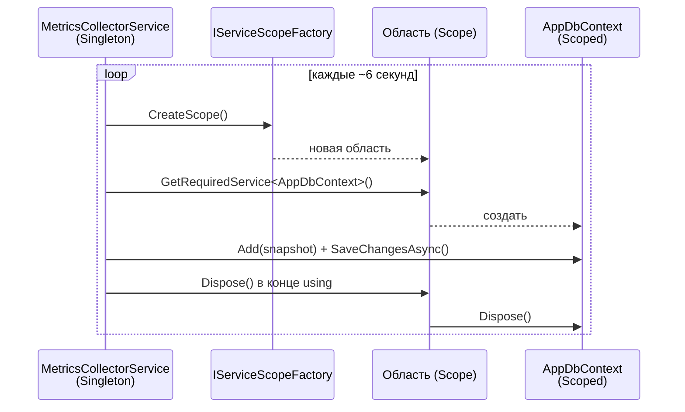

# Глава 04 — Фоновые сервисы

Веб-приложение обычно только отвечает на запросы. Но наше должно ещё и работать само по себе:
раз в 5 секунд снимать метрики и раз в 30 секунд проверять пороги. За это отвечают **фоновые
сервисы** — два класса, унаследованных от `BackgroundService`.

В этой главе: как устроен их жизненный цикл, почему они не могут просто попросить
`AppDbContext` в конструкторе и что происходит при остановке приложения.

---

## Часть 1. `IHostedService` и `BackgroundService`

### Хост

Любое приложение на .NET, использующее `WebApplication.CreateBuilder`, строится вокруг
**хоста** (host) — объекта, который управляет жизненным циклом: запускает всё нужное при
старте и корректно останавливает при завершении.

Хост знает про интерфейс **`IHostedService`** с двумя методами:

```csharp
Task StartAsync(CancellationToken cancellationToken);
Task StopAsync(CancellationToken cancellationToken);
```

Всё, что зарегистрировано через `AddHostedService`, хост запускает при старте и останавливает
при выключении. Веб-сервер Kestrel, кстати, реализован ровно так же — он тоже hosted service.

### `BackgroundService`

Реализовывать `IHostedService` вручную неудобно: пришлось бы самому запускать задачу, хранить
её, ждать завершения. Поэтому в .NET есть готовый абстрактный класс `BackgroundService`,
который берёт это на себя. От тебя требуется один метод:

```csharp
protected override async Task ExecuteAsync(CancellationToken stoppingToken)
```

Внутри — обычно бесконечный цикл. Токен `stoppingToken` сработает, когда приложение начнёт
останавливаться.

### Регистрация

```csharp
builder.Services.AddHostedService<MetricsCollectorService>();
builder.Services.AddHostedService<TelegramBotService>();
```

Важная деталь: `AddHostedService` регистрирует сервис как **Singleton** — один экземпляр на
всё время работы приложения. Из этого вытекает главная сложность главы, к которой мы скоро
придём.

---

## Часть 2. `MetricsCollectorService` построчно

Весь метод из
[`MetricsCollectorService.cs`](../../ServerMonitor.Infrastructure/Monitoring/MetricsCollectorService.cs):

```csharp
protected override async Task ExecuteAsync(CancellationToken stoppingToken)
{
    _logger.LogInformation("Metrics collector service started.");

    while (!stoppingToken.IsCancellationRequested)
    {
        try
        {
            var snapshot = await _collector.CollectAsync(stoppingToken);

            using var scope = _scopeFactory.CreateScope();
            var dbContext = scope.ServiceProvider.GetRequiredService<AppDbContext>();

            dbContext.MetricSnapshots.Add(snapshot);
            await dbContext.SaveChangesAsync(stoppingToken);

            _logger.LogInformation(
                "Snapshot saved: CPU={Cpu}%, RAM={RamUsed:F0}/{RamTotal:F0} MB",
                snapshot.CpuUsagePercent, snapshot.MemoryUsedMb, snapshot.MemoryTotalMb);
        }
        catch (Exception ex)
        {
            _logger.LogError(ex, "Error while collecting metrics.");
        }

        try
        {
            await Task.Delay(_interval, stoppingToken);
        }
        catch (TaskCanceledException)
        {
            break;
        }
    }

    _logger.LogInformation("Metrics collector service stopped.");
}
```

Разберём по частям — каждое решение здесь неслучайно.

### Условие цикла

```csharp
while (!stoppingToken.IsCancellationRequested)
```

Цикл работает, пока приложение не начали останавливать. `IsCancellationRequested` — булево
свойство: «был ли запрошен останов». Это **корректное завершение** (graceful shutdown):
сервис сам выходит из цикла, а не убивается извне.

### Два `try` вместо одного

Обрати внимание: полезная работа и пауза обёрнуты в **разные** блоки `try`, и это важно.

**Первый** ловит ошибки сбора и сохранения. Смысл — живучесть: база недоступна, файл `/proc`
не прочитался, сеть моргнула — сервис не должен умирать. Ошибка попадает в журнал, цикл идёт
дальше и через 5 секунд попробует снова.

**Второй** ловит `TaskCanceledException` от `Task.Delay`. Как разбиралось в главе 01, при
отмене `Task.Delay` не досыпает молча, а **бросает исключение** — таков контракт отмены в
.NET. Если бы пауза была внутри общего `try`, исключение поймал бы `catch (Exception)`,
записал бы его как ошибку («Error while collecting metrics») и цикл пошёл бы на новый виток
вместо остановки. Разделение делает две вещи: нормальный останов не выглядит ошибкой в
журнале и действительно прерывает цикл через `break`.

### Структурированное логирование

```csharp
_logger.LogInformation(
    "Snapshot saved: CPU={Cpu}%, RAM={RamUsed:F0}/{RamTotal:F0} MB",
    snapshot.CpuUsagePercent, snapshot.MemoryUsedMb, snapshot.MemoryTotalMb);
```

Здесь нет интерполяции строк — вместо неё **шаблон с именованными placeholder'ами** и
отдельные аргументы. Разница принципиальная: система логирования сохраняет не только готовый
текст, но и **значения по именам**. При выводе в файл разницы не видно, но при отправке в
систему сбора логов (Seq, Elasticsearch, Grafana Loki) можно будет искать «все записи, где
`Cpu > 90`».

Правило: в логах — шаблон и аргументы, а не `$"..."`.

---

## Часть 3. Главная проблема: время жизни

Теперь самое важное. Почему сервис не может просто попросить контекст базы в конструкторе?

### Что было бы, сделай мы «как обычно»

```csharp
// ТАК НЕЛЬЗЯ
public MetricsCollectorService(AppDbContext dbContext, ...)
{
    _dbContext = dbContext;
}
```

Сервис — **Singleton**, `AppDbContext` — **Scoped**. Из главы 02: долгоживущий объект не
может держать короткоживущий, это **захваченная зависимость** (captive dependency). Что
пошло бы не так:

1. Контекст жил бы всё время работы приложения и **копил бы отслеживаемые сущности** —
   утечка памяти, растущая на 17 тысяч объектов в сутки.
2. Соединение с базой оставалось бы занятым; при обрыве оно бы не восстановилось.
3. Второй фоновый сервис работал бы с тем же контекстом **из другого потока**, а он не
   потокобезопасен — гонки и странные ошибки.

К счастью, .NET не даст такое собрать: контейнер по умолчанию проверяет области при старте и
бросит исключение с текстом про «Cannot consume scoped service from singleton».

### Решение: создавать область вручную

```csharp
using var scope = _scopeFactory.CreateScope();
var dbContext = scope.ServiceProvider.GetRequiredService<AppDbContext>();
```

`IServiceScopeFactory` — фабрика областей, сама по себе синглтон, поэтому просить её можно.
Каждая итерация цикла:

1. создаёт **новую область** — то же, что ASP.NET Core делает для каждого HTTP-запроса;
2. запрашивает у неё `AppDbContext` — контейнер создаёт свежий экземпляр;
3. работает с ним;
4. на выходе из области `using` вызывает `Dispose()` — соединение возвращается в пул,
   отслеживаемые объекты забываются.



Ровно та же схема — в `TelegramBotService.CheckMetricsAsync` и `GetStatusMessage`. Это
типовой приём: **фоновый сервис создаёт область на каждую единицу работы**.

### `GetRequiredService` против `GetService`

`GetRequiredService<T>()` бросит понятное исключение, если тип не зарегистрирован.
`GetService<T>()` вернёт `null`, и ошибка проявится позже и в другом месте. Для обязательной
зависимости всегда бери первый вариант — «упасть громко и сразу» лучше, чем `null` неизвестно
откуда.

---

## Часть 4. Сколько на самом деле длится цикл

Тонкость, которую легко пропустить. Интервал объявлен так:

```csharp
private readonly TimeSpan _interval = TimeSpan.FromSeconds(5);
```

Но пауза считается **после** работы, а внутри `CollectAsync` есть собственная пауза в
секунду — она нужна, чтобы измерить дельту загрузки процессора (глава 05):

```csharp
var first = await ReadCpuTimesAsync(cancellationToken);
await Task.Delay(1000, cancellationToken);      // ← секунда внутри сбора
var second = await ReadCpuTimesAsync(cancellationToken);
```

Итого реальный период: 1 секунда измерения + время записи в базу + 5 секунд паузы ≈
**6 секунд**, а не 5. Проверяется просто — по меткам времени соседних строк в таблице.

Так работает схема «пауза после работы»: интервал **дрейфует** на длительность самой работы.
Если нужен ровный ритм, используют `PeriodicTimer`, который отсчитывает от начала предыдущего
тика:

```csharp
using var timer = new PeriodicTimer(TimeSpan.FromSeconds(5));
while (await timer.WaitForNextTickAsync(stoppingToken))
{
    // работа
}
```

Для мониторинга дрейф в секунду безвреден — но понимать, почему в базе шаг 6 секунд, а в коде
написано 5, полезно. И на собеседовании это хороший ответ на вопрос «а как бы вы сделали
точный интервал».

---

## Часть 5. Запуск и остановка

### Что происходит при старте

`BackgroundService.StartAsync` вызывает твой `ExecuteAsync` и **не ждёт его завершения** — он
ждёт только до первого `await` внутри. Дальше задача живёт сама, а хост идёт запускать
остальное.

Отсюда правило: **не делай долгую синхронную работу в начале `ExecuteAsync`** — она задержит
старт всего приложения, включая веб-сервер. Наш код это правило соблюдает: первым делом идёт
`await`.

### Что происходит при остановке

Нажали Ctrl+C или система послала сигнал завершения:

1. Хост переводит `stoppingToken` в состояние «отменено».
2. `Task.Delay` бросает `TaskCanceledException`, наш `catch` делает `break`.
3. Метод `ExecuteAsync` завершается, пишется финальная строка в журнал.
4. Хост ждёт завершения всех фоновых сервисов — **по умолчанию не дольше 30 секунд**, потом
   процесс закрывается принудительно.

Именно ради шага 4 токен передают дальше — в `CollectAsync` и в `SaveChangesAsync`. Если
операция долгая, она прервётся сама, а не будет удерживать процесс.

---

## Часть 6. Второй сервис и его особенности

[`TelegramBotService`](../../ServerMonitor.Infrastructure/Telegram/TelegramBotService.cs)
устроен по той же схеме, но с двумя отличиями.

**Он может вообще не запуститься:**

```csharp
var token = _configuration["Telegram:BotToken"];
_chatId = _configuration["Telegram:ChatId"];

if (string.IsNullOrWhiteSpace(token) || string.IsNullOrWhiteSpace(_chatId))
{
    _logger.LogWarning("Telegram bot token or chat ID is not configured. Bot disabled.");
    return;
}
```

Нет настроек — метод просто возвращается, сервис завершает работу, приложение продолжает жить.
Это правильное поведение для необязательной функции: отсутствие токена не должно ронять
мониторинг. Обрати внимание на уровень записи — `LogWarning`, а не `LogError`: ситуация
ожидаемая, но заметить её стоит.

**Он делает две вещи одновременно.** Кроме цикла проверки порогов, бот принимает команды
пользователя:

```csharp
_botClient.StartReceiving(
    updateHandler: HandleUpdateAsync,
    errorHandler: HandleErrorAsync,
    receiverOptions: receiverOptions,
    cancellationToken: stoppingToken);
```

`StartReceiving` не блокирует — он запускает **параллельный** цикл опроса серверов Telegram
(long polling) и сразу возвращает управление. После этого наш `while` спокойно занимается
своим делом. Получается два независимых цикла в одном сервисе; подробнее — в главе 07.

**Важное следствие:** оба фоновых сервиса и все HTTP-запросы работают с базой **одновременно
и из разных потоков**. Именно поэтому у каждого своя область и свой `AppDbContext` — иначе
гонок не избежать.

---

## Часть 7. Слабые места

- **Интервалы зашиты в код.** `TimeSpan.FromSeconds(5)` и `FromSeconds(30)` — константы в
  полях класса. Чтобы поменять частоту сбора, нужна перекомпиляция. Правильнее читать их из
  конфигурации (глава 08) через `IOptions<T>`.
- **Нет паузы при повторяющихся ошибках.** Если база лежит, сервис будет долбиться в неё
  каждые 6 секунд и писать в журнал ошибку за ошибкой. Обычно в таких случаях применяют
  **экспоненциальную задержку** (exponential backoff): 5 секунд, 10, 20, 40 — до потолка.
- **Нет проверки живости.** Если сервис по какой-то причине завершится (не пойманное
  исключение вне `try`), приложение продолжит работать как ни в чём не бывало: API будет
  отвечать, а новые метрики перестанут появляться. Никто об этом не узнает. Стандартное
  решение — эндпоинт `/healthz`, который проверяет свежесть последнего снимка. Заодно это
  ровно та задача, которую решает запланированный heartbeat-алерт.
- **Сбор живёт внутри API.** Главное архитектурное ограничение, о котором говорилось в главе
  00: мониторится только та машина, где запущен `ServerMonitor.Api`.

---

## Что запомнить из главы

- `BackgroundService` — обёртка над `IHostedService`; от тебя нужен только `ExecuteAsync` с
  циклом, а хост управляет запуском и остановкой.
- `AddHostedService` регистрирует сервис как Singleton — отсюда все ограничения по
  зависимостям.
- Singleton не может держать Scoped: `AppDbContext` создаётся через
  `_scopeFactory.CreateScope()` на каждой итерации и уничтожается вместе с областью.
- Ошибки полезной работы ловятся отдельно от отмены — иначе штатный останов выглядел бы как
  ошибка и не прерывал цикл.
- Пауза после работы означает дрейф интервала: у нас реальный шаг ≈ 6 секунд вместо 5. Ровный
  ритм даёт `PeriodicTimer`.
- В логах используй шаблон с именованными параметрами, а не интерполяцию — так значения
  остаются доступными для поиска.
- Токен остановки нужно передавать во все вложенные операции, иначе они задержат завершение
  процесса.

Дальше: глава 05 — как именно снимаются метрики: файлы `/proc` в Linux, вызовы Windows API
через P/Invoke и почему загрузку процессора нельзя измерить мгновенно.
