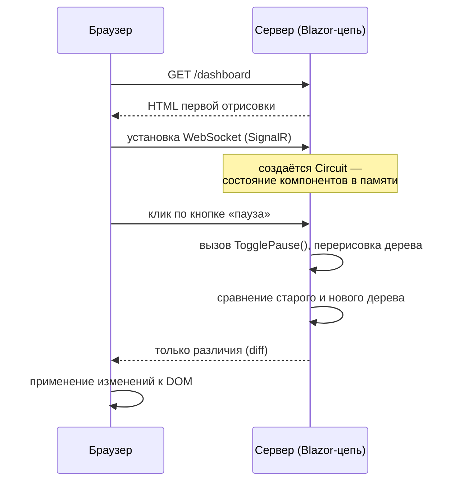
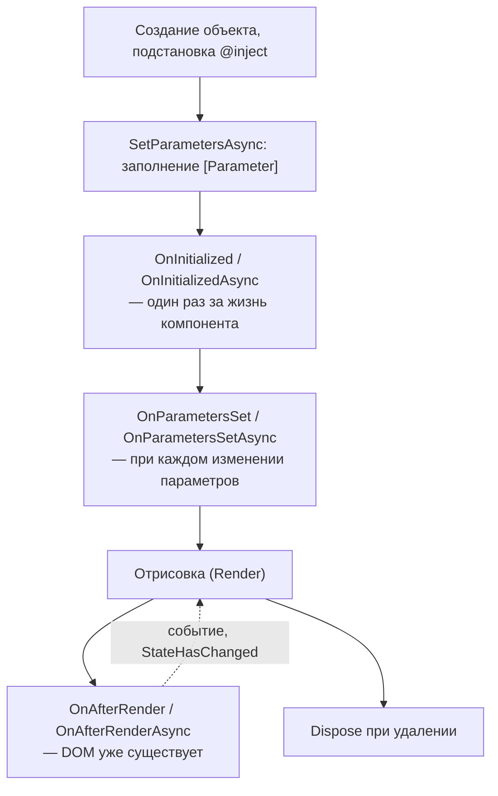
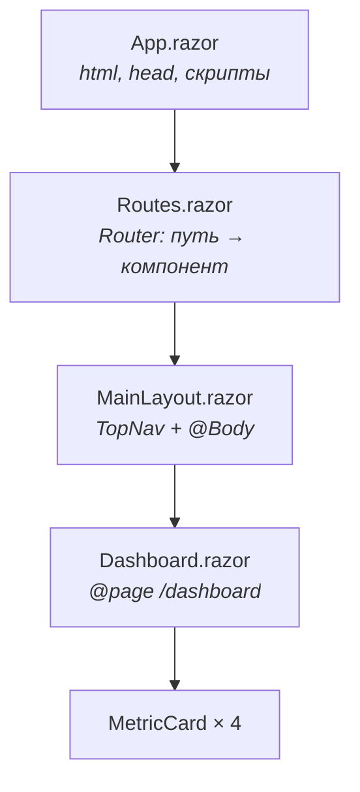

# Глава 06 — Blazor Server

Интерфейс проекта написан на C#. Ни одного самописного фреймворка на JavaScript, а кнопки
нажимаются, таблица сортируется, график обновляется. В этой главе — как это возможно, что
такое рендер-режимы и почему у такого подхода есть своя цена.

---

## Часть 1. Что такое Blazor

**Blazor** — часть ASP.NET Core, позволяющая строить веб-интерфейс на C# вместо JavaScript.
Единица интерфейса — **компонент**: файл `.razor`, где перемешаны разметка и код.

У Blazor есть несколько режимов работы, и понимать разницу важно:

| Режим | Где выполняется C# | Чем платим |
|-------|--------------------|-----------|
| **Server** (наш) | на сервере; браузер получает готовый HTML | нужно постоянное соединение, задержка сети на каждое действие |
| **WebAssembly** | в браузере, в песочнице WebAssembly | долгая первая загрузка (нужно скачать среду .NET) |
| **Auto** | сперва Server, затем переключается на WebAssembly | сложность обоих |

Мы используем **Interactive Server** — это видно в
[`ServerMonitor.Web/Program.cs`](../../ServerMonitor.Web/Program.cs):

```csharp
builder.Services.AddRazorComponents()
    .AddInteractiveServerComponents();
...
app.MapRazorComponents<App>()
    .AddInteractiveServerRenderMode();
```

и в [`App.razor`](../../ServerMonitor.Web/Components/App.razor):

```razor
<Routes @rendermode="InteractiveServer" />
```

---

## Часть 2. Как работает Server-режим

Ключевая идея: **дерево компонентов живёт на сервере**, браузер работает тонким клиентом.



Пошагово:

1. Первый запрос отдаёт обычный HTML — страница видна сразу, до всякой интерактивности.
2. Браузер поднимает постоянное соединение через **SignalR** (в основном WebSocket).
3. На сервере создаётся **цепь** (circuit) — объект с состоянием всех компонентов этого
   пользователя: значения полей, текущая страница, всё дерево.
4. Любое событие (клик, ввод, срабатывание таймера) уходит на сервер сообщением.
5. Сервер выполняет твой C#-метод, перерисовывает дерево компонентов **в памяти**, сравнивает
   с прежним состоянием и отправляет в браузер **только различия**.
6. Маленький JavaScript-слой Blazor применяет различия к настоящему DOM.

Отсюда все свойства режима:

- **Плюсы.** Весь код на C#, прямой доступ к серверным сервисам, мгновенная первая загрузка,
  ничего не нужно скачивать. Секреты и логика остаются на сервере.
- **Минусы.** Требуется постоянное соединение — при его обрыве интерфейс замирает (наш
  [`ReconnectModal`](../../ServerMonitor.Web/Components/Layout/ReconnectModal.razor) как раз
  про это). Каждое действие — сетевой обход, при плохой связи заметны задержки. И главное:
  **состояние каждого пользователя хранится в памяти сервера**, поэтому масштабирование
  ограничено, а при нескольких серверах нужна «липкая» сессия.

---

## Часть 3. Синтаксис Razor

Файл `.razor` — это HTML со вставками C#. Возьмём фрагменты
[`Dashboard.razor`](../../ServerMonitor.Web/Components/Pages/Dashboard.razor).

### Директивы в начале файла

```razor
@page "/dashboard"
@using System.Globalization
@using ServerMonitor.Web.Services
@inject MetricsApiClient ApiClient
@implements IDisposable
```

| Директива | Что делает |
|-----------|-----------|
| `@page "/dashboard"` | компонент становится страницей по этому адресу |
| `@using` | то же, что `using` в C#-файле |
| `@inject Тип Имя` | получить сервис из DI-контейнера (глава 02) |
| `@implements IDisposable` | компонент реализует интерфейс |

`@inject MetricsApiClient ApiClient` — то самое внедрение зависимостей, только не через
конструктор, а через свойство: Blazor создаст компонент и подставит сервис.

Общие для всех компонентов `@using` вынесены в
[`_Imports.razor`](../../ServerMonitor.Web/Components/_Imports.razor) — их не нужно повторять
в каждом файле.

### Вставки кода в разметку

```razor
<h1>Server Monitor</h1>
@if (status is not null)
{
    <p class="dash-subtitle">
        <span class="live-dot @(isPaused ? "paused" : "")"></span>
        @(isPaused ? "Paused" : "Live") · upd @status.TimeStampUtc.ToLocalTime().ToString("HH:mm:ss")
    </p>
}
```

- `@if`, `@foreach`, `@for` — обычные конструкции C# в разметке.
- `@выражение` — вставить значение (например, `@status.CpuUsagePercent`).
- `@(...)` — скобки нужны, когда выражение сложнее одного обращения: `@(isPaused ? "a" : "b")`.
- Внутри значения атрибута код тоже работает: `class="live-dot @(isPaused ? "paused" : "")"`.

Полезный приём из нашего кода — вычисляемые классы:

```razor
<button class="icon-btn @(isRefreshing ? "spinning" : "")" @onclick="RefreshNow">
```

CSS-класс появляется и исчезает в зависимости от поля — так сделана крутящаяся иконка
обновления.

### События и привязка

```razor
<button @onclick="TogglePause">...</button>
<button @onclick="() => ChangePeriod(p)">@p</button>
```

`@onclick` принимает метод или лямбду. Лямбда нужна, когда надо передать аргумент — как в
переключателе периода внутри `@foreach`.

**Двусторонняя привязка** — в
[`Settings.razor`](../../ServerMonitor.Web/Components/Pages/Settings.razor):

```razor
<input type="number" min="1" max="100" @bind="settings.CpuThreshold" class="threshold-input" />
<input type="checkbox" @bind="settings.AlertsEnabled" />
```

`@bind` связывает значение элемента с полем в обе стороны: изменение в поле ввода попадает в
объект, изменение объекта — в поле ввода. По умолчанию значение забирается по событию
`onchange` (когда поле теряет фокус); при необходимости это меняют через `@bind:event`.

---

## Часть 4. Компоненты и параметры

[`MetricCard.razor`](../../ServerMonitor.Web/Components/Shared/MetricCard.razor) — свой
переиспользуемый компонент. Его вход описан так:

```csharp
[Parameter] public string Title { get; set; } = string.Empty;
[Parameter] public string Value { get; set; } = string.Empty;
[Parameter] public double? Percent { get; set; }
[Parameter] public string? Subtitle { get; set; }
[Parameter] public string? Spark { get; set; }
```

Атрибут `[Parameter]` делает свойство доступным снаружи — как атрибут HTML-тега:

```razor
<MetricCard Title="CPU Usage"
            Value="@($"{status.CpuUsagePercent}%")"
            Percent="status.CpuUsagePercent"
            Spark="@ChartPoints(h => h.CpuUsagePercent, 100, 24)" />
```

Требования к параметрам: свойство должно быть `public` и иметь `get` и `set` — иначе Blazor не
сможет его заполнить.

`Percent` объявлен как `double?` не случайно: карточка «Uptime» показывает строку без
процентов, и `null` означает «шкалу не рисовать»:

```razor
@if (Percent is not null)
{
    <div class="metric-scale">...</div>
}
```

Это типичный приём: **необязательный параметр как переключатель части разметки**.

### Куда уходит вёрстка: `RenderFragment`

Компоненты могут принимать не только значения, но и целые куски разметки — через параметр
типа `RenderFragment` (обычно называемый `ChildContent`). В нашем проекте это не понадобилось,
но именно так устроены `<Router>`, `<Found>` и другие встроенные компоненты.

---

## Часть 5. Жизненный цикл компонента

Порядок вызовов при появлении компонента на странице:



### `OnInitializedAsync` — загрузка данных

```csharp
protected override async Task OnInitializedAsync()
{
    await LoadDataAsync();
    refreshTimer = new Timer(async _ =>
    {
        if (!isPaused)
        {
            await LoadDataAsync();
            await InvokeAsync(StateHasChanged);
        }
    }, null, TimeSpan.FromSeconds(5), TimeSpan.FromSeconds(5));
}
```

Здесь загружаются начальные данные и заводится таймер автообновления. Вызывается один раз за
жизнь компонента — при переходе на другую страницу и обратно компонент создаётся заново.

### `InvokeAsync(StateHasChanged)` — важнейшая деталь

**`StateHasChanged()`** говорит Blazor: «состояние изменилось, перерисуй меня». После
обработчиков событий (`@onclick`) вызывать его не нужно — Blazor делает это сам. А вот после
изменения состояния «извне» — из таймера, из фонового потока — обязательно.

Почему `InvokeAsync(...)`, а не просто `StateHasChanged()`? У каждой цепи Blazor есть
собственный **контекст синхронизации** — очередь, гарантирующая, что дерево компонентов
изменяется в один момент времени только одним потоком. Обратный вызов `Timer` приходит из
пула потоков, то есть **снаружи** этой очереди. `InvokeAsync` ставит работу в очередь цепи.

Вызов `StateHasChanged()` напрямую из таймера — источник плавающих ошибок вроде «Collection
was modified» и порчи состояния. Правило: **всё, что приходит из фонового потока, оборачивай
в `InvokeAsync`**.

### `OnAfterRenderAsync` — когда DOM уже есть

```csharp
// ThemeToggle.razor
protected override async Task OnAfterRenderAsync(bool firstRender)
{
    if (firstRender)
    {
        currentTheme = await JS.InvokeAsync<string>("themeManager.initTheme");
        StateHasChanged();
    }
}
```

Вызывается **после** того, как разметка попала в браузер. Только здесь можно обращаться к
JavaScript — до этого DOM ещё не существует.

Параметр `firstRender` отделяет первую отрисовку от последующих. Без проверки код выполнялся
бы при **каждой** перерисовке — а поскольку `StateHasChanged()` вызывает новую отрисовку,
получился бы бесконечный цикл.

### `Dispose` — уборка за собой

```csharp
@implements IDisposable
...
public void Dispose() => refreshTimer?.Dispose();
```

Ушли со страницы — таймер надо остановить, иначе он продолжит тикать и дёргать API для
несуществующего компонента. Это утечка, которая копится с каждым переходом.

Тот же принцип в [`TopNav.razor`](../../ServerMonitor.Web/Components/Layout/TopNav.razor), но
для подписки на событие:

```csharp
protected override void OnInitialized()
{
    Nav.LocationChanged += OnLocationChanged;
}

public void Dispose()
{
    Nav.LocationChanged -= OnLocationChanged;
}
```

**Подписался — отпишись.** Не отписавшись от события долгоживущего объекта (`NavigationManager`
живёт всю цепь), ты оставляешь ссылку на удалённый компонент, и сборщик мусора не сможет его
освободить.

---

## Часть 6. Взаимодействие с JavaScript

Иногда без JavaScript нельзя: работа с `localStorage`, измерение элементов, эффекты. Для
этого есть **JS interop**.

```csharp
@inject IJSRuntime JS
...
await JS.InvokeVoidAsync("navPill.update");                       // без результата
currentTheme = await JS.InvokeAsync<string>("themeManager.initTheme");  // с результатом
```

`InvokeVoidAsync` — вызвать функцию, `InvokeAsync<T>` — вызвать и получить значение. Первый
аргумент — путь к функции в глобальном объекте `window`.

В проекте три таких скрипта, все подключены в `App.razor`:

| Файл | Зачем |
|------|-------|
| [`js/theme.js`](../../ServerMonitor.Web/wwwroot/js/theme.js) | тема: чтение и запись `localStorage`, установка `data-theme` |
| [`js/navpill.js`](../../ServerMonitor.Web/wwwroot/js/navpill.js) | измерение активной ссылки и позиционирование индикатора |
| [`js/liveflash.js`](../../ServerMonitor.Web/wwwroot/js/liveflash.js) | вспышка цифр при обновлении данных |

Почему именно они не могли остаться на C#:

- **Тема** хранится в `localStorage` — это API браузера, с сервера к нему доступа нет.
- **Индикатор навигации** требует `getBoundingClientRect()` — реальных размеров элементов,
  которые известны только браузеру после раскладки.
- **Вспышка** реализована через `MutationObserver` — наблюдение за изменениями DOM. Это как
  раз тот случай, когда чисто визуальный эффект дешевле сделать в браузере, чем гонять по
  сети.

Работа с темой устроена аккуратно: атрибут `data-theme` ставится на `<html>`, а все цвета
подтягиваются из CSS-переменных, привязанных к этому атрибуту (глава про дизайн — в спеке
редизайна). Компонент только переключает строку, всё остальное делает CSS.

> **Слабое место.** Вызовы JS не обёрнуты в `try/catch`. Если функция не найдена (скрипт не
> загрузился) или упала, исключение уйдёт в обработчик события. В `TopNav` это усугубляется
> тем, что обработчик объявлен как `async void` (глава 01) — такое исключение никто не
> поймает.

---

## Часть 7. Изолированный CSS

Рядом с `MetricCard.razor` лежит `MetricCard.razor.css`. Такой файл — **изолированный
CSS-компонента** (CSS isolation): его правила действуют только на разметку этого компонента.

Механика простая и остроумная. При сборке .NET добавляет каждому элементу компонента
уникальный атрибут и дописывает его в селекторы. Загляни в сгенерированный файл
`obj/Debug/net10.0/scopedcss/.../MetricCard.razor.rz.scp.css`:

```css
.metric-card[b-uyrcqs6vy1] {
    background: var(--surface);
    ...
}
```

Хеш `b-uyrcqs6vy1` уникален для компонента. Поэтому класс `.metric-card`, объявленный здесь,
не заденет одноимённый класс в другом месте — конфликты имён исчезают как класс проблем.

Все такие файлы собираются в один бандл `ServerMonitor.Web.styles.css`, который подключён в
`App.razor`.

Два следствия, о которые легко споткнуться:

1. **Изолированный CSS не действует на дочерние компоненты.** Стиль из `Dashboard.razor.css`
   не достанет до внутренностей `MetricCard`. Для таких случаев есть `::deep`:
   ```css
   .chart-panel ::deep .rz-legend-item-text { ... }
   ```
2. **Глобальные стили живут отдельно** — в `wwwroot/app.css`. Именно поэтому переменные тем,
   утилиты `.section-label` и стили навигации (её ссылки рисует встроенный компонент
   `NavLink`, а он вне нашей изоляции) вынесены туда.

---

## Часть 8. Как собирается страница

Сложим всё вместе. Что участвует в отрисовке `/dashboard`:



- **`App.razor`** — корневой документ: `<html>`, `<head>`, подключение стилей и скриптов.
- **[`Routes.razor`](../../ServerMonitor.Web/Components/Routes.razor)** — маршрутизация:
  ```razor
  <Router AppAssembly="typeof(Program).Assembly" NotFoundPage="typeof(Pages.NotFound)">
      <Found Context="routeData">
          <RouteView RouteData="routeData" DefaultLayout="typeof(Layout.MainLayout)" />
          <FocusOnNavigate RouteData="routeData" Selector="h1" />
      </Found>
  </Router>
  ```
  `Router` просматривает сборку, находит все компоненты с `@page` и сопоставляет адрес.
  `NotFoundPage` задаёт страницу для несуществующих адресов, `DefaultLayout` — общий макет.
  `FocusOnNavigate` ставит фокус на `h1` после перехода — небольшая, но важная деталь для
  доступности: пользователь с экранным диктором услышит заголовок новой страницы.
- **`MainLayout.razor`** — общая рамка: шапка `TopNav` и `@Body`, куда подставляется текущая
  страница.
- **`Dashboard.razor`** — сама страница, внутри неё дочерние компоненты.

Переход между страницами не перезагружает документ: `Router` подменяет содержимое `@Body`, а
на сервере это просто перерисовка части дерева.

---

## Часть 9. Слабые места

- **`async void` в `TopNav`** — разобрано в главе 01: исключение из такого метода некому
  поймать.
- **JS-вызовы без обработки ошибок** — см. часть 6.
- **Обычный `Timer` вместо `PeriodicTimer`.** `System.Threading.Timer` в `Dashboard` вызывает
  обработчик по расписанию **независимо от того, завершился ли предыдущий**. Если API отвечает
  дольше пяти секунд, запросы начнут накладываться. `PeriodicTimer` в цикле `while` такой
  проблемы не создаёт.
- **Ошибки загрузки показываются, но не повторяются.** При недоступном API страница покажет
  `[ERR]` и продолжит попытки каждые 5 секунд — это нормально. Но пользователь не видит,
  сколько времени данные устарели: показывается только время последнего успешного ответа.
- **Состояние в памяти сервера.** Для одного пользователя это неважно, но при росте нагрузки
  Server-режим упирается в память и требует «липких» сессий на балансировщике. Знать об этом
  ограничении полезно — на собеседовании это стандартный вопрос про Blazor Server.

---

## Что запомнить из главы

- Blazor Server выполняет C# на сервере, а в браузер шлёт только различия разметки через
  постоянное соединение SignalR.
- Состояние пользователя (цепь) живёт в памяти сервера — отсюда и плюсы, и ограничения
  масштабирования.
- `[Parameter]`-свойства — вход компонента; `null` в необязательном параметре удобно
  использовать как переключатель части разметки.
- `OnInitializedAsync` — загрузка данных, `OnAfterRenderAsync(firstRender)` — работа с DOM и
  JavaScript, `Dispose` — уборка таймеров и подписок.
- Изменения из фонового потока требуют `InvokeAsync(StateHasChanged)` — иначе нарушается
  контекст синхронизации цепи.
- Изолированный CSS работает за счёт уникального атрибута в селекторах; до дочерних
  компонентов он не достаёт — для этого есть `::deep`.
- JavaScript остаётся нужен для того, к чему у сервера нет доступа: `localStorage`, реальные
  размеры элементов, наблюдение за DOM.

Дальше: глава 07 — Telegram-бот и алертинг: long polling, хранение состояния между проверками
и почему текущая схема оповещений будет спамить.
