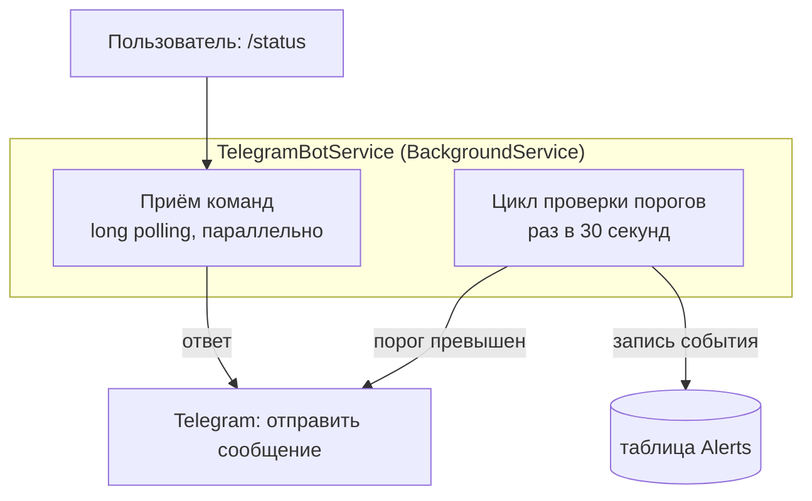
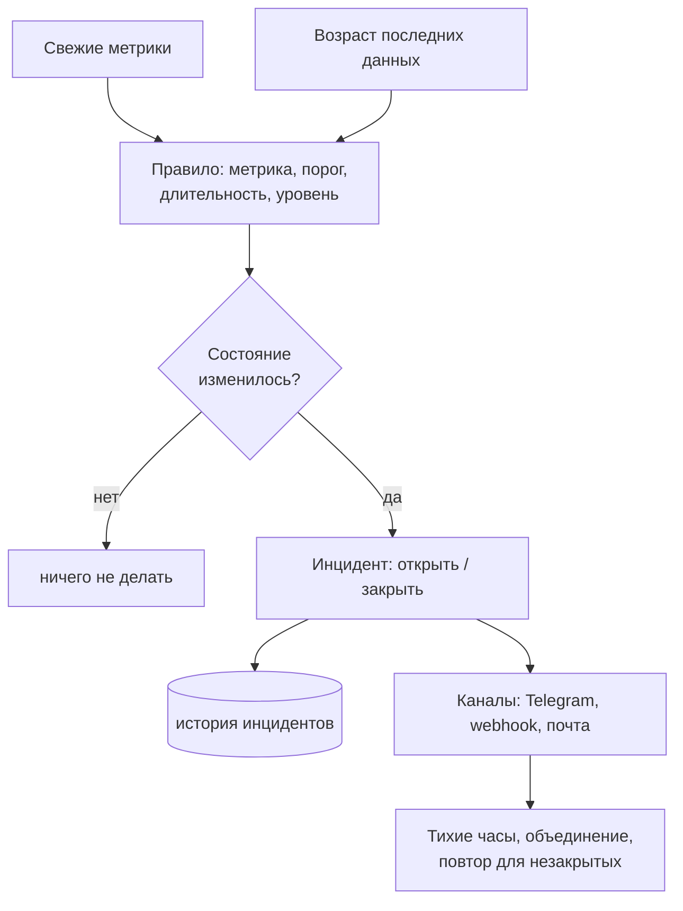

# Глава 07 — Telegram-бот и алертинг

Мониторинг без оповещений бесполезен: никто не смотрит на дашборд круглосуточно. За
оповещения отвечает
[`TelegramBotService`](../../ServerMonitor.Infrastructure/Telegram/TelegramBotService.cs) — он
же принимает команды.

В этой главе разбираем, как бот общается с Telegram, как устроена защита от спама
сообщениями — и почему нынешняя схема алертинга пропустит самую важную аварию.

---

## Часть 1. Две задачи в одном сервисе

Сервис делает две независимые вещи:



Обе задачи живут в одном классе, унаследованном от `BackgroundService` (глава 04). Цикл
проверки — это наш `while`, а приём команд запускается один раз и дальше крутится сам.

---

## Часть 2. Как бот разговаривает с Telegram

### Long polling

У Telegram Bot API два способа получать сообщения:

- **Webhook** — ты даёшь Telegram публичный HTTPS-адрес, и он сам присылает туда запросы.
  Требует, чтобы твой сервер был доступен из интернета и имел валидный сертификат.
- **Long polling** («длинный опрос») — ты сам спрашиваешь Telegram «есть что-нибудь новое?».
  Сервер **не отвечает сразу**, если новостей нет: держит соединение открытым до 30–50 секунд
  и отвечает, как только что-то появится. Затем клиент сразу спрашивает снова.

Мы используем второй вариант:

```csharp
var receiverOptions = new ReceiverOptions
{
    AllowedUpdates = new[] { UpdateType.Message }
};

_botClient.StartReceiving(
    updateHandler: HandleUpdateAsync,
    errorHandler: HandleErrorAsync,
    receiverOptions: receiverOptions,
    cancellationToken: stoppingToken);
```

> **Почему long polling — правильный выбор здесь.** Приложение работает на домашнем
> ноутбуке-сервере, у него нет постоянного публичного адреса и сертификата. Webhook потребовал
> бы туннеля или белого IP. Long polling работает откуда угодно: наружу идут только исходящие
> запросы, как из браузера.
>
> Приём почти бесплатный по трафику: одно висящее соединение вместо тысяч бессмысленных
> запросов «а сейчас?». Это тот же принцип, что и у SignalR в главе 06.

`AllowedUpdates` ограничивает подписку только текстовыми сообщениями — Telegram не будет
присылать события о вступлении в чаты, реакции и прочее, что нам не нужно.

Ключевое свойство `StartReceiving`: он **не блокирует**. Запускает опрос в фоне и сразу
возвращает управление, поэтому следом спокойно начинает работать цикл проверки порогов.

### Обработка команд

```csharp
private async Task HandleUpdateAsync(ITelegramBotClient bot, Update update, CancellationToken cancellationToken)
{
    if (update.Message is not { Text: { } messageText } message)
        return;

    var command = messageText.Split(' ')[0].ToLower();

    var response = command switch
    {
        "/start" => "👋 Welcome to Server Monitor!\n\nCommands:\n/status - current metrics\n/help - show commands",
        "/help" => "📋 <b>Commands</b>\n/status - current server metrics\n/help - show this help",
        "/status" => await GetStatusMessage(cancellationToken),
        _ => "Unknown command. Type /help for available commands."
    };

    try
    {
        await bot.SendMessage(message.Chat.Id, response, parseMode: ParseMode.Html, cancellationToken: cancellationToken);
    }
    catch (Exception ex)
    {
        _logger.LogError(ex, "Failed to reply to command.");
    }
}
```

Три языковые конструкции из главы 01 в одном месте:

1. **Сопоставление с шаблоном** — `is not { Text: { } messageText } message` отсеивает всё,
   что не является текстовым сообщением, и заодно достаёт текст.
2. **Switch-выражение** — таблица «команда → ответ». Обрати внимание, что одна из веток
   асинхронная (`await GetStatusMessage(...)`); это допустимо, но означает, что ветки не
   равноценны по стоимости: `/status` идёт в базу.
3. **`ParseMode.Html`** разрешает теги `<b>` в тексте — так получается жирный шрифт.

Обработка ошибок отправки на месте — если Telegram недоступен, сервис не упадёт.

> **Уязвимость.** Ответ отправляется на `message.Chat.Id` — то есть **тому, кто написал**.
> Проверки, что это разрешённый чат, нет. Любой, кто узнает имя бота, может отправить ему
> `/status` и получить метрики сервера: загрузку, объём памяти, заполненность диска. Для
> разведки перед атакой это ценные сведения.
>
> Исправляется одной строкой в начале обработчика:
> ```csharp
> if (message.Chat.Id.ToString() != _chatId)
>     return;
> ```
> Позже, при поддержке нескольких получателей, здесь появится список разрешённых чатов.

### Обработка ошибок опроса

```csharp
private Task HandleErrorAsync(ITelegramBotClient bot, Exception exception, CancellationToken cancellationToken)
{
    _logger.LogError(exception, "Telegram polling error.");
    return Task.CompletedTask;
}
```

Метод синхронный по сути, но обязан вернуть `Task` — таково требование библиотеки. Для этого
есть готовый **`Task.CompletedTask`** — уже завершённая задача. Создавать её через
`async`-метод было бы расточительно: компилятор построил бы конечный автомат ради ничего.

---

## Часть 3. Проверка порогов

### Цикл

```csharp
private async Task CheckMetricsAsync(CancellationToken cancellationToken)
{
    using var scope = _scopeFactory.CreateScope();
    var dbContext = scope.ServiceProvider.GetRequiredService<AppDbContext>();

    var settings = await dbContext.AppSettings.FirstOrDefaultAsync(cancellationToken);
    if (settings is null) return;
    if (!settings.AlertsEnabled) return;

    var latest = dbContext.MetricSnapshots
        .OrderByDescending(m => m.TimestampUtc)
        .FirstOrDefault();

    if (latest is null) return;

    var cpu = latest.CpuUsagePercent;
    var memory = latest.MemoryTotalMb > 0 ? latest.MemoryUsedMb / latest.MemoryTotalMb * 100 : 0;
    var disk = latest.DiskTotalGb > 0 ? latest.DiskUsedGb / latest.DiskTotalGb * 100 : 0;

    await CheckThreshold(dbContext, cpu, settings.CpuThreshold, "CPU",
        () => _cpuWasHigh, v => _cpuWasHigh = v, cancellationToken);
    ...
}
```

Знакомая структура: своя область для `AppDbContext` (глава 04), пороги читаются из базы, а не
из конфигурации — их можно менять на странице Settings без перезапуска.

Обрати внимание: проценты памяти и диска считаются **здесь заново**, той же формулой, что и в
`MetricsController.GetStatus` (глава 02). Логика продублирована в двух местах — если однажды
формула изменится, легко забыть про второе. Кандидат на вынос в общий метод.

### Гистерезис: защита от спама

Самое интересное. Наивная проверка «значение выше порога → отправить сообщение» слала бы
сообщение **каждые 30 секунд**, пока держится нагрузка. За час перегрузки — 120 сообщений.

Поэтому сервис помнит, было ли значение высоким на прошлой проверке:

```csharp
private bool _cpuWasHigh = false;
private bool _memoryWasHigh = false;
private bool _diskWasHigh = false;
```

и реагирует не на состояние, а на **переход** между состояниями:

```csharp
private async Task CheckThreshold(AppDbContext dbContext, double value, double threshold, string name,
    Func<bool> getWasHigh, Action<bool> setWasHigh, CancellationToken cancellationToken)
{
    bool isHigh = value > threshold;
    bool wasHigh = getWasHigh();

    if (isHigh && !wasHigh)
    {
        await SendAlert($"⚠️ <b>{name} Alert</b>\n{name} usage is high: <b>{value:F1}%</b> (threshold {threshold}%)", cancellationToken);
        await SaveAlert(dbContext, name, value, threshold, "Triggered", cancellationToken);
    }
    else if (!isHigh && wasHigh)
    {
        await SendAlert($"✅ <b>{name} Recovered</b>\n{name} usage back to normal: <b>{value:F1}%</b>", cancellationToken);
        await SaveAlert(dbContext, name, value, threshold, "Recovered", cancellationToken);
    }

    setWasHigh(isHigh);
}
```

Логика в виде таблицы:

| `wasHigh` | `isHigh` | Действие |
|-----------|----------|----------|
| нет | нет | ничего |
| нет | **да** | отправить «Alert», записать `Triggered` |
| **да** | да | ничего — уже сообщали |
| **да** | нет | отправить «Recovered», записать `Recovered` |

Такое отслеживание фронтов — базовый приём алертинга. Про делегаты `Func<bool>`/`Action<bool>`
в параметрах и о том, почему это не лучшее решение, подробно разобрано в главе 01.

### Запись события в базу

```csharp
private async Task SaveAlert(AppDbContext dbContext, string metricType, double value,
    double threshold, string alertType, CancellationToken cancellationToken)
{
    var alert = new Alert
    {
        TimestampUtc = DateTime.UtcNow,
        MetricType = metricType,
        Value = Math.Round(value, 1),
        Threshold = threshold,
        AlertType = alertType
    };

    dbContext.Alerts.Add(alert);
    await dbContext.SaveChangesAsync(cancellationToken);
}
```

Отсюда берутся записи для страницы Alerts. Поля `MetricType` и `AlertType` — обычные строки
(`"CPU"`, `"Triggered"`).

> **Стоит знать.** Строки в роли перечислений — распространённая слабость. Опечатка
> `"Trigered"` компилятор не остановит, а фронтенд сравнивает именно со строкой:
> ```razor
> <div class="alert-item @(alert.AlertType == "Triggered" ? "triggered" : "recovered")">
> ```
> Аккуратнее — объявить `enum AlertType { Triggered, Recovered }`; EF Core умеет хранить
> перечисления и как число, и как строку. Тогда опечатка станет ошибкой компиляции.

---

## Часть 4. Что не так с текущим алертингом

Самая полезная часть главы. Схема рабочая, но до продакшена ей далеко.

### 1. Не обнаруживается падение сервера

**Главная проблема.** Все проверки построены на «значение превысило порог». Но что произойдёт,
если машина выключится или сбор метрик сломается?

`latest` останется старым снимком с нормальными значениями. `isHigh` будет `false`, переходов
не случится, сообщений не будет. **Мониторинг молча замолчит, и это выглядит точно так же,
как «всё хорошо».**

Для системы мониторинга это худший из возможных сценариев: она не заметила аварию, ради
которой её и ставили.

Решение — **heartbeat**: отдельная проверка «когда приходил последний снимок». Если он старше
нескольких интервалов сбора — отправить «Сервер не отвечает», а при возобновлении —
«Восстановлен». Логика та же самая, что у `CheckThreshold`, только сравнивается не значение, а
возраст данных:

```csharp
var age = DateTime.UtcNow - latest.TimestampUtc;
bool isDown = age > TimeSpan.FromSeconds(60);
```

Это первая задача в списке доработок алертинга.

### 2. Состояние живёт только в памяти

Поля `_cpuWasHigh` и другие — обычные поля объекта. При перезапуске приложения они
сбрасываются в `false`.

Последствие: перезапустил сервис во время затянувшейся перегрузки — и получишь повторное
сообщение «CPU Alert» о том, о чём уже сообщали. А если сервис перезапустился, когда нагрузка
уже спала, сообщение «Recovered» не придёт вообще — переход потерян.

Правильнее хранить состояние там же, где данные: последний записанный `Alert` по каждой
метрике и есть текущее состояние. Достаточно при старте прочитать из базы последнюю запись по
каждому типу метрики.

### 3. Решение по одному замеру — будет дребезг

`value > threshold` проверяется по **единственному** последнему снимку. Загрузка процессора —
величина дёрганая: 91 %, 88 %, 92 %, 87 %… При пороге 90 % это даст цепочку
Alert → Recovered → Alert → Recovered — то самое «дребезжание» (flapping), от которого мы
пытались уйти.

Два стандартных лекарства, обычно применяемых вместе:

- **Подтверждение длительностью**: срабатывать только если превышение держится N проверок
  подряд (например, 3 раза по 30 секунд = полторы минуты).
- **Разные пороги для срабатывания и восстановления** (настоящий гистерезис): сработать при
  90 %, а «восстановиться» только ниже 80 %. Между ними — мёртвая зона, в которой состояние
  не меняется.

Сейчас порог для обоих переходов один и тот же, зазора нет вовсе.

### 4. Всего один канал и один уровень

- Оповещения умеют только в Telegram. Универсальный **webhook** (произвольный HTTP-запрос с
  JSON) закрыл бы разом Slack, Discord, PagerDuty и любые самописные приёмники.
- Нет градации: событие либо есть, либо нет. Обычно различают **warning** (обратить внимание)
  и **critical** (чинить немедленно) — с разными порогами и, возможно, разными каналами.
- Нет «тихих часов» и объединения: ночью десяток одинаковых сообщений подряд — верный способ
  приучить себя их игнорировать.

### 5. Мелочи

- `FirstOrDefault()` вместо `FirstOrDefaultAsync()` — синхронное ожидание базы в асинхронном
  методе (глава 03).
- Интервал проверки (30 секунд) зашит в код.
- Первое сообщение при старте («🟢 Server Monitor started») отправляется всегда — при частых
  перезапусках это шум.

---

## Часть 5. Как выглядел бы правильный алертинг

Чтобы был ориентир — вот к чему обычно приходят зрелые системы:



Три идеи, которых нам не хватает:

1. **Правило как данные, а не как код.** Сейчас три метрики жёстко прописаны тремя вызовами
   `CheckThreshold`. Если правила хранить в таблице (метрика, порог, длительность, уровень),
   добавление новой проверки не потребует изменения кода.
2. **Инцидент, а не событие.** Сейчас в базе лежат отдельные записи `Triggered` и `Recovered`,
   которые никак не связаны. Инцидент — это одна запись с началом и концом; тогда сразу видно
   «сколько длилась авария».
3. **Оповещение отделено от обнаружения.** Правило решает «что случилось», канал —
   «кому и как сказать». Сейчас эти вещи перемешаны внутри `CheckThreshold`.

---

## Что запомнить из главы

- Long polling — способ получать сообщения без публичного адреса: клиент сам держит соединение
  и ждёт ответа.
- `StartReceiving` не блокирует поток: приём команд и цикл проверки работают параллельно в
  одном сервисе.
- Алертинг должен реагировать на **переход** состояния, а не на само состояние — иначе
  сообщения посыплются с каждой проверкой.
- Состояние алертов, живущее только в памяти, теряется при перезапуске: дубли и потерянные
  «восстановления».
- Решение по одному замеру вызывает дребезг; лечится подтверждением длительности и разными
  порогами на срабатывание и восстановление.
- Пороговые проверки в принципе не видят падения узла — для этого нужен отдельный heartbeat.
- Бот отвечает любому, кто ему напишет: проверку `Chat.Id` нужно добавить.

Дальше: глава 08 — конфигурация и запуск: откуда берутся настройки, где хранить пароли и
токены и как поднять весь проект с нуля.
