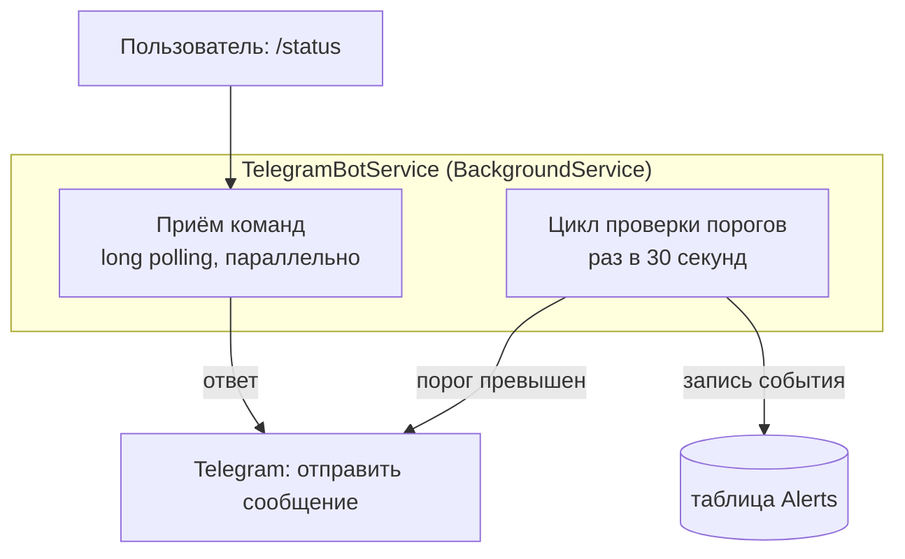
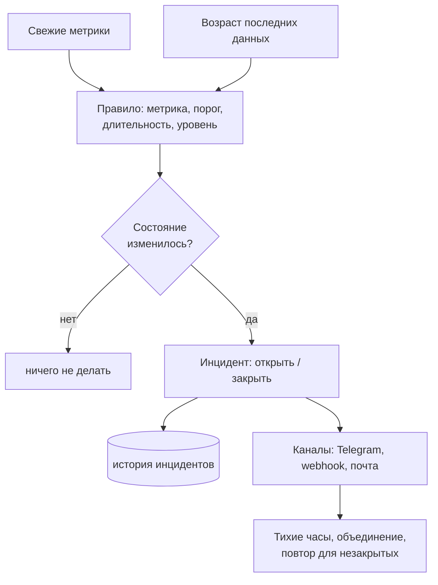

# Глава 07 — Telegram-бот и алертинг

Мониторинг без оповещений бесполезен: никто не смотрит на дашборд круглосуточно. За
оповещения отвечает
[`TelegramBotService`](../../ServerMonitor.Infrastructure/Telegram/TelegramBotService.cs) — он
же принимает команды.

В этой главе разбираем, как бот общается с Telegram, как устроена защита от спама
сообщениями — и почему нынешняя схема алертинга пропустит самую важную аварию.

> **Обновление после этапа heartbeat.** Описанная здесь схема «всё в одном сервисе» больше не
> действует. Проверка правил переехала в отдельный `AlertingService`, отправка — за интерфейс
> `IAlertChannel`, а `TelegramBotService` отвечает только на команды. Причина ровно та, о
> которой предупреждает конец этой главы: ранний выход при ненастроенном боте выключал заодно
> и проверку порогов. Всё, что здесь написано про long polling, гистерезис и состояние
> алертов, остаётся верным — поменялось то, **где** это живёт. Разбор новой схемы и самой
> проверки пропажи машин — в [главе 11](11-heartbeat-and-alerting.md).

---

## Часть 1. Две задачи в одном сервисе

Сервис делает две независимые вещи:



Обе задачи живут в одном классе, унаследованном от `BackgroundService` (глава 04). Цикл
проверки — это наш `while`, а приём команд запускается один раз и дальше крутится сам.

---

## Часть 2. Как бот разговаривает с Telegram

### Long polling

У Telegram Bot API два способа получать сообщения:

- **Webhook** — ты даёшь Telegram публичный HTTPS-адрес, и он сам присылает туда запросы.
  Требует, чтобы твой сервер был доступен из интернета и имел валидный сертификат.
- **Long polling** («длинный опрос») — ты сам спрашиваешь Telegram «есть что-нибудь новое?».
  Сервер **не отвечает сразу**, если новостей нет: держит соединение открытым до 30–50 секунд
  и отвечает, как только что-то появится. Затем клиент сразу спрашивает снова.

Мы используем второй вариант:

```csharp
var receiverOptions = new ReceiverOptions
{
    AllowedUpdates = new[] { UpdateType.Message }
};

_botClient.StartReceiving(
    updateHandler: HandleUpdateAsync,
    errorHandler: HandleErrorAsync,
    receiverOptions: receiverOptions,
    cancellationToken: stoppingToken);
```

> **Почему long polling — правильный выбор здесь.** Приложение работает на домашнем
> ноутбуке-сервере, у него нет постоянного публичного адреса и сертификата. Webhook потребовал
> бы туннеля или белого IP. Long polling работает откуда угодно: наружу идут только исходящие
> запросы, как из браузера.
>
> Приём почти бесплатный по трафику: одно висящее соединение вместо тысяч бессмысленных
> запросов «а сейчас?». Это тот же принцип, что и у SignalR в главе 06.

`AllowedUpdates` ограничивает подписку только текстовыми сообщениями — Telegram не будет
присылать события о вступлении в чаты, реакции и прочее, что нам не нужно.

Ключевое свойство `StartReceiving`: он **не блокирует**. Запускает опрос в фоне и сразу
возвращает управление, поэтому следом спокойно начинает работать цикл проверки порогов.

### Обработка команд

```csharp
private async Task HandleUpdateAsync(ITelegramBotClient bot, Update update, CancellationToken cancellationToken)
{
    if (update.Message is not { Text: { } messageText } message)
        return;

    // Отвечаем только в настроенный чат.
    if (!string.Equals(message.Chat.Id.ToString(), _chatId, StringComparison.Ordinal))
    {
        _logger.LogWarning("Ignored command from unauthorized chat {ChatId}.", message.Chat.Id);
        return;
    }

    var command = messageText.Split(' ')[0].ToLower();

    var response = command switch
    {
        "/start" => "👋 Welcome to Server Monitor!\n\nCommands:\n/status - current metrics\n/help - show commands",
        "/help" => "📋 <b>Commands</b>\n/status - current server metrics\n/help - show this help",
        "/status" => await GetStatusMessage(cancellationToken),
        _ => "Unknown command. Type /help for available commands."
    };

    try
    {
        await bot.SendMessage(message.Chat.Id, response, parseMode: ParseMode.Html, cancellationToken: cancellationToken);
    }
    catch (Exception ex)
    {
        _logger.LogError(ex, "Failed to reply to command.");
    }
}
```

Три языковые конструкции из главы 01 в одном месте:

1. **Сопоставление с шаблоном** — `is not { Text: { } messageText } message` отсеивает всё,
   что не является текстовым сообщением, и заодно достаёт текст.
2. **Switch-выражение** — таблица «команда → ответ». Обрати внимание, что одна из веток
   асинхронная (`await GetStatusMessage(...)`); это допустимо, но означает, что ветки не
   равноценны по стоимости: `/status` идёт в базу.
3. **`ParseMode.Html`** разрешает теги `<b>` в тексте — так получается жирный шрифт.

Обработка ошибок отправки на месте — если Telegram недоступен, сервис не упадёт.

> **Здесь была уязвимость.** Проверки чата не было вовсе: ответ уходил на `message.Chat.Id`,
> то есть **тому, кто написал**. Любой, кто узнал бы имя бота, мог отправить `/status` и
> получить метрики сервера: загрузку, объём памяти, заполненность диска. Для разведки перед
> атакой это ценные сведения.
>
> Сейчас команды от посторонних чатов игнорируются, а попытка записывается в журнал с
> уровнем `Warning` — так видно, что бота кто-то нашёл. Позже, при поддержке нескольких
> получателей, одиночная проверка превратится в список разрешённых чатов.

### Обработка ошибок опроса

```csharp
private Task HandleErrorAsync(ITelegramBotClient bot, Exception exception, CancellationToken cancellationToken)
{
    _logger.LogError(exception, "Telegram polling error.");
    return Task.CompletedTask;
}
```

Метод синхронный по сути, но обязан вернуть `Task` — таково требование библиотеки. Для этого
есть готовый **`Task.CompletedTask`** — уже завершённая задача. Создавать её через
`async`-метод было бы расточительно: компилятор построил бы конечный автомат ради ничего.

---

## Часть 3. Проверка порогов

### Цикл

```csharp
private async Task CheckMetricsAsync(CancellationToken cancellationToken)
{
    using var scope = _scopeFactory.CreateScope();
    var dbContext = scope.ServiceProvider.GetRequiredService<AppDbContext>();

    var settings = await dbContext.AppSettings.FirstOrDefaultAsync(cancellationToken);

    if (settings is null || !settings.AlertsEnabled)
    {
        return;
    }

    var latest = await dbContext.MetricSnapshots
        .AsNoTracking()
        .OrderByDescending(m => m.TimestampUtc)
        .FirstOrDefaultAsync(cancellationToken);

    if (latest is null)
    {
        return;
    }

    await CheckThresholdAsync(dbContext, MetricKind.Cpu, latest.CpuUsagePercent, settings.CpuThreshold, cancellationToken);
    await CheckThresholdAsync(dbContext, MetricKind.Memory, latest.MemoryUsagePercent, settings.MemoryThreshold, cancellationToken);
    await CheckThresholdAsync(dbContext, MetricKind.Disk, latest.DiskUsagePercent, settings.DiskThreshold, cancellationToken);
}
```

Знакомая структура: своя область для `AppDbContext` (глава 04), пороги читаются из базы, а не
из конфигурации — их можно менять на странице Settings без перезапуска.

Обрати внимание на `latest.MemoryUsagePercent`: раньше проценты считались **здесь заново**,
той же формулой, что и в контроллере, — одна логика в двух местах. Теперь это вычисляемое
свойство сущности (главы 02 и 03), и формула существует в единственном экземпляре.

### Гистерезис: защита от спама

Самое интересное. Наивная проверка «значение выше порога → отправить сообщение» слала бы
сообщение **каждые 30 секунд**, пока держится нагрузка. За час перегрузки — 120 сообщений.

Поэтому сервис помнит состояние по каждой метрике:

```csharp
private readonly Dictionary<MetricKind, MetricAlertState> _states = new()
{
    [MetricKind.Cpu] = new MetricAlertState(),
    [MetricKind.Memory] = new MetricAlertState(),
    [MetricKind.Disk] = new MetricAlertState()
};

private sealed class MetricAlertState
{
    public bool IsAlerting { get; set; }              // тревога открыта, повторять не надо
    public int ConsecutiveHighSamples { get; set; }   // сколько проверок подряд выше порога
}
```

> **Как было раньше.** Вместо словаря лежали три отдельных поля `_cpuWasHigh`,
> `_memoryWasHigh`, `_diskWasHigh`, а в метод проверки они передавались **парой делегатов** —
> «прочитать это поле» и «записать в это поле» (`Func<bool>` и `Action<bool>`, разбор в
> главе 01). Приём рабочий, но сигнатура метода разрасталась, и добавление четвёртой метрики
> означало новое поле плюс новую пару лямбд. Со словарём достаточно одной строки.

Проверка реагирует не на состояние, а на **переход** между состояниями:

```csharp
private async Task CheckThresholdAsync(
    AppDbContext dbContext, MetricKind kind, double value, double threshold,
    CancellationToken cancellationToken)
{
    var state = _states[kind];
    var name = kind.ToDisplayName();

    if (value > threshold)
    {
        state.ConsecutiveHighSamples++;

        // Одиночный всплеск не поднимает тревогу: нужно несколько превышений подряд.
        if (!state.IsAlerting && state.ConsecutiveHighSamples >= _options.RequiredConsecutiveSamples)
        {
            state.IsAlerting = true;
            await SendAlertAsync($"⚠️ <b>{name} Alert</b> ...", cancellationToken);
            await SaveAlertAsync(dbContext, kind, value, threshold, AlertKind.Triggered, cancellationToken);
        }
    }
    else
    {
        state.ConsecutiveHighSamples = 0;

        if (state.IsAlerting)
        {
            state.IsAlerting = false;
            await SendAlertAsync($"✅ <b>{name} Recovered</b> ...", cancellationToken);
            await SaveAlertAsync(dbContext, kind, value, threshold, AlertKind.Recovered, cancellationToken);
        }
    }
}
```

Логика в виде таблицы:

| Тревога открыта | Значение выше порога | Действие |
|-----------------|----------------------|----------|
| нет | нет | сбросить счётчик |
| нет | да, но подряд меньше N раз | увеличить счётчик, молчать |
| нет | да, N раз подряд | отправить «Alert», записать `Triggered` |
| да | да | ничего — уже сообщали |
| да | нет | отправить «Recovered», записать `Recovered` |

Счётчик подряд идущих превышений — это защита от **дребезга** (flapping). Загрузка процессора
дёргается: 91 %, 88 %, 92 %, 87 %… При пороге 90 % и реакции по одному замеру получалась бы
цепочка Alert → Recovered → Alert → Recovered. Требование трёх подряд превышений (значение
настраивается в конфигурации) означает, что тревога поднимается, только если нагрузка
действительно держится.

### Состояние переживает перезапуск

Словарь живёт в памяти, а значит при перезапуске приложения обнулился бы: о продолжающейся
аварии сообщили бы второй раз, а «восстановление» после перезапуска потерялось бы совсем.
Поэтому при старте состояние восстанавливается из журнала алертов:

```csharp
foreach (var kind in _states.Keys)
{
    var lastAlert = await dbContext.Alerts
        .AsNoTracking()
        .Where(a => a.MetricType == kind)
        .OrderByDescending(a => a.TimestampUtc)
        .FirstOrDefaultAsync(cancellationToken);

    if (lastAlert is not null)
    {
        _states[kind].IsAlerting = lastAlert.AlertType == AlertKind.Triggered;
    }
}
```

Идея простая: последняя запись по метрике и есть её текущее состояние. Если последним было
`Triggered` — тревога всё ещё открыта. База уже хранит нужные данные, отдельная таблица
состояний не понадобилась.

### Запись события в базу

```csharp
private async Task SaveAlertAsync(AppDbContext dbContext, MetricKind metricType, double value,
    double threshold, AlertKind alertType, CancellationToken cancellationToken)
{
    var alert = new Alert
    {
        TimestampUtc = DateTime.UtcNow,
        MetricType = metricType,
        Value = Math.Round(value, 1),
        Threshold = threshold,
        AlertType = alertType
    };

    dbContext.Alerts.Add(alert);
    await dbContext.SaveChangesAsync(cancellationToken);
}
```

Отсюда берутся записи для страницы Alerts.

> **Здесь были «магические строки».** Поля `MetricType` и `AlertType` раньше объявлялись как
> `string`, и в коде передавались литералы `"CPU"`, `"Triggered"`. Опечатку `"Trigered"`
> компилятор не остановил бы, а фронтенд сравнивает именно со строкой:
> ```razor
> <div class="alert-item @(alert.AlertType == "Triggered" ? "triggered" : "recovered")">
> ```
> Сейчас это перечисления `MetricKind` и `AlertKind` (глава 03): опечатка стала ошибкой
> компиляции. В базе значения по-прежнему хранятся строками — за перевод отвечает конвертер
> значений EF Core, поэтому старые записи читаются без миграции данных, а контракт API не
> изменился: наружу по-прежнему уходят те же строки.

---

## Часть 4. Что не так с текущим алертингом

Самая полезная часть главы. Схема рабочая, но до продакшена ей далеко.

### 1. Не обнаруживается падение сервера

**Главная проблема.** Все проверки построены на «значение превысило порог». Но что произойдёт,
если машина выключится или сбор метрик сломается?

`latest` останется старым снимком с нормальными значениями. `isHigh` будет `false`, переходов
не случится, сообщений не будет. **Мониторинг молча замолчит, и это выглядит точно так же,
как «всё хорошо».**

Для системы мониторинга это худший из возможных сценариев: она не заметила аварию, ради
которой её и ставили.

Решение — **heartbeat**: отдельная проверка «когда приходил последний снимок». Если он старше
нескольких интервалов сбора — отправить «Сервер не отвечает», а при возобновлении —
«Восстановлен». Логика та же самая, что у `CheckThreshold`, только сравнивается не значение, а
возраст данных:

```csharp
var age = DateTime.UtcNow - latest.TimestampUtc;
bool isDown = age > TimeSpan.FromSeconds(60);
```

Это первая задача в списке доработок алертинга.

### 2. ~~Состояние живёт только в памяти~~ — исправлено

Поля `_cpuWasHigh` и другие были обычными полями объекта и при перезапуске сбрасывались в
`false`. Последствия: перезапустил сервис во время затянувшейся перегрузки — получил повторное
сообщение о том, о чём уже сообщали; а если перезапуск пришёлся на момент, когда нагрузка уже
спала, сообщение «Recovered» не приходило вовсе — переход терялся.

Теперь состояние восстанавливается из таблицы `Alerts` при старте (см. часть 3): последняя
запись по метрике и есть её текущее состояние. Отдельного хранилища не понадобилось.

### 3. ~~Решение по одному замеру — дребезг~~ — исправлено наполовину

`value > threshold` проверялось по **единственному** последнему снимку, и на дёрганой метрике
это давало цепочку Alert → Recovered → Alert → Recovered.

Из двух стандартных лекарств применено первое:

- **Подтверждение длительностью** — сделано: тревога поднимается только если превышение
  держится N проверок подряд (`Monitoring:AlertConsecutiveSamples`, по умолчанию 3 — это
  полторы минуты при интервале 30 секунд).
- **Разные пороги для срабатывания и восстановления** (настоящий гистерезис с мёртвой зоной:
  сработать при 90 %, «восстановиться» ниже 80 %) — пока не сделано. Это потребует второго
  порога в настройках и на странице Settings, поэтому отложено до этапа доработки алертинга.

### 4. Всего один канал и один уровень

- Оповещения умеют только в Telegram. Универсальный **webhook** (произвольный HTTP-запрос с
  JSON) закрыл бы разом Slack, Discord, PagerDuty и любые самописные приёмники.
- Нет градации: событие либо есть, либо нет. Обычно различают **warning** (обратить внимание)
  и **critical** (чинить немедленно) — с разными порогами и, возможно, разными каналами.
- Нет «тихих часов» и объединения: ночью десяток одинаковых сообщений подряд — верный способ
  приучить себя их игнорировать.

### 5. Мелочи

- ~~`FirstOrDefault()` вместо `FirstOrDefaultAsync()`~~ — исправлено, везде асинхронные
  вызовы с передачей токена (глава 03).
- ~~Интервал проверки зашит в код~~ — исправлено, читается из секции `Monitoring`.
- Первое сообщение при старте («🟢 Server Monitor started») отправляется всегда — при частых
  перезапусках это шум. Осталось как есть: для домашнего сервера скорее полезно, чем мешает.

---

## Часть 5. Как выглядел бы правильный алертинг

Чтобы был ориентир — вот к чему обычно приходят зрелые системы:



Три идеи, которых нам не хватает:

1. **Правило как данные, а не как код.** Сейчас три метрики жёстко прописаны тремя вызовами
   `CheckThreshold`. Если правила хранить в таблице (метрика, порог, длительность, уровень),
   добавление новой проверки не потребует изменения кода.
2. **Инцидент, а не событие.** Сейчас в базе лежат отдельные записи `Triggered` и `Recovered`,
   которые никак не связаны. Инцидент — это одна запись с началом и концом; тогда сразу видно
   «сколько длилась авария».
3. **Оповещение отделено от обнаружения.** Правило решает «что случилось», канал —
   «кому и как сказать». Сейчас эти вещи перемешаны внутри `CheckThreshold`.

---

## Что запомнить из главы

- Long polling — способ получать сообщения без публичного адреса: клиент сам держит соединение
  и ждёт ответа.
- `StartReceiving` не блокирует поток: приём команд и цикл проверки работают параллельно в
  одном сервисе.
- Алертинг должен реагировать на **переход** состояния, а не на само состояние — иначе
  сообщения посыплются с каждой проверкой.
- Состояние алертов нельзя держать только в памяти: при перезапуске получаются дубли и
  потерянные «восстановления». У нас оно восстанавливается из журнала алертов.
- Решение по одному замеру вызывает дребезг; лечится подтверждением длительности (сделано) и
  разными порогами на срабатывание и восстановление (пока нет).
- Пороговые проверки в принципе не видят падения узла — для этого нужен отдельный heartbeat.
  Это по-прежнему главный пробел алертинга.
- Бот должен отвечать только в разрешённый чат — иначе `/status` раздаёт метрики сервера
  любому желающему.

Дальше: глава 08 — конфигурация и запуск: откуда берутся настройки, где хранить пароли и
токены и как поднять весь проект с нуля.
