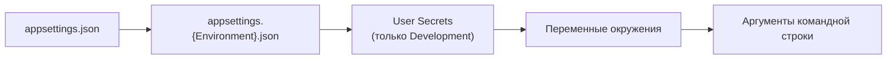

# Глава 08 — Конфигурация и запуск

Последняя глава по существующему коду: откуда приложение берёт настройки, где место паролям и
токенам, чем отличаются профили запуска и как поднять весь проект с нуля на чистой машине.

---

## Часть 1. Система конфигурации

### Несколько источников, один интерфейс

В .NET конфигурация собирается из нескольких источников в **единый набор пар «ключ —
значение»**. Коду безразлично, откуда пришло значение:

```csharp
builder.Configuration["Telegram:BotToken"]
builder.Configuration.GetConnectionString("DefaultConnection")
```

Двоеточие в ключе — разделитель уровней вложенности. То есть `Telegram:BotToken` — это:

```json
{ "Telegram": { "BotToken": "..." } }
```

### Порядок источников

`WebApplication.CreateBuilder(args)` подключает источники в строгом порядке, и **каждый
следующий перекрывает предыдущий**:



Практический смысл: одно и то же значение можно задать в файле для разработки и переопределить
переменной окружения на сервере, ничего не пересобирая.

### Окружение

Какой именно `appsettings.{Environment}.json` подхватится, решает переменная окружения
**`ASPNETCORE_ENVIRONMENT`**. Стандартные значения — `Development`, `Staging`, `Production`.
Если переменная не задана, считается `Production`.

От окружения зависит поведение кода — мы видели это дважды:

```csharp
// Api: документация только в разработке
if (app.Environment.IsDevelopment())
{
    app.MapOpenApi();
    app.MapScalarApiReference();
}

// Web: подробные ошибки в разработке, аккуратная страница в проде
if (!app.Environment.IsDevelopment())
{
    app.UseExceptionHandler("/Error", createScopeForErrors: true);
    app.UseHsts();
}
```

---

## Часть 2. Что где лежит в нашем проекте

| Настройка | Где хранится | Комментарий |
|-----------|--------------|-------------|
| Строка подключения к БД | `ServerMonitor.Api/appsettings.json` | **лежит в git вместе с паролем** |
| Токен и chat ID Telegram | User Secrets | правильно: вне репозитория |
| Адрес API для Web | `ServerMonitor.Web/appsettings.json` | не секрет, всё в порядке |
| Порты, профили запуска | `Properties/launchSettings.json` | только для разработки |
| Интервалы сбора и проверки | **зашиты в код** | стоит вынести в конфигурацию |

### Строка подключения

```json
"ConnectionStrings": {
  "DefaultConnection": "Host=localhost;Port=5432;Database=servermonitor;Username=monitor;Password=..."
}
```

Строка подключения — это набор параметров через точку с запятой: адрес сервера, порт, имя
базы, пользователь, пароль. Формат специфичен для провайдера (у Npgsql свой набор ключей).

> **Слабое место, и это самое серьёзное в главе.** Файл `appsettings.json` **отслеживается
> git**, то есть пароль от базы попал в историю репозитория. Если репозиторий когда-нибудь
> станет публичным (а он задуман как портфолио!), пароль окажется в открытом доступе —
> вместе со всей историей коммитов, откуда его не удалить простым редактированием файла.
>
> Что делать:
> 1. Убрать пароль из `appsettings.json`, оставив там безопасный шаблон без секрета.
> 2. Положить реальную строку в User Secrets — ровно так, как уже сделано с токеном бота.
> 3. На сервере задавать её переменной окружения.
> 4. Сменить пароль в самой базе, раз прежний уже попал в историю.
>
> Хорошая новость: с токеном Telegram всё сделано правильно с самого начала — в файлах
> `appsettings*.json` его нет, только в секретах. Значит, механизм тебе знаком, осталось
> применить его и здесь.

### User Secrets

**User Secrets** — хранилище настроек для разработки **вне папки проекта**. Привязка задаётся
в [`ServerMonitor.Api.csproj`](../../ServerMonitor.Api/ServerMonitor.Api.csproj):

```xml
<UserSecretsId>4566d9f2-9131-40f2-a0f0-b29d097dbddd</UserSecretsId>
```

По этому идентификатору .NET ищет файл:

```
%APPDATA%\Microsoft\UserSecrets\4566d9f2-.../secrets.json     (Windows)
~/.microsoft/usersecrets/4566d9f2-.../secrets.json            (Linux/macOS)
```

Файл лежит в профиле пользователя, поэтому физически не может попасть в репозиторий. Именно
там находятся `Telegram:BotToken` и `Telegram:ChatId`.

Работа из командной строки:

```bash
dotnet user-secrets set "Telegram:BotToken" "12345:ABC..." --project ServerMonitor.Api
```

```bash
dotnet user-secrets list --project ServerMonitor.Api
```

Важное ограничение: User Secrets работают **только в окружении Development**. Это сделано
намеренно — на сервере секреты должны приходить из переменных окружения или из специального
хранилища (Azure Key Vault, HashiCorp Vault, Docker secrets).

### Переменные окружения

Вложенность в имени переменной обозначается **двойным подчёркиванием**:

```bash
ConnectionStrings__DefaultConnection="Host=...;Password=..."
Telegram__BotToken="12345:ABC..."
ASPNETCORE_ENVIRONMENT=Production
```

(Двоеточие в именах переменных окружения не работает в Linux-оболочках, отсюда `__`.)

Это основной способ передачи настроек в контейнеры и в systemd-юниты.

---

## Часть 3. `launchSettings.json` — только для разработки

Файл [`ServerMonitor.Api/Properties/launchSettings.json`](../../ServerMonitor.Api/Properties/launchSettings.json)
описывает **профили запуска**: как именно `dotnet run` или IDE должны стартовать проект.

```json
"profiles": {
  "http":  { "applicationUrl": "http://localhost:5241", ... },
  "https": { "applicationUrl": "https://localhost:7212;http://localhost:5241", ... }
}
```

Отсюда берутся наши порты:

| Проект | http | https |
|--------|------|-------|
| `ServerMonitor.Api` | 5241 | 7212 |
| `ServerMonitor.Web` | 5298 | 7047 |

Профиль выбирается ключом:

```bash
dotnet run --project ServerMonitor.Api --launch-profile https
```

Ключевое, что нужно понимать: **на сервере этот файл не используется вообще**. Он существует
только для удобства разработки; в опубликованном приложении адреса задаются переменной
`ASPNETCORE_URLS` или ключом `--urls`.

Именно поэтому Web-приложение ищет API по адресу `https://localhost:7212` — так записано в его
`appsettings.json`, и это совпадает с профилем `https` у API. Запустишь API с профилем `http`
— интерфейс перестанет получать данные, хотя оба приложения работают.

---

## Часть 4. Как поднять проект с нуля

Полная последовательность на чистой машине.

### 1. Что нужно установить

- **.NET SDK 10** — проверка: `dotnet --version`.
- **PostgreSQL** — локально или в Docker.
- **Инструмент EF Core** (один раз на машину):
  ```bash
  dotnet tool install --global dotnet-ef
  ```

### 2. База данных

Создать базу и пользователя, совпадающих со строкой подключения:

```sql
CREATE DATABASE servermonitor;
CREATE USER monitor WITH PASSWORD 'ваш_пароль';
GRANT ALL PRIVILEGES ON DATABASE servermonitor TO monitor;
```

### 3. Секреты

```bash
dotnet user-secrets set "ConnectionStrings:DefaultConnection" "Host=localhost;Port=5432;Database=servermonitor;Username=monitor;Password=ваш_пароль" --project ServerMonitor.Api
```

```bash
dotnet user-secrets set "Telegram:BotToken" "токен_от_BotFather" --project ServerMonitor.Api
```

Токен получают у бота `@BotFather` в Telegram, `ChatId` — у `@userinfobot`. Без этих настроек
приложение работает, просто без оповещений (глава 04).

### 4. Схема базы

```bash
dotnet ef database update --project ServerMonitor.Infrastructure --startup-project ServerMonitor.Api
```

Команда создаст все таблицы и вставит строку настроек с порогами 90 % (глава 03).

### 5. Сертификат для локального HTTPS

```bash
dotnet dev-certs https --trust
```

Одноразовое действие: создаёт и делает доверенным сертификат для `localhost`. Без него браузер
будет ругаться на `https://localhost:7047`.

### 6. Запуск

Два приложения, два терминала:

```bash
dotnet run --project ServerMonitor.Api --launch-profile https
```

```bash
dotnet run --project ServerMonitor.Web --launch-profile https
```

Открыть `https://localhost:7047/dashboard`. Первые несколько секунд метрик ещё нет — сбор идёт
раз в 6 секунд (глава 04), и до первого снимка страница покажет состояние загрузки.

Проверить API отдельно можно на `https://localhost:7212/scalar/v1` (глава 02).

---

## Часть 5. Как это делают на сервере

Наш способ запуска — для разработки. Кратко о том, к чему стоит прийти.

### Публикация

```bash
dotnet publish -c Release -o ./publish
```

Собирает приложение в режиме Release со всеми зависимостями. На сервере достаточно
установленного Runtime, SDK не нужен.

### Настройки через окружение

```bash
export ASPNETCORE_ENVIRONMENT=Production
export ASPNETCORE_URLS="http://localhost:5000"
export ConnectionStrings__DefaultConnection="Host=...;Password=..."
export Telegram__BotToken="..."
```

### Автозапуск

На Linux приложение оформляют как **systemd-юнит**: он поднимает процесс при загрузке машины,
перезапускает при падении и собирает логи в `journald`. Для домашнего сервера — самый простой
и надёжный вариант.

### Docker Compose

Ещё удобнее — описать всю систему одним файлом: PostgreSQL, API и Web как три сервиса с общей
сетью. Тогда развёртывание на новой машине сводится к `docker compose up`, а строка подключения
указывает не на `localhost`, а на имя сервиса базы. Это одна из запланированных задач.

### Чего не хватает для эксплуатации

- **Эндпоинт проверки здоровья** (`/healthz`), который отвечает «жив» и заодно проверяет, что
  свежие метрики поступают (глава 04).
- **Миграции как отдельный шаг развёртывания**, а не ручная команда (глава 03).
- **Обратный прокси** (nginx или Caddy) с настоящим TLS-сертификатом, если сервис смотрит
  наружу.
- **Аутентификация** — до открытия наружу это обязательное условие (глава 02).

---

## Что запомнить из главы

- Конфигурация собирается из нескольких источников по цепочке, где каждый следующий
  перекрывает предыдущий: файлы → секреты → переменные окружения → аргументы.
- Разделитель уровней — двоеточие в коде и двойное подчёркивание в переменных окружения.
- `ASPNETCORE_ENVIRONMENT` определяет и файл настроек, и поведение кода (документация,
  страницы ошибок).
- User Secrets хранят секреты вне проекта и работают только в Development — токен Telegram у
  нас лежит правильно, а пароль от базы всё ещё в `appsettings.json` под git.
- `launchSettings.json` существует только для разработки; на сервере адреса задаются через
  `ASPNETCORE_URLS`.
- Развёртывание с нуля: SDK → база → секреты → `dotnet ef database update` → сертификат →
  запуск двух приложений.

---

## Итог первой части гайда

На этом разобран весь существующий код проекта:

| Глава | Что закрыла |
|-------|-------------|
| [00](00-project-map.md) | архитектура и путь данных |
| [01](01-csharp-and-dotnet.md) | язык C# и платформа |
| [02](02-aspnet-core.md) | веб-слой, DI, контроллеры |
| [03](03-ef-core-and-postgres.md) | работа с базой |
| [04](04-background-services.md) | фоновые процессы |
| [05](05-metrics-collection.md) | взаимодействие с ОС |
| [06](06-blazor-server.md) | интерфейс |
| [07](07-telegram-and-alerting.md) | оповещения |
| 08 | конфигурация и запуск |

Найденные по ходу слабые места собраны в один список — он же черновик плана работ:

**Безопасность**
- пароль от базы в `appsettings.json` под git (глава 08);
- API без аутентификации, `UseAuthorization()` вхолостую (глава 02);
- бот отвечает любому собеседнику (глава 07).

**Корректность**
- разбор `/proc/uptime` без инвариантной культуры (глава 05);
- CPU в Windows считается неточно и дорого (глава 05);
- диск выбирается «первый попавшийся» (глава 05);
- `async void` без `try/catch` в `TopNav` (главы 01, 06).

**Надёжность мониторинга**
- падение узла не обнаруживается — нет heartbeat (глава 07);
- состояние алертов теряется при перезапуске (глава 07);
- дребезг на границе порога (глава 07).

**Производительность и данные**
- нет индекса по `TimestampUtc` (глава 03);
- нет срока хранения и прореживания истории (глава 03);
- синхронные обращения к базе в фоновых сервисах (главы 03, 07).

**Чистота кода**
- `GetLatest` отдаёт сущность вместо DTO (глава 02);
- формула процентов продублирована в двух местах (глава 07);
- строки вместо перечислений в типах алертов (глава 07);
- интервалы зашиты в код (главы 04, 08);
- нет ни одного теста (глава 05).

Следующие главы будут появляться по мере развития проекта: агент и мульти-сервер, heartbeat,
аутентификация, срок хранения данных.
