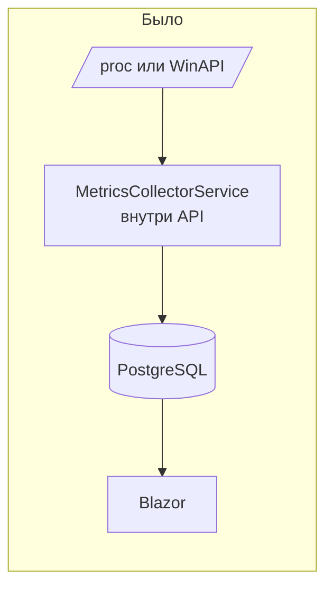
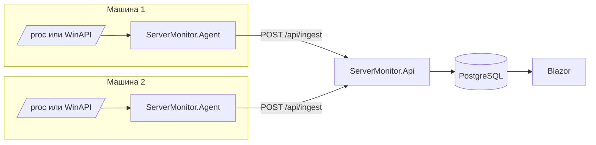
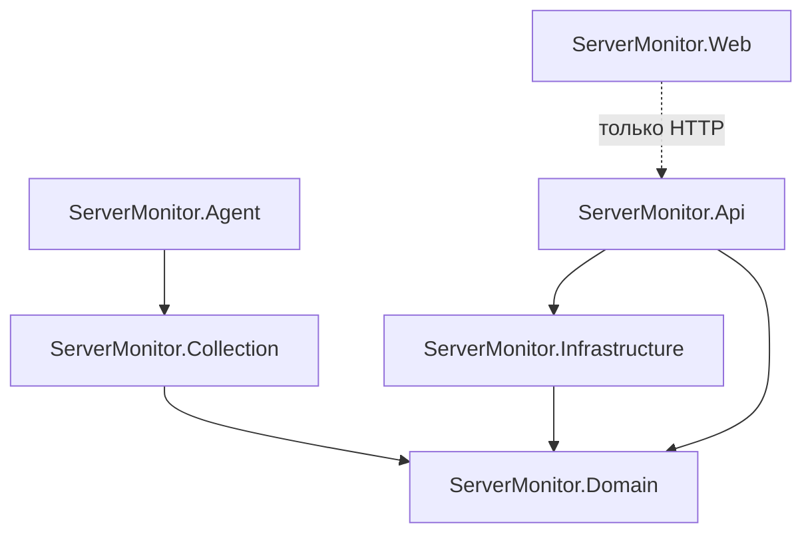
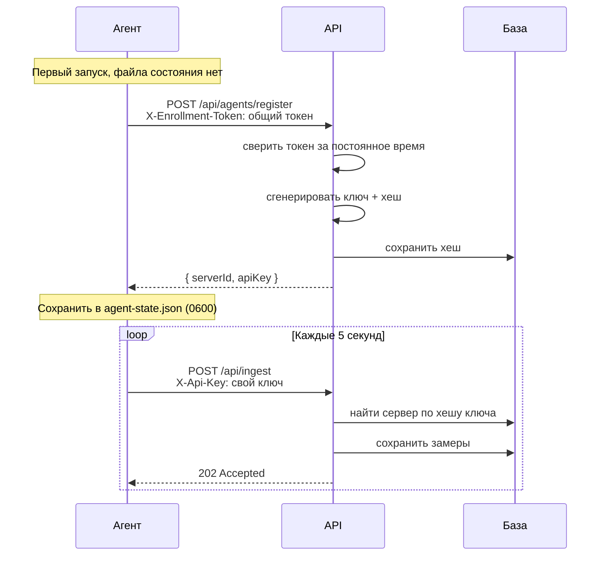
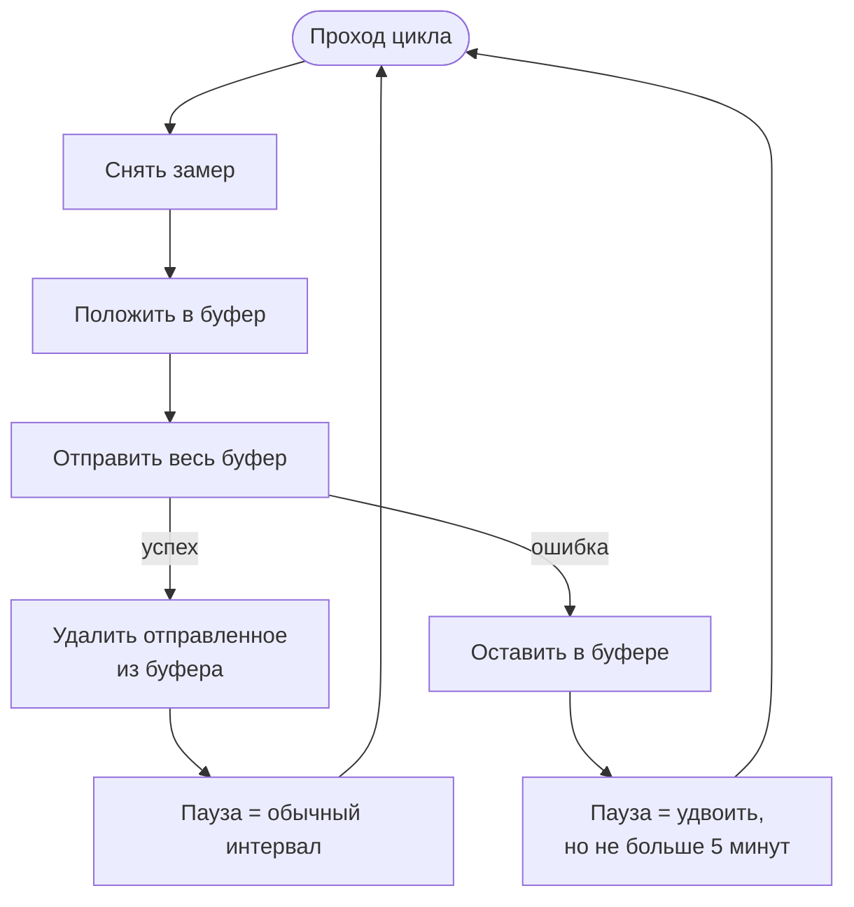

# Глава 10 — Агент и мульти-сервер

До этого этапа у проекта было одно ограничение, из-за которого он оставался учебным: он умел
следить **только за той машиной, на которой сам запущен**. Фоновый сервис внутри API читал
`/proc` или звал Windows API, складывал результат в базу и отдавал его же на экран. Поставить
такое на десять серверов нельзя — получится десять независимых мониторингов с десятью базами.

Этот этап убирает ограничение. Сбор метрик уезжает в отдельную программу — **агента
(agent)**, которая ставится на каждую машину и шлёт замеры в один центральный API. Появляется
понятие **парка (fleet)** — списка машин, за которыми мы следим.

Глава разбирает всё, что для этого понадобилось: новый проект, новую сущность в базе,
миграцию, которая не потеряла месяц истории, два разных вида секретов, буфер на случай обрыва
связи и переделанный интерфейс.

---

## Часть 1. Что поменялось в целом

### 1.1. Путь одного числа: было и стало

В главе 00 путь числа от железа до экрана укладывался в один процесс. Теперь он проходит
через сеть:





Главное отличие не в стрелках, а в **направлении инициативы**. API больше ничего не
собирает — он только принимает, хранит и отдаёт. Инициатива у агента: это он решает, когда
снять замер и когда его отправить.

> **Почему так, а не наоборот.** Мониторинг бывает двух видов: **pull** — центральный сервер
> сам ходит по машинам и опрашивает их, и **push** — машины сами шлют данные в центр.
> Prometheus работает по pull, наш агент — по push.
>
> Push выбран потому, что он не требует, чтобы центральный сервер **мог достучаться** до
> каждой машины. Агент за домашним роутером, в другой сети, за NAT — ему достаточно уметь
> открыть исходящее соединение наружу. При pull пришлось бы пробрасывать порты на каждой
> наблюдаемой машине, что для «небольшого парка на коленке» неприемлемо.
>
> Цена push — центральный сервер не отличает «машина здорова и молчит» от «машина умерла».
> Именно поэтому появилось вычисляемое состояние по свежести данных (раздел 5.2), а полноценное
> обнаружение падения вынесено в отдельный этап (heartbeat).

### 1.2. Новая карта проектов

Проектов стало семь:

| Проект | Роль | От кого зависит |
|--------|------|-----------------|
| `ServerMonitor.Domain` | Сущности и правила предметной области | ни от кого |
| `ServerMonitor.Collection` | **Новый.** Снятие метрик с машины | Domain |
| `ServerMonitor.Agent` | **Новый.** Программа для наблюдаемой машины | Collection |
| `ServerMonitor.Infrastructure` | БД, миграции, Telegram | Domain |
| `ServerMonitor.Api` | HTTP: приём и отдача | Infrastructure, Domain |
| `ServerMonitor.Web` | Интерфейс на Blazor | ничего из бэкенда |
| `ServerMonitor.Tests` | Тесты | почти всё |



Обрати внимание на то, чего на схеме **нет**: от `Agent` не идёт стрелка в `Infrastructure`.
Это сделано намеренно.

> **Почему `Collection` — отдельный проект.** Раньше классы сбора лежали в `Infrastructure`
> рядом с `AppDbContext`. Если бы агент сослался на `Infrastructure`, он утащил бы за собой
> EF Core, драйвер Npgsql и клиент Telegram — всё, что этому проекту нужно для работы с базой.
>
> Агенту не нужно ничего из этого: он не ходит в базу, он шлёт HTTP-запрос. Каждая лишняя
> зависимость — это лишние мегабайты в дистрибутиве, который придётся ставить на каждую
> наблюдаемую машину, и лишняя поверхность для уязвимостей в пакетах.
>
> Приём называется **выделением общего ядра**: код, нужный двум сторонам, выносится в
> отдельный проект, от которого зависят обе, вместо того чтобы одна зависела от другой целиком.

Файлы переехали как есть, поменялась одна строка в каждом — пространство имён:

```csharp
namespace ServerMonitor.Collection;
```

---

## Часть 2. Сущность Server

### 2.1. Поля и зачем каждое

[`ServerMonitor.Domain/Entities/Server.cs`](../../ServerMonitor.Domain/Entities/Server.cs):

```csharp
public class Server
{
    public int Id { get; set; }
    public Guid PublicId { get; set; }
    public string Name { get; set; } = string.Empty;
    public string? OperatingSystem { get; set; }
    public string? AgentVersion { get; set; }
    public string ApiKeyHash { get; set; } = string.Empty;
    public DateTime RegisteredAtUtc { get; set; }
    public DateTime? LastSeenUtc { get; set; }
}
```

`MetricSnapshot` и `Alert` получили по одному новому полю — `ServerId`. Теперь каждый замер и
каждое событие знают, к какой машине относятся.

### 2.2. Два идентификатора вместо одного

Самое неочевидное здесь — **зачем машине два идентификатора**, `Id` и `PublicId`.

`Id` — обычный автоинкремент, по нему построены связи внутри базы. Он компактный (4 байта),
индексы по нему быстрые, соединения таблиц дешёвые.

`PublicId` — `Guid`, и наружу отдаётся только он: в адресах страниц (`/servers/{guid}`), в
маршрутах API, в ответе на регистрацию.

> **Почему так.** Последовательный идентификатор в публичном адресе — это утечка. Увидев
> `/servers/3`, любой понимает, что серверов у нас максимум несколько штук, и может перебрать
> `/servers/1`, `/servers/2` и так далее. Это называется **перечислимостью (enumeration)**.
>
> Для мониторинга количество машин — не государственная тайна, но правило общее: **внутренние
> ключи не должны появляться в публичных адресах**. В интернет-магазине по такому же перебору
> считают количество заказов, в SaaS — количество клиентов.
>
> `Guid` (128 бит случайности) перебрать нельзя. Платим за это местом в базе и чуть более
> медленным индексом — цена, которую почти всегда стоит заплатить.

Перевод одного в другой делается в одном месте — [`MetricsController.ResolveServerIdAsync`](../../ServerMonitor.Api/Controllers/MetricsController.cs):

```csharp
private async Task<int?> ResolveServerIdAsync(Guid publicId, CancellationToken cancellationToken)
{
    return await _dbContext.Servers
        .AsNoTracking()
        .Where(s => s.PublicId == publicId)
        .Select(s => (int?)s.Id)
        .FirstOrDefaultAsync(cancellationToken);
}
```

Обрати внимание на приведение `(int?)s.Id`. Без него `FirstOrDefaultAsync` для `int` вернул
бы `0` и для «сервер не найден», и для «сервер с Id = 0» — а различить эти случаи обязательно.
С `int?` отсутствие даёт `null`, и проверка `if (serverId is null)` честная.

---

## Часть 3. Миграция, которая не потеряла историю

К моменту этого этапа в базе лежал **2021 замер** — месяц наблюдений за реальной машиной.
Задача миграции была не «добавить таблицу», а «добавить таблицу, ничего не потеряв».

### 3.1. Почему автоматическая миграция сломалась бы

Команда `dotnet ef migrations add AddServers` сгенерировала бы такой порядок действий:

1. создать таблицу `Servers` (пустую);
2. добавить в `MetricSnapshots` колонку `ServerId` со значением по умолчанию `0`;
3. создать внешний ключ `MetricSnapshots.ServerId → Servers.Id`.

Третий шаг упал бы: в таблице 2021 строка со значением `ServerId = 0`, а сервера с `Id = 0` не
существует. **Внешний ключ (foreign key)** — это обещание базе, что значение в колонке
действительно указывает на существующую строку другой таблицы; база проверяет обещание при
создании ключа и не даёт его нарушить.

### 3.2. Как это решено

В [миграцию](../../ServerMonitor.Infrastructure/Migrations/20260906184346_AddServers.cs) вписан
кусок SQL — **между** созданием таблицы и созданием внешних ключей:

```csharp
migrationBuilder.Sql("""
    INSERT INTO "Servers" ("PublicId", "Name", "ApiKeyHash", "RegisteredAtUtc")
    VALUES (gen_random_uuid(), 'this-machine', '', now());

    UPDATE "MetricSnapshots" SET "ServerId" = (SELECT MIN("Id") FROM "Servers");
    UPDATE "Alerts" SET "ServerId" = (SELECT MIN("Id") FROM "Servers");
    """);
```

Порядок: создать таблицу → **завести одну запись** → привязать к ней все старые данные →
только потом создать внешний ключ. Теперь обещание выполнимо, и ключ создаётся.

Такой шаг называется **backfill** — заполнение задним числом. Он неизбежен всякий раз, когда
в существующую таблицу добавляется обязательная связь.

> **Почему имя `'this-machine'`, а не `Environment.MachineName`.** Миграция — это статический
> SQL, который выполнится на **любой** машине, где развернут проект. Подставив туда имя моего
> компьютера, я записал бы «DESKTOP-5FCP59V» в базу каждого, кто склонирует репозиторий.
> Имя-заглушка честнее: оно очевидно временное.

### 3.3. Правило усыновления

Запись `'this-machine'` — временная: у неё нет ключа (`ApiKeyHash` пустой), и она не
соответствует никакому настоящему агенту. Когда на той же машине запустится агент, он должен
**занять эту запись**, а не создать вторую — иначе месяц истории останется висеть на пустышке,
а новые замеры пойдут на новую строку.

[`AgentsController`](../../ServerMonitor.Api/Controllers/AgentsController.cs) делает это так:

```csharp
var orphans = await _dbContext.Servers
    .Where(s => s.ApiKeyHash == string.Empty)
    .ToListAsync(cancellationToken);

if (orphans.Count == 1)
{
    server = orphans[0];
    server.Name = request.Hostname;
    // ...
    server.ApiKeyHash = hash;
}
else
{
    server = new Server { /* ... */ };
    _dbContext.Servers.Add(server);
}
```

Условие именно `== 1`, а не `>= 1`. Если бесхозных записей окажется несколько, непонятно,
какую из них усыновлять, и правильнее не гадать, а завести новую.

**Проверка сработала:** после первого запуска агента запись получила настоящее имя машины, ОС
и версию агента, а число привязанных к ней замеров осталось прежним — 2021.

---

## Часть 4. Два вида секретов

Здесь важно не перепутать две разные вещи, обе из которых — «секрет».

| | Токен установки (enrollment token) | Ключ агента (API key) |
|---|---|---|
| Сколько | Один на всю установку | Свой у каждой машины |
| Когда используется | Только при первой регистрации | При каждой отправке замеров |
| Где хранится на сервере | В конфигурации (User Secrets) | В базе, **только хеш** |
| Где хранится у агента | В конфигурации, до регистрации | В файле `agent-state.json` |
| Если утёк | Чужой может зарегистрировать машину | Чужой может слать данные от имени одной машины |

Схема обмена:



### 4.1. Почему ключ хешируется, а хеш — быстрый

[`ApiKeyGenerator`](../../ServerMonitor.Infrastructure/Agents/ApiKeyGenerator.cs):

```csharp
public static (string Key, string Hash) Generate()
{
    var bytes = RandomNumberGenerator.GetBytes(32);
    var key = Convert.ToBase64String(bytes).TrimEnd('=').Replace('+', '-').Replace('/', '_');

    return (key, Hash(key));
}

public static string Hash(string key)
{
    var hash = SHA256.HashData(Encoding.UTF8.GetBytes(key));
    return Convert.ToHexString(hash);
}
```

Ключ показывается **один раз** — в ответе на регистрацию. В базе остаётся только хеш, поэтому
утечка дампа базы не даёт возможности слать данные за чужую машину.

Дальше — тонкость, которая часто становится вопросом на собеседовании.

> **Почему для паролей нужен bcrypt, а здесь достаточно SHA-256.**
>
> Пароль придумывает человек, и энтропии в нём мало: `qwerty123`, `Лето2026!`. По хешу такого
> пароля работает **перебор по словарю** — атакующий хеширует миллионы вероятных вариантов и
> сравнивает. Защита от этого — **намеренно медленный** хеш (bcrypt, scrypt, Argon2): если
> одна проверка занимает 100 мс, миллион вариантов займёт больше суток.
>
> Наш ключ — это 32 байта из криптографического генератора случайных чисел, то есть 256 бит
> энтропии. Словаря вероятных значений не существует: перебор здесь равносилен перебору всего
> пространства, а это заведомо невыполнимо при любой скорости хеширования. Медленный хеш не
> добавил бы стойкости, но добавил бы задержку **на каждый входящий запрос** — а их приходит по
> одному в пять секунд с каждой машины.
>
> Правило: **медленный хеш нужен там, где секрет придумал человек.** Там, где секрет
> сгенерирован машиной и достаточно длинный, быстрый хеш корректен.

### 4.2. Сравнение за постоянное время

```csharp
public static bool FixedTimeEquals(string left, string right)
{
    var leftBytes = Encoding.UTF8.GetBytes(left);
    var rightBytes = Encoding.UTF8.GetBytes(right);

    return CryptographicOperations.FixedTimeEquals(leftBytes, rightBytes);
}
```

Обычное сравнение строк (`==`) останавливается на первом несовпавшем символе. Значит, время
ответа зависит от того, сколько символов угадано: подобрав первый символ верно, атакующий
получит ответ на микросекунды позже. Это **атака по времени (timing attack)**, и по такой
разнице секрет восстанавливается посимвольно.

`CryptographicOperations.FixedTimeEquals` всегда проходит все байты и возвращает результат за
одинаковое время независимо от того, где именно разошлись данные.

> **Слабое место.** Токен установки один и не имеет срока жизни. В настоящем продукте он был
> бы одноразовым или живущим 10 минут, а ключ агента можно было бы отозвать и перевыпустить.
> Сейчас единственный способ отозвать доступ машины — удалить её из парка.

---

## Часть 5. Агент

### 5.1. Рабочий цикл

[`AgentWorker`](../../ServerMonitor.Agent/AgentWorker.cs) — это `BackgroundService` (глава 04),
но живущий в отдельном процессе. Один проход цикла:



Ключевой фрагмент:

```csharp
var pending = _buffer.Snapshot();

await _client.SendAsync(state.ApiKey, pending, stoppingToken);

// Убираем ровно отправленное: за время запроса мог добавиться новый замер.
_buffer.Remove(pending.Count);
```

Комментарий здесь важнее кода. Соблазнительно после успешной отправки написать
`_buffer.Clear()` — и это была бы ошибка. Отправка идёт по сети и занимает время; если она
затянулась, за это время в буфер мог попасть **новый** замер, которого в отправленной пачке не
было. `Clear()` выбросил бы его молча.

> **Правило.** Удаляй ровно то, что подтверждено, а не «всё, что было». Это общий принцип
> работы с очередями: подтверждение (acknowledgement) относится к конкретным элементам.

### 5.2. Буфер: почему выбрасывается самый старый

[`MetricBuffer`](../../ServerMonitor.Agent/MetricBuffer.cs) — очередь ограниченного размера:

```csharp
public void Add(MetricReport report)
{
    lock (_sync)
    {
        while (_items.Count >= _capacity)
        {
            _items.Dequeue();
        }

        _items.Enqueue(report);
    }
}
```

Ёмкость по умолчанию — 720 замеров, то есть примерно час при интервале 5 секунд. Когда буфер
полон, выбрасывается **самый старый** элемент.

> **Почему так.** Возможных стратегий две: отказываться принимать новое или выбрасывать
> старое. Для мониторинга ответ однозначен: если связь пропала на сутки, ценность имеет
> последний час, а не первый. Инженер, разбирающий аварию, смотрит на то, что было перед
> падением, а не на то, что было в начале обрыва.
>
> В очереди задач на выполнение было бы наоборот — там терять старые задачи нельзя.

`lock` нужен потому, что теоретически к буферу могут обратиться из разных потоков. Здесь
используется тип `Lock` из .NET 9 — специальный тип для блокировок, пришедший на смену
`lock (object)`.

> **Слабое место — закрыто позже.** ~~Буфер живёт **в памяти**. Если агента перезапустить, пока
> связи нет, накопленные замеры пропадут.~~ Ограничение было названо верно, а оценка «для
> домашнего парка избыточно» — нет: сервер лежит и машина перезагружается **вместе** гораздо чаще,
> чем по отдельности, и это ровно тот случай, ради которого буфер вообще существует. Разбор — в
> разделе 5.2.1.

### 5.2.1. Буфер на диске

Недоставленные замеры пишутся в `agent-buffer.json` рядом с `agent-state.json` и подхватываются
при следующем запуске. Три решения здесь стоят внимания.

**Запись через временный файл.**

```csharp
await using (var stream = File.Create(temporaryPath)) { ... }

File.Move(temporaryPath, _path, overwrite: true);
```

Переименование внутри одного каталога **атомарно**: либо оно произошло, либо нет. Сериализация
прямо в целевой файл такого свойства не имеет — падение на середине оставило бы **обрезанный
JSON**. И это худший из возможных исходов: файл есть, выглядит нормально, а при следующем старте
не читается. Приём общий и называется *write-temp-then-rename*; так пишут конфиги, базы и всё,
что должно пережить внезапную остановку.

**Нечитаемый файл удаляется, а не роняет агента.**

```csharp
catch (Exception ex) when (ex is JsonException or IOException or UnauthorizedAccessException)
```

Потерять час буферизованных замеров — небольшой вред. Агент, который из-за них не стартует, — это
машина, за которой **вообще никто не следит**, и вред несопоставимо больший. Общее правило:
спрашивай не «что тут может испортиться», а «что будет хуже — потерять это или остановиться».

**Запись не чаще раза в 30 секунд.** На каждый замер — это запись на диск каждые пять секунд для
файла, который почти всегда пуст: доступный сервер опустошает буфер сразу. Только при остановке —
это покрывает штатное завершение и пропускает пропадание питания, то есть как раз тот случай, ради
которого всё делалось. Полминуты стоят дёшево и ограничивают потерю теми же полминутой.

Отдельно: **пустой буфер удаляет файл сразу**, не дожидаясь интервала. Оставшийся файл заставил бы
следующий запуск переслать замеры, которые сервер уже принял.

И маленькая деталь, на которой легко обжечься: сохранение при остановке получает **неотменённый**
токен. Штатный `stoppingToken` к этому моменту уже отменён, и передать его значило бы отменить ту
самую запись, ради которой всё это написано.

### 5.3. Растущая пауза

```csharp
retryDelay = sent
    ? _options.CollectInterval
    : Min(retryDelay + retryDelay, _options.MaxRetryDelay);
```

При успехе пауза возвращается к обычным 5 секундам. При неудаче — удваивается: 5, 10, 20, 40…
до потолка в 5 минут.

Это **экспоненциальная выдержка (exponential backoff)**. Смысл в том, чтобы не добивать
сервер, которому и так плохо. Если бы сто агентов продолжали стучаться каждые 5 секунд в
перезагружающийся API, они мешали бы ему подняться — этот эффект называется **штормом
повторов (retry storm)**.

К выдержке добавлено **дрожание (jitter)** — случайный разброс паузы на ±20%:

```csharp
private static TimeSpan WithJitter(TimeSpan delay)
{
    var factor = 0.8 + Random.Shared.NextDouble() * 0.4;

    return TimeSpan.FromMilliseconds(delay.TotalMilliseconds * factor);
}
```

> **Зачем.** Без него агенты, потерявшие связь одновременно, и повторять будут одновременно —
> синхронным залпом ровно в тот момент, когда сервер пытается подняться. Случайный разброс
> превращает залп в поток.

> **Тонкость, на которой легко ошибиться.** Дрожать должна **фактическая пауза**, а не база
> удвоения:
>
> ```csharp
> retryDelay = Min(retryDelay + retryDelay, _options.MaxRetryDelay);
> await Task.Delay(WithJitter(retryDelay), stoppingToken);
> ```
>
> Если записать дрогнувшее значение обратно в `retryDelay`, случайность попадёт в основу
> следующего удвоения, и кривая выдержки уплывёт от задуманной. Я именно так и написал в первой
> версии, и заметил только перечитывая.

### 5.4. Состояние агента

```csharp
public async Task SaveAsync(string path, CancellationToken cancellationToken)
{
    await using (var stream = File.Create(path))
    {
        await JsonSerializer.SerializeAsync(stream, this, cancellationToken: cancellationToken);
    }

    if (!RuntimeInformation.IsOSPlatform(OSPlatform.Windows))
    {
        File.SetUnixFileMode(path, UnixFileMode.UserRead | UnixFileMode.UserWrite);
    }
}
```

Файл `agent-state.json` хранит выданные `ServerId` и `ApiKey`. Он обязан пережить
перезапуск: без него агент зарегистрировался бы заново и завёл бы **вторую запись** для той же
машины.

`UnixFileMode.UserRead | UnixFileMode.UserWrite` — это права `600`: читать и писать может
только владелец файла. На Linux, где на машине бывает много пользователей, это существенно; на
Windows права наследуются от каталога, поэтому шаг пропускается.

---

## Часть 6. Приём и отдача данных

### 6.1. Приём: почему пачкой и почему 202

[`IngestController`](../../ServerMonitor.Api/Controllers/IngestController.cs) принимает **список**
замеров, а не один:

```csharp
public async Task<IActionResult> Ingest(
    [FromBody] List<MetricReportDto> readings,
    [FromHeader(Name = "X-Api-Key")] string? apiKey,
    CancellationToken cancellationToken)
```

Причина прямо связана с буфером: после часового обрыва агенту нужно отправить 720 замеров, и
делать это 720 отдельными запросами расточительно. Ограничение `MaxBatchSize = 1000` защищает
сервер от слишком больших пачек.

Ответ — `202 Accepted`, а не `200 OK`.

> **Почему.** `200 OK` означает «запрос выполнен, вот результат». `202 Accepted` — «принято к
> обработке». Разница смысловая: агенту не нужен результат, ему нужно знать, что данные
> приняты и можно чистить буфер.

Ещё одна деталь:

```csharp
TimestampUtc = DateTime.SpecifyKind(reading.TimestampUtc, DateTimeKind.Utc),
```

`DateTime` после разбора JSON приходит с `Kind = Unspecified`, а Npgsql для колонки
`timestamp with time zone` требует явного `Utc` и иначе бросает исключение. `SpecifyKind` не
меняет само значение — он только проставляет пометку «это UTC».

### 6.2. Отдача: вложенные маршруты

Маршрут чтения метрик переехал:

```csharp
[Route("api/servers/{publicId:guid}/metrics")]
```

Было `api/metrics/status`, стало `api/servers/{guid}/metrics/status`.

> **Почему так.** Адрес в REST описывает **ресурс**, а не действие. Замер не существует сам по
> себе — он всегда чей-то. Вложенность прямо выражает эту принадлежность, и по адресу видно,
> о какой машине речь.
>
> Альтернатива — оставить `api/metrics?serverId=...`. Формально работает, но параметр запроса
> обычно означает **фильтр** необязательного характера, а здесь принадлежность обязательна:
> запроса «метрики вообще» больше не существует.

Алерты устроены иначе — и намеренно:

```csharp
[HttpGet]
public async Task<ActionResult<List<AlertDto>>> GetAlerts(
    [FromQuery] int count = 50,
    [FromQuery] Guid? serverId = null,
    ...
```

Алерты остались на `api/alerts` с **необязательным** фильтром. Вопрос «где вообще что-то
сломалось» относится ко всему парку сразу, и заставлять выбирать машину заранее — значит
сделать самый частый сценарий неудобным.

Здесь же появилось соединение с таблицей серверов, чтобы в общем списке было видно имя машины:

```csharp
var query = from alert in _dbContext.Alerts.AsNoTracking()
            join server in _dbContext.Servers.AsNoTracking() on alert.ServerId equals server.Id
            select new { Alert = alert, server.Name, server.PublicId };
```

Событие «CPU превысил порог» без указания машины бесполезно — непонятно, куда идти.

### 6.3. Состояние машины считается, а не хранится

[`ServerHealthCalculator`](../../ServerMonitor.Domain/Entities/ServerHealth.cs):

```csharp
public static readonly TimeSpan StaleAfter = TimeSpan.FromMinutes(1);
public static readonly TimeSpan OfflineAfter = TimeSpan.FromMinutes(5);

public static ServerHealth FromLastSeen(DateTime? lastSeenUtc, DateTime nowUtc)
{
    if (lastSeenUtc is null) return ServerHealth.Offline;

    var age = nowUtc - lastSeenUtc.Value;

    if (age > OfflineAfter) return ServerHealth.Offline;
    if (age > StaleAfter) return ServerHealth.Stale;

    return ServerHealth.Online;
}
```

Состояние **не хранится в базе** — оно вычисляется из возраста последнего замера в момент
запроса.

> **Почему так.** Хранимое состояние надо кем-то обновлять, и это отдельный фоновый процесс,
> который сам может встать. Вычисляемое состояние не может «протухнуть»: если машина замолчала,
> возраст последнего замера растёт сам собой, и ответ меняется без чьего-либо участия.
>
> Правило шире: **если значение выводится из других данных, выводи его, а не дублируй.**
> Хранить стоит то, что нельзя вычислить.

Функция чистая — принимает время явным параметром `nowUtc`, а не читает `DateTime.UtcNow`
внутри. Именно поэтому её удалось покрыть тестами
([`ServerHealthTests`](../../ServerMonitor.Tests/Domain/ServerHealthTests.cs)): в тесте
«сейчас» задаётся константой, и результат не зависит от момента запуска.

---

## Часть 7. Интерфейс: парк машин

### 7.1. Строки, а не плитки

Главная страница [`Fleet.razor`](../../ServerMonitor.Web/Components/Pages/Fleet.razor) — список
машин, по строке на каждую: точка состояния, имя, ОС и версия агента, три текущих значения с
полосками, спарклайн загрузки CPU и возраст последнего замера.

> **Почему строки.** Плитки хорошо смотрятся, пока машин две-три, и разваливаются на двадцати.
> Строка читается одинаково при любом количестве и позволяет сравнивать значения по вертикали —
> глазу легко пробежать колонку CPU сверху вниз.

Машина, от которой давно нет данных, **гасится**: имя и значения приглушаются, спарклайн
блёкнет, метка состояния становится красной.

> **Почему это важнее, чем кажется.** Если у молчащей машины оставить обычные яркие числа, они
> читаются как актуальные. Человек смотрит на «CPU 4%» и делает вывод, что всё хорошо, — хотя
> на самом деле это последнее, что успело прийти два часа назад. Интерфейс обязан визуально
> отличать «данные свежие» от «данные застыли».

### 7.2. Навигация следует за данными

[`TopNav`](../../ServerMonitor.Web/Components/Layout/TopNav.razor) меняется в зависимости от
того, где находится пользователь. Снаружи машины: `Fleet | Alerts | Settings`. Внутри машины
добавляются её собственные разделы: `Fleet | Dashboard | History | Alerts | Settings`.

Определяется это разбором адреса:

```csharp
private Guid? ReadServerId()
{
    var path = Nav.ToBaseRelativePath(Nav.Uri);
    var segments = path.Split('/', StringSplitOptions.RemoveEmptyEntries);

    if (segments.Length >= 2 &&
        segments[0].Equals("servers", StringComparison.OrdinalIgnoreCase) &&
        Guid.TryParse(segments[1], out var id))
    {
        return id;
    }

    return null;
}
```

> **Почему не выпадающий список машин в шапке.** Такой вариант выглядит проще, но опаснее:
> выпадашка маленькая и находится далеко от графика. Легко посмотреть на график и не заметить,
> что выбрана другая машина. При навигации разделами имя машины стоит в заголовке страницы
> крупно — перепутать нельзя.

### 7.3. Переиспользование компонента и `OnParametersSetAsync`

Тонкость Blazor, на которой легко ошибиться. При переходе с `/servers/A` на `/servers/B`
Blazor **не создаёт компонент заново** — меняется только параметр маршрута. Поэтому
`OnInitializedAsync` не сработает второй раз, и на экране останутся данные предыдущей машины.

Правильное место — `OnParametersSetAsync`:

```csharp
protected override async Task OnParametersSetAsync()
{
    if (loadedId == PublicId)
    {
        return;
    }

    loadedId = PublicId;

    // Чужие показания на новой странице мелькнуть не должны, поэтому чистим состояние.
    hasLoaded = false;
    server = null;
    status = null;
    history = new();

    await LoadDataAsync();
    // ...
}
```

Проверка `loadedId == PublicId` обязательна: `OnParametersSetAsync` вызывается при **каждом**
изменении параметров, в том числе при обычной перерисовке. Без неё компонент перезагружал бы
данные бесконечно.

### 7.4. Удаление под подтверждением

Удаление машины каскадом сносит все её замеры и алерты. Поэтому кнопка живёт на странице самой
машины, а не в списке, и требует **ввести имя машины**:

```razor
<input id="confirmName" class="confirm-input" ... />
<button class="danger-btn" disabled="@(confirmName != server.Name)" @onclick="DeleteServerAsync">
    Delete permanently
</button>
```

> **Правило.** Сложность подтверждения должна быть соразмерна ущербу. Для обратимого действия
> хватит кнопки, для необратимого — осознанного действия, которое нельзя выполнить случайно.
> Ввод имени именно таков: промахнуться мышью можно, случайно набрать `DESKTOP-5FCP59V` — нет.

Проверка повторяется и в обработчике, не только в разметке:

```csharp
if (server is null || confirmName != server.Name)
{
    return;
}
```

Атрибут `disabled` — подсказка интерфейса, а не защита. Состояние могло измениться между
отрисовкой и щелчком, да и разметку в браузере никто не мешает поправить.

---

## Часть 8. Дефекты этапа

Как и в главе 09, добавление сущности вскрыло ошибки — на этот раз одинаковые по природе.

### 8.1. Замеры перестали сохраняться

**Было.** После миграции старый `MetricsCollectorService` внутри API продолжал работать и
создавать `MetricSnapshot` **без** `ServerId`, то есть с нулём. Внешний ключ такие записи не
пропускал:

```
fail: MetricsCollectorService[0] Error while collecting metrics.
23503: insert or update on table "MetricSnapshots" violates foreign key
constraint "FK_MetricSnapshots_Servers_ServerId"
```

**Чем плохо, помимо очевидного.** Ошибка ловилась и уходила в лог, поэтому API продолжал
работать как ни в чём не бывало. Снаружи всё выглядело исправным — данные-то шли, их присылал
агент. Дефект был виден только в логах, куда никто не смотрит, пока не сломается.

**Стало.** Сервис удалён целиком: агент полностью его заменяет, а собирать метрики о машине,
на которой случайно оказался API, — изначально неправильная форма для мониторинга парка.

> **Правило.** `catch (Exception)`, который только пишет в лог и продолжает работу, превращает
> поломку в невидимую. Такой обработчик уместен там, где сбой действительно не важен; во всех
> остальных случаях нужно либо падать, либо отдавать наружу признак нездоровья.

### 8.2. Алерты не сохранялись — та же ошибка

**Было.** `SaveAlertAsync` создавал `Alert` без `ServerId`. Внешний ключ отклонял каждую
вставку, алерты не попадали в базу вообще — с момента миграции.

**Стало.** Поле проставляется:

```csharp
var alert = new Alert
{
    ServerId = serverId,
    // ...
};
```

> **Наблюдение.** Один и тот же дефект возник в двух местах, потому что причина была общая:
> у сущности появилось обязательное поле, а все места её создания не проверили. Найдя такую
> ошибку в одном месте, ищи `new ИмяСущности` по всему решению — это заняло бы одну команду
> `grep` и сэкономило бы неделю невидимой поломки.

### 8.3. Состояние тревог было общим на весь парк

Дефект тоньше предыдущих и появился бы не сразу.

**Было.** Состояние тревоги хранилось по метрике:

```csharp
private readonly Dictionary<MetricKind, MetricAlertState> _states = ...
```

Плюс сама проверка брала **глобально последний** замер, без привязки к машине.

**Чем плохо.** При одной машине это работало. При двух — вердикт для всего парка выносила та
машина, что успела отчитаться последней, а восстановление на одном сервере гасило бы тревогу
другого. Классический случай, когда код «работает», пока данные не станут разнообразнее.

**Стало.** Ключом стала пара, а проверка обходит все машины:

```csharp
private readonly Dictionary<(int ServerId, MetricKind Kind), MetricAlertState> _states = new();
```

Плюс машины, которые молчат дольше порога, пропускаются — судить о нагрузке по устаревшему
замеру бессмысленно.

> **Правило.** Когда сущность из единственной становится множественной, проверь **всё
> состояние в памяти**, связанное с ней. Данные в базе защищает внешний ключ, а поля и словари
> в коде не защищает никто — компилятор такую ошибку не увидит.

### 8.4. Имя машины уходило в HTML без экранирования

Мелочь, замеченная попутно. Имя машины приходит от агента, то есть **снаружи**, а уходит в
сообщение Telegram с `parseMode: Html`. Имя с символом `<` сломало бы разметку сообщения.

```csharp
private static string Escape(string value) =>
    value.Replace("&", "&amp;").Replace("<", "&lt;").Replace(">", "&gt;");
```

> **Правило.** Данные, пришедшие извне, экранируются перед подстановкой в любой язык разметки —
> HTML, SQL, командную строку. Здесь риск невелик, но привычка проверять источник данных важнее
> оценки конкретного случая.

---

## Часть 9. Что осталось слабым

Честный список того, что этот этап не закрыл.

**Нет обнаружения падения.** Мы видим, что машина замолчала, только если открыть экран парка.
Уведомления о пропаже нет — это следующий этап (heartbeat).

**Алертинг привязан к Telegram.** Проверка порогов запускается внутри `TelegramBotService`, и
без настроенного бота она не работает вовсе. Проверка условий и доставка уведомлений — разные
обязанности, их стоит развести.

**Запрос списка серверов делает N+1 обращений к базе.** Для каждой машины выполняется отдельный
запрос за последними замерами:

```csharp
foreach (var server in servers)
{
    result.Add(await BuildSummaryAsync(server, now, cancellationToken));
}
```

Для десятка машин это дёшево, для сотни — уже нет. Правильное решение — один запрос с оконной
функцией, но его пришлось бы писать сырым SQL. Ограничение осознанное и помечено комментарием
в коде.

**API открыт.** Эндпоинты чтения не требуют аутентификации: кто угодно, имея адрес, посмотрит
метрики. Защищены только приём данных и регистрация. Аутентификация — отдельный этап.

**Токен установки бессрочный, ключи не отзываются.** См. раздел 4.2.

**Буфер агента ограничен по размеру.** Он переживает перезапуск (раздел 5.2.1), но обрыв дольше
ёмкости по-прежнему отбрасывает самые старые замеры.

---

## Что дальше

По дорожной карте следующий этап — **heartbeat**: обнаружение пропавших машин и уведомление о
них. После него — аутентификация, упаковка (Docker, скрипт установки, `/healthz`) и удаление
старых данных по сроку хранения (retention).

| ← Предыдущая | Оглавление |
|---|---|
| [09 — Работа над ошибками](09-fixing-the-defects.md) | [README](README.md) |
