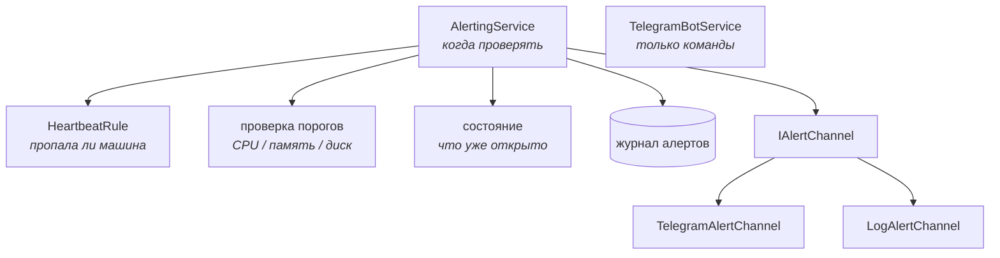
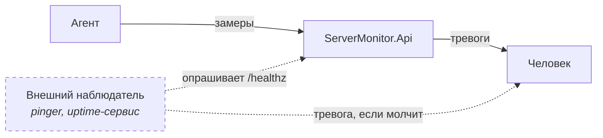

# Глава 11 — Heartbeat и развязка алертинга

К концу прошлого этапа система умела показывать, что машина замолчала: строка на экране парка
гасла и получала метку `OFFLINE`. Но **сообщать** об этом было некому. Мониторинг, который
молчит именно в тот момент, ради которого он существует, — бесполезен.

Этот этап учит систему говорить «машина пропала» и «машина вернулась». Попутно решается
дефект, записанный в главе 10 как слабое место: проверка правил была намертво сшита с
Telegram.

---

## Часть 1. Почему это не ещё одно пороговое правило

### 1.1. Событие, которого не происходит

Пороговый алерт устроен просто: пришёл замер — сравнили с порогом. Данные приходят сами,
остаётся на них реагировать.

Heartbeat устроен наоборот. Он реагирует на то, что данные **не пришли**. Отсюда два
следствия, которые определяют всю конструкцию.

**Проверку нельзя повесить на приём замера.** Обработчик `POST /api/ingest` вызывается, когда
данные пришли. Но событие, которого мы ждём, — это как раз отсутствие вызова. Обработчик,
которого не позвали, ничего проверить не может. Значит нужен независимый таймер, который сам
просыпается и смотрит на возраст последних данных.

**Проверку нельзя поручить агенту.** Агент не может сообщить о собственной смерти: если
процесс убит, а машина выключена, отправлять сообщение некому и нечем. Единственное место, где
такая проверка вообще выполнима, — центральный сервер, который знает, когда каждая машина
отчитывалась в последний раз.

> **Почему так, и как устроено у больших.** Это фундаментальное свойство **push**-мониторинга
> (глава 10): центр не отличает «машина здорова и молчит» от «машина умерла», пока не введёт
> ожидание регулярности. В Prometheus, работающем по **pull**, эта проблема решается сама:
> там центр сам ходит опрашивать, и неудачный опрос — уже событие. Мы платим за удобство
> push (агент за NAT работает без проброса портов) вот этой отдельной проверкой.

### 1.2. Какое место события в журнале

Технически событие «машина пропала» можно было бы вынести в отдельную таблицу. Мы этого не
сделали — добавили в перечисление новое значение:

```csharp
public enum MetricKind
{
    Cpu,
    Memory,
    Disk,
    Availability
}
```

> **Почему так.** Строго говоря, доступность — не метрика: никакой агент её не присылает, она
> выводится из отсутствия данных. Но по **форме** событие ровно то же самое: у него есть
> машина, время, значение, порог и два перехода — «началось» и «закончилось».
>
> Отдельная таблица заставила бы продублировать всё, что вокруг этого построено: хранение,
> восстановление состояния после перезапуска, экран алертов, отправку. Ради разницы в одном
> поле. Это тот случай, когда общая абстракция дешевле точности терминологии.
>
> Миграция данных при этом не нужна: перечисления хранятся в базе строками через конвертер
> значений (глава 03), поэтому новое значение просто начинает встречаться в колонке.

Значения полей для события доступности:

| Поле | Что означает |
|------|--------------|
| `MetricType` | `Availability` |
| `Value` | у `Triggered` — сколько минут машина молчала; у `Recovered` — сколько длился простой |
| `Threshold` | настроенный порог в минутах |
| `AlertType` | `Triggered` — пропала, `Recovered` — вернулась |

---

## Часть 2. Правило как чистая функция

Это, пожалуй, самая ценная для переноса в другие проекты часть главы.

[`HeartbeatRule`](../../ServerMonitor.Domain/Entities/HeartbeatRule.cs) целиком:

```csharp
public static AlertKind? Evaluate(
    bool isAlerting,
    DateTime? lastSeenUtc,
    DateTime nowUtc,
    TimeSpan offlineAfter)
{
    if (lastSeenUtc is null)
    {
        return null;
    }

    var isSilent = nowUtc - lastSeenUtc.Value > offlineAfter;

    if (isSilent && !isAlerting) return AlertKind.Triggered;
    if (!isSilent && isAlerting) return AlertKind.Recovered;

    return null;
}
```

Обрати внимание на то, чего здесь **нет**: обращения к базе, отправки сообщения и вызова
`DateTime.UtcNow`. Всё, что нужно для решения, приходит параметрами, а наружу возвращается
только вердикт.

> **Почему `nowUtc` — параметр, а не `DateTime.UtcNow` внутри.** Функция, которая сама
> спрашивает текущее время, непроверяема: результат зависит от момента запуска теста. Приняв
> время параметром, мы делаем её **детерминированной** — на одних и тех же входах она всегда
> даёт один и тот же ответ.
>
> Приём называется **внедрением зависимости от времени**. В больших проектах для этого заводят
> абстракцию вроде `TimeProvider` (появился в .NET 8); в маленькой чистой функции достаточно
> обычного параметра.
>
> Это же и есть ответ на вопрос «как тестировать логику, завязанную на время»: не мокать часы,
> а не спрашивать их внутри.

Что это дало на практике —
[`HeartbeatRuleTests`](../../ServerMonitor.Tests/Domain/HeartbeatRuleTests.cs), девять тестов,
ни одного мока, ни одной базы:

```csharp
private static readonly DateTime Now = new(2026, 9, 7, 12, 0, 0, DateTimeKind.Utc);

[Fact]
public void SilenceBeyondThreshold_Triggers()
{
    Assert.Equal(
        AlertKind.Triggered,
        HeartbeatRule.Evaluate(isAlerting: false, Now.AddMinutes(-6), Now, Offline));
}
```

### 2.1. Три случая, которые правило обрабатывает намеренно

**Машина никогда не отчитывалась** (`lastSeenUtc is null`) — не событие ни в одну сторону.
Агент зарегистрировался, но ни разу не прислал данные: это незаконченная установка, а не
авария. Слать тревогу здесь означало бы будить человека по поводу его собственной невнимательности.

**Молчание продолжается** — тоже не событие. Правило срабатывает **на переход**, а не на
состояние; иначе каждые полминуты приходило бы «машина всё ещё недоступна». Тот же гистерезис,
что у порогов (глава 07).

**Метка времени из будущего** — считается свежестью. Часы агента могут уйти вперёд, и тогда
`nowUtc - lastSeenUtc` отрицательно. Расхождение часов — не признак смерти машины, поэтому
строгое сравнение `>` здесь именно то, что нужно, без дополнительных проверок.

---

## Часть 3. Развязка алертинга

### 3.1. Что было не так

До этого этапа [`TelegramBotService`](../../ServerMonitor.Infrastructure/Telegram/TelegramBotService.cs)
делал три разные вещи: держал соединение с Telegram и отвечал на команды, проверял пороги и
отправлял сообщения. И начинался он так:

```csharp
if (string.IsNullOrWhiteSpace(token) || string.IsNullOrWhiteSpace(_chatId))
{
    _logger.LogWarning("Telegram bot token or chat ID is not configured. Bot disabled.");
    return;
}
```

После `return` не запускался цикл проверки. То есть без настроенного бота **пороги не
проверялись вовсе, и в журнал ничего не писалось**. Канал доставки оказался выключателем всей
функции.

Пока источник правил был один, это сходило за простоту. Heartbeat — второй источник, и класс
превратился бы в четыре обязанности, ни одна из которых не работает без токена.

> **Как такое распознать заранее.** Признак — предложение с «и» в описании класса: «держит
> соединение **и** проверяет пороги **и** отправляет». Каждое «и» — кандидат на отдельный тип.
> Формально это **принцип единственной ответственности** (single responsibility), но полезнее
> помнить не формулировку, а следствие: у класса с четырьмя обязанностями любая из них может
> отключить остальные.

### 3.2. Что стало



[`IAlertChannel`](../../ServerMonitor.Infrastructure/Alerting/IAlertChannel.cs) — весь
интерфейс:

```csharp
public interface IAlertChannel
{
    Task SendAsync(AlertNotification notification, CancellationToken cancellationToken);
}
```

Реализаций две: [`LogAlertChannel`](../../ServerMonitor.Infrastructure/Alerting/LogAlertChannel.cs)
и [`TelegramAlertChannel`](../../ServerMonitor.Infrastructure/Alerting/TelegramAlertChannel.cs).
Регистрируются обе, вызываются обе:

```csharp
builder.Services.AddSingleton<IAlertChannel, LogAlertChannel>();
builder.Services.AddSingleton<IAlertChannel, TelegramAlertChannel>();
```

> **Деталь про DI, которую стоит запомнить.** Две регистрации одного интерфейса — не ошибка.
> Контейнер отдаст обе, если попросить `IEnumerable<IAlertChannel>`:
>
> ```csharp
> public AlertingService(IEnumerable<IAlertChannel> channels, ...)
> ```
>
> А если попросить просто `IAlertChannel`, придёт **последняя зарегистрированная**. Это частый
> источник недоумения: «почему работает только один канал».

### 3.3. Канал не передаёт текст, он передаёт факт

[`AlertNotification`](../../ServerMonitor.Infrastructure/Alerting/AlertNotification.cs) — это
`record` из пяти полей: машина, метрика, направление, значение, порог. Готовой строки в нём
нет.

> **Почему так.** Формулировка зависит от канала: в Telegram уместна разметка `<b>` и эмодзи,
> в журнале — сухая строка с параметрами для структурированного поиска. Если бы текст собирался
> заранее, каждый новый канал получал бы чужое форматирование и был бы вынужден его
> расковыривать.

Правило шире мониторинга: **передавай данные, а не их представление**. Представление — дело
того, кто показывает.

Вот та же пара событий в двух каналах:

```
🔌 <b>Machine unreachable</b> · build-runner-02
No data for <b>6 min</b> (threshold 5 min)
```

```
warn: LogAlertChannel[0] Alert TRIGGERED: build-runner-02 unreachable for 6 min (threshold 5 min).
```

### 3.4. Ненастроенный канал обязан молчать, а не падать

```csharp
public async Task SendAsync(AlertNotification notification, CancellationToken cancellationToken)
{
    if (_botClient is null || _chatId is null)
    {
        return;
    }
    // ...
    catch (Exception ex)
    {
        _logger.LogError(ex, "Failed to send a Telegram alert.");
    }
}
```

Два решения в одном методе, оба важные.

**Отсутствие настройки — нормальное состояние**, а не ошибка. Канал не бросает исключение и не
мешает остальным. Именно смешение «не настроено» и «сломалось» и породило исходный дефект.

**Сбой доставки не роняет проверку.** Событие к этому моменту уже записано в журнал, и
недоступный Telegram не должен ни отменять запись, ни лишать остальные каналы их очереди.

---

## Часть 4. Служба проверки

[`AlertingService`](../../ServerMonitor.Infrastructure/Alerting/AlertingService.cs) — обычный
`BackgroundService` (глава 04) с циклом раз в 30 секунд. Интересны не сами проверки, а три
вещи вокруг них.

### 4.1. Окно тишины после старта

```csharp
// После простоя API все машины выглядят пропавшими, хотя отчитаются в ближайшие
// секунды. Первый проход пропускает проверку доступности, давая агентам объявиться.
var isFirstPass = true;

while (!stoppingToken.IsCancellationRequested)
{
    await CheckAsync(checkHeartbeat: !isFirstPass, stoppingToken);
    isFirstPass = false;
    // ...
}
```

Представь: API лежал час. При старте у каждой машины `LastSeenUtc` — часовой давности, то есть
все они формально пропали. Без этой строки каждый деплой рассылал бы шквал ложных тревог, а
через минуту — столько же «восстановлений».

Реальная машина, которая действительно умерла, будет обнаружена на следующем проходе. Лишние
30 секунд задержки — несопоставимо меньшее зло.

> **Обобщение.** Всякий раз, когда состояние выводится из «давности», перезапуск наблюдателя
> выглядит как массовая авария. Спрашивай себя: **что увидит эта проверка в первую секунду
> после старта?**

### 4.2. Состояние переживает перезапуск

Открытые тревоги восстанавливаются из журнала: для каждой пары «машина + метрика» берётся
последнее событие, и если это `Triggered` — тревога считается открытой.

Тонкость касается сообщения о возвращении: в нём хочется назвать длительность простоя, а для
этого нужно знать, **когда молчание началось**. В памяти это есть, но после перезапуска —
нет. Восстанавливаем арифметикой:

```csharp
if (kind == MetricKind.Availability)
{
    // В Value события записано, сколько минут машина молчала на момент срабатывания.
    // Отняв их от времени события, получаем момент последнего замера перед пропажей.
    state.SilentSinceUtc = lastAlert.TimestampUtc.AddMinutes(-lastAlert.Value);
}
```

Данные для этого уже лежали в журнале — просто не рассматривались как источник. Проверка на
живой системе: агент остановлен в 17:28:57, API перезапущен, восстановление замечено в
17:33:00, в событии записано `4.1` минуты. Реальная разница — 4:03.

> **Слабое место.** Точность ограничена округлением: `Value` хранится с одним знаком после
> запятой, поэтому восстановленный момент отличается от настоящего на секунды. Для показа
> длительности простоя это несущественно, но знать про источник погрешности полезно.

### 4.3. Уборка за удалёнными машинами

```csharp
private void PruneRemovedServers(HashSet<int> existingServerIds)
{
    var stale = _states.Keys
        .Where(key => !existingServerIds.Contains(key.ServerId))
        .ToList();

    foreach (var key in stale)
    {
        _states.Remove(key);
    }
}
```

Словарь состояний живёт в памяти столько же, сколько процесс. Без уборки удалённые машины
оставались бы в нём навсегда — небольшая, но настоящая **утечка памяти**.

Обрати внимание на `.ToList()`: удалять из словаря во время перебора его же ключей нельзя,
поэтому список ключей сначала материализуется.

---

## Часть 5. Дефект, найденный по дороге

Порог «машина пропала» стал настройкой. И тут же выяснилось, что
[`ServersController`](../../ServerMonitor.Api/Controllers/ServersController.cs) — тот, который
рисует экран парка, — продолжал считать состояние по **зашитым** пяти минутам:

```csharp
Health = ServerHealthCalculator.FromLastSeen(server.LastSeenUtc, nowUtc).ToString(),
```

Пока значение по умолчанию совпадало с настройкой, всё выглядело работающим. Стоило поменять
порог — и интерфейс с оповещениями разошлись бы: экран показывает машину здоровой, а в Telegram
уже ушло «машина пропала». Хуже неработающей функции только функция, которая противоречит
сама себе.

Починка — читать настройку и передавать её вниз:

```csharp
private async Task<TimeSpan> ReadOfflineThresholdAsync(CancellationToken cancellationToken)
{
    var seconds = await _dbContext.AppSettings
        .AsNoTracking()
        .Select(a => (int?)a.OfflineAfterSeconds)
        .FirstOrDefaultAsync(cancellationToken);

    return seconds is null or <= 0
        ? ServerHealthCalculator.OfflineAfter
        : TimeSpan.FromSeconds(seconds.Value);
}
```

> **Правило.** Превращая константу в настройку, найди **все** места, где эта константа
> использовалась. Компилятор здесь не поможет: старый вызов остаётся корректным кодом, просто
> теперь он отвечает на другой вопрос.

Сам расчёт стал принимать пороги параметрами, оставив прежние значения умолчаниями
([`ServerHealth.cs`](../../ServerMonitor.Domain/Entities/ServerHealth.cs)):

```csharp
public static ServerHealth FromLastSeen(
    DateTime? lastSeenUtc,
    DateTime nowUtc,
    TimeSpan? staleAfter = null,
    TimeSpan? offlineAfter = null)
```

Необязательные параметры здесь не для красоты: они позволили изменить сигнатуру, **не трогая
существующие вызовы и тесты**.

---

## Часть 6. Чего система не может в принципе

Всё, что описано выше, обнаруживает падение **наблюдаемой** машины. Падение самого центрального
сервера не обнаружит ничто из этого — по той же причине, по которой агент не сообщает о своей
смерти: некому выполнить проверку и некому отправить сообщение.



Единственное решение — **внешний наблюдатель**: сторонний сервис, который периодически
дёргает наш `/healthz` и шумит, если ответа нет. Он обязан быть отдельной системой, иначе
задача просто сдвигается на уровень выше.

Пунктир на схеме — то, чего пока нет: сам эндпоинт `/healthz` появится на этапе упаковки.

> **Мысль, которую стоит унести.** У любой системы наблюдения есть слепое пятно — она сама.
> Вопрос «а кто следит за следящим» не риторический: на него отвечают либо внешним сервисом,
> либо двумя экземплярами, наблюдающими друг за другом. Не ответить на него — значит иметь
> мониторинг, который однажды тихо умрёт вместе с наблюдаемым.

---

## Часть 7. Что осталось слабым

**Обнаружение запаздывает** в пределах одного интервала проверки. При интервале 30 секунд и
пороге 5 минут сообщение приходит через 5–5,5 минуты после последнего замера. Уменьшать
задержку имеет смысл только вместе с уменьшением самого порога.

**Один порог на весь парк.** Ноутбуку, который выключают на ночь, и серверу в стойке разумно
задать разные ожидания, но настройка пока общая.

**Нет уровней важности.** Событие либо есть, либо нет; «предупреждение» и «авария» не
различаются.

**Каналов по-прежнему два.** Интерфейс готов, но webhook или почту никто не написал —
появятся по потребности.

**Проверка последовательная.** Машины обходятся по очереди, с отдельным запросом к базе на
каждую. Для десятка машин незаметно, для сотни понадобится другой подход — тот же разговор,
что и про `N+1` в главе 10.

---

## Что запомнить из главы

- Реакция на **отсутствие** события требует независимого таймера: обработчик, которого не
  позвали, ничего не проверит.
- Наблюдаемый объект не может сообщить о собственной смерти — ни агент, ни сам сервер.
- Время, принятое **параметром**, превращает непроверяемую логику в чистую функцию.
- Канал доставки не должен быть выключателем логики; ненастроенный канал молчит, а не падает.
- Передавай факт, а не готовый текст: представление — дело того, кто показывает.
- Спрашивай себя, что проверка увидит **в первую секунду после старта**.
- Превращая константу в настройку, найди все места, где она использовалась: компилятор
  промолчит.

| ← Предыдущая | Оглавление |
|---|---|
| [10 — Агент и мульти-сервер](10-agent-and-multiserver.md) | [README](README.md) |
