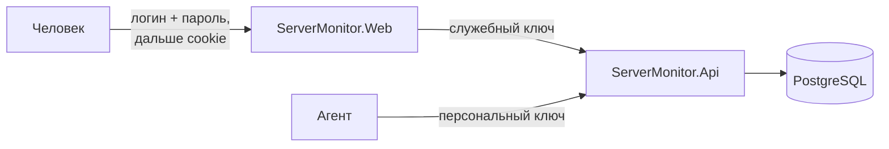
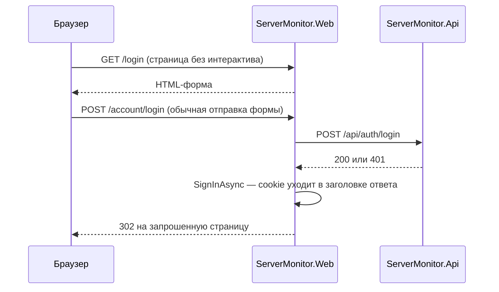

# Глава 12 — Аутентификация

До этого этапа систему мог смотреть и настраивать кто угодно, кто дотянулся до порта. Хуже
всего был открытый `PUT /api/settings`: посторонний мог поднять пороги до 100% и тем самым
**выключить оповещения**, ничего не сломав заметным образом. Мониторинг продолжал бы работать
и молчать.

Эта глава — про то, как в систему добавили вход, и про несколько решений, которые выглядят
мелочью, а на деле определяют, защищает ли она хоть что-нибудь.

---

## Часть 1. Три действующих лица

Половина работы здесь — понять, **кто именно** должен доказывать, что он свой. Действующих лиц
три, и защищаются они по-разному.



| Кто | Чем доказывает | Появилось |
|-----|----------------|-----------|
| Агент | персональный ключ, выданный при регистрации | этап агента (глава 10) |
| Веб-приложение | служебный ключ из конфигурации | этот этап |
| Человек | логин и пароль, дальше cookie | этот этап |

> **Почему у человека и у веб-приложения разные механизмы.** Это не усложнение, а следствие
> того, что они по разные стороны. Веб-приложение — **серверный клиент** API: оно ходит туда
> от своего имени, а не от имени пользователя. Человек в API напрямую не ходит вообще — он
> работает с интерфейсом.
>
> Отсюда важный вывод: **веб становится границей доверия для людей**, а служебный ключ —
> границей доверия для машин. Украв служебный ключ, посторонний получит данные в обход входа;
> поэтому ключ живёт в User Secrets, а не в отслеживаемом файле.

### 1.1. «А зачем оно вообще, если это мой собственный сервер?»

Вопрос законный, и ответ стоит проговорить.

Аутентификация защищает не от владельца, а от **всех остальных, кто может дотянуться до
порта**. Пока приложение слушает только `localhost`, смысла в ней почти нет. Но весь этап
агента был ради того, чтобы следить за парком машин, — а значит, API обязан быть доступен
другим машинам. Как только он слушает не только localhost, до него дотягивается вся домашняя
сеть: телефон гостя, телевизор, любое устройство на том же Wi-Fi. Проброс порта наружу
добавляет к этому списку весь интернет.

Что конкретно получал посторонний до этого этапа:

- **выключить оповещения** через `PUT /api/settings`, подняв пороги до 100%;
- **удалить машину** вместе со всей историей — `DELETE` каскадом;
- метрики как **разведданные**: имя машины, версия ОС (то есть список известных уязвимостей),
  uptime (ядро давно не обновлялось), а по графику нагрузки видно, когда за компьютером никого
  нет.

---

## Часть 2. Ловушка, определившая конструкцию входа

Это главная техническая мысль этапа, и она про устройство Blazor.

В [`App.razor`](../../ServerMonitor.Web/Components/App.razor) всё приложение объявлено
интерактивным. Значит, страницы живут внутри постоянного соединения **SignalR**, а не в цикле
«запрос — ответ».

А cookie выставляется **заголовком HTTP-ответа**. Этого ответа в момент нажатия кнопки уже
нет: он был отправлен, когда страница загружалась.

> **Следствие.** Обработчик `@onclick` в обычном интерактивном компоненте **физически не может**
> залогинить пользователя. Вызов `HttpContext.SignInAsync` оттуда завершится исключением про
> уже отправленные заголовки. Это одна из самых частых ошибок при переходе на Blazor Web App,
> и она не лечится «поправить код» — лечится только сменой способа.

Решение — вернуть вход в обычный цикл «запрос — ответ»:



Страница помечается атрибутом, который выводит её из интерактивной маршрутизации:

```razor
@attribute [ExcludeFromInteractiveRouting]
```

А `App.razor` выбирает режим отрисовки в зависимости от того, стоит ли этот атрибут:

```razor
private IComponentRenderMode? RenderModeForPage =>
    HttpContext.AcceptsInteractiveRouting() ? InteractiveServer : null;
```

В форме нет ни одного `@onclick` — она отправляется обычным POST. В этом весь смысл.

> **Мелочь, которая экономит время.** Расширение `AcceptsInteractiveRouting` я сначала написал
> сам — и компилятор сообщил, что такое уже есть во фреймворке. Прежде чем писать вспомогательный
> метод вокруг чужого API, стоит поискать: у типовых задач обычно есть типовое решение.

---

## Часть 3. Пароли

### 3.1. Здесь наконец нужен медленный хеш

В главе 10 мы разбирали, почему ключу агента хватает быстрого SHA-256: ключ — 32 случайных
байта, словаря вероятных значений не существует, перебирать нечего.

С паролем всё наоборот. Его придумывает человек, энтропии в нём мало, и **перебор по словарю
работает**. Поэтому нужен намеренно медленный хеш: если одна проверка занимает десятки
миллисекунд, миллион вариантов растягивается на сутки.

Две половины одного правила:

> **Медленный хеш нужен там, где секрет придумал человек.** Там, где секрет сгенерирован машиной
> и достаточно длинный, быстрый хеш корректен.

### 3.2. Почему не пишем PBKDF2 руками

`Rfc2898DeriveBytes` есть в .NET, и соблазн реализовать самому велик. Но у готового
[`PasswordHasher<T>`](../../ServerMonitor.Infrastructure/Auth/PasswordService.cs) есть три вещи,
которые легко забыть:

1. **Случайная соль на каждый пароль.** Без неё одинаковые пароли дают одинаковые хеши, и по
   базе видно, у кого пароль совпадает с чужим.
2. **Версия формата внутри самого хеша.** Хеш самоописывающийся: в нём лежат алгоритм, число
   итераций и соль.
3. **Ответ «пароль верный, но параметры устарели».** Это встроенный путь миграции на более
   стойкие настройки **без сброса паролей**:

```csharp
if (verification == PasswordVerification.SuccessRehashNeeded)
{
    user.PasswordHash = _passwords.Hash(password);
}
```

Пользователь ничего не замечает, а стойкость подрастает при следующем же входе.

> **Правило.** «Не изобретай своё» в криптографии — не суеверие, а перечислимая выгода. Если
> можешь назвать, что именно даёт готовое решение, — используй его. Если не можешь назвать —
> тем более используй.

Обёртка над `PasswordHasher<T>` нужна ещё и затем, чтобы остальной код не знал ни про ASP.NET
Identity, ни про его тип-параметр: домен не должен зависеть от того, чем считают хеш.

---

## Часть 4. Что выдаёт систему, когда она отвечает «нет»

Самая содержательная часть главы. Проверка пароля живёт в
[`UserService.VerifyAsync`](../../ServerMonitor.Infrastructure/Auth/UserService.cs), и в ней два
решения важнее всего остального кода вокруг.

### 4.1. Ответ одинаков для «нет пользователя» и «неверный пароль»

Если различать эти случаи, перебором выясняется, **какие логины существуют**. А знание валидного
имени — половина работы взломщика: дальше атака сужается до подбора пароля.

Поэтому наружу уходит только `401`, а настоящая причина — в журнал:

```csharp
_logger.LogWarning("Login failed for unknown user {Username}.", username);
```

Владелец сервера видит причину. Атакующий — нет.

### 4.2. Хеш считается даже для несуществующего имени

Это тоньше, и без него первое решение бесполезно.

```csharp
if (user is null)
{
    _passwords.Verify(DummyHash, password);   // выбрасываем результат
    _throttle.RecordFailure(username, nowUtc);

    return new LoginResult(null, LoginFailure.UnknownUser);
}
```

Без этой строки несуществующий логин отвергался бы **мгновенно**, а существующий — только
после десятков тысяч итераций PBKDF2. Разница во времени ответа выдала бы ровно то, что мы
прячем в тексте ошибки.

Атака называется **по сторонним каналам (side-channel)**: секрет утекает не через данные, а
через физическое свойство — время, потребление энергии, размер ответа. Здесь мы уравниваем
время, считая хеш заведомо недостижимого пароля и выбрасывая результат.

> **Мысль, которую стоит унести.** Скрыть информацию в тексте ответа мало. Спрашивай себя: чем
> ещё различаются два случая — временем, длиной, кодом ответа, количеством запросов к базе?
> Того же рода приём — сравнение ключей за постоянное время (глава 10).

### 4.3. Троттлинг: по имени, а не по адресу

[`LoginThrottle`](../../ServerMonitor.Infrastructure/Auth/LoginThrottle.cs) блокирует имя после
пяти промахов подряд на пять минут.

Считать можно по имени пользователя или по IP-адресу. Выбрано имя.

> **Почему.** За одним адресом может сидеть целый дом или офис. Блокировка по адресу
> превратилась бы в **отказ в обслуживании для соседей**: чужие неудачные попытки закрыли бы
> вход всем.
>
> **Обратная сторона, названная честно:** зная твой логин, посторонний может временно закрыть
> вход тебе. Для домашней системы это приемлемая цена. Публичному сервису понадобилась бы
> связка «имя + адрес» и капча.

Состояние живёт в памяти и обнуляется при перезапуске. Тоже осознанно: хранить счётчики в базе
означало бы **запись на каждую неудачную попытку** — удобная мишень для того, кто захочет
нагрузить чужой диск.

Время, как и в `HeartbeatRule` (глава 11), приходит параметром — иначе поведение блокировки
нельзя было бы проверить тестами, не засыпая на пять минут.

---

## Часть 5. Защита API

Все эндпоинты, кроме приёма метрик и регистрации агентов, требуют заголовок `X-Service-Key`.

```csharp
var expected = configuration["Api:ServiceKey"];

if (string.IsNullOrWhiteSpace(expected))
{
    logger.LogError("Api:ServiceKey is not configured; refusing every request that needs it.");
    context.Result = new ObjectResult(...) { StatusCode = StatusCodes.Status503ServiceUnavailable };
    return;
}
```

Обрати внимание на эту ветку — она важнее, чем кажется.

> **Незаданный секрет означает «никого не пускать», а не «пускать всех».** Обратное поведение —
> классический способ развернуть систему и молча оставить её открытой: всё «работает», никто
> ничего не замечает, и защиты нет.
>
> Правило: **отсутствие настройки безопасности — это отказ, а не разрешение.**

Заголовок намеренно другой, чем у агентов:

| Заголовок | Отвечает на вопрос |
|-----------|--------------------|
| `X-Api-Key` | какая это машина |
| `X-Service-Key` | это наш веб-интерфейс |

Один заголовок для двух смыслов заставил бы обработчик гадать, а гадание в проверке доступа —
плохая идея.

---

## Часть 6. Две дыры, которые легко не заметить

Обе в [`AccountEndpoints`](../../ServerMonitor.Web/Endpoints/AccountEndpoints.cs), обе стоят по
две строки, и обе — классика.

### 6.1. Антифорджери на форме входа

Форму мы читаем вручную, поэтому автоматическая проверка middleware на этот эндпоинт **не
распространяется**. Значит, её надо вызвать явно:

```csharp
await antiforgery.ValidateRequestAsync(context);
```

Кажется, что CSRF на входе не страшен — что плохого, если кого-то залогинят? Плохое вот что:
чужой сайт может залогинить посетителя **в подставную учётку**, и дальше человек работает,
думая, что он у себя, а на деле — в чужом аккаунте, где всё, что он делает, видно владельцу
этой учётки. Приём называется **login CSRF**.

### 6.2. Открытое перенаправление

Параметр `returnUrl` нужен, чтобы после входа вернуть человека туда, куда он шёл. Без проверки
он превращается в **открытое перенаправление (open redirect)**:

```
/login?returnUrl=https://зло.example
```

Ссылка выглядит ссылкой на наш сайт — домен настоящий, и человек ей доверяет. Но после входа
его уводит на чужой, визуально такой же. Классика фишинга.

Защита — разрешать только адреса внутри сайта:

```csharp
if (string.IsNullOrWhiteSpace(returnUrl) ||
    !returnUrl.StartsWith('/') ||
    returnUrl.StartsWith("//") ||
    returnUrl.StartsWith("/\\"))
{
    return "/";
}
```

Проверок на `//` и `/\` не случайно две: `//зло.example` браузер понимает как адрес с текущим
протоколом, то есть это тоже внешняя ссылка, хотя и начинается со слэша.

---

## Часть 7. Забытый пароль

Сброса по почте не будет: канала доставки в проекте нет, а заводить SMTP ради одной функции —
несоразмерно.

Через Telegram — тоже нет, хотя бот уже знает нужный чат. Причина в том, что этап heartbeat
(глава 11) специально развязал алертинг с Telegram, и вешать на канал уведомлений критичный
путь восстановления доступа означало бы вернуть ту же связанность: не настроен бот — заперт
снаружи.

Остаётся [команда на сервере](../../ServerMonitor.Api/Commands/ResetPasswordCommand.cs), как в
GitLab, Grafana и Sentry:

```bash
dotnet run --project ServerMonitor.Api -- reset-password <имя>
```

> **Почему это не дыра.** У того, кто может выполнить команду на сервере, уже есть строка
> подключения к базе — он и так может подменить хеш вручную. Команда не выдаёт новых прав.
>
> **Граница доступа здесь — доступ к машине, а не к приложению.** Для self-hosted это обычный и
> сознательный выбор: администратор сервера и владелец системы — одно лицо.

Две детали реализации:

**Пароль читается из стандартного ввода, а не из аргумента команды.** Аргументы попадают в
историю оболочки и видны в списке процессов (`ps`) всем пользователям машины.

**Ввод не отображается** — посимвольно через `Console.ReadKey(intercept: true)`. А когда ввод
перенаправлен (запуск из скрипта), скрыть его невозможно, и команда честно предупреждает об
этом, а не делает вид, что скрыла.

Ещё одна тонкость, замеченная при проверке: разбор аргументов пришлось поставить **до**
`WebApplication.CreateBuilder`. Тот скармливает `args` провайдеру конфигурации, который ждёт
`--ключ=значение` и на голом слове `reset-password` падает с `FormatException`.

---

## Часть 8. Что осталось слабым

**Удаление учётки не обрывает открытую сессию.** ~~Cookie самодостаточен и действует до истечения
срока. Чтобы выкидывать удалённого немедленно, нужна проверка пользователя на каждом запросе — то
есть поход в базу на каждой странице.~~ **Закрыто, см. часть 9 ниже.** Заодно обрати внимание, что
рассуждение в зачёркнутом абзаце было наполовину неверным: проверка на *каждом* запросе не нужна.
Достаточно проверять раз в минуту — и это тот случай, когда «правильно» и «дорого» разошлись,
стоило вспомнить, что окно отзыва не обязано быть нулевым.

**Команда сброса не снимает блокировку перебора.** Она работает в другом процессе и до счётчиков
в памяти работающего API не дотягивается. Забыл пароль, пять раз промахнулся, сбросил — вход всё
равно закрыт, пока не истекут пять минут.

**Ролей нет.** Все учётки равны: кто может смотреть, тот может и менять настройки, и удалять
машины.

**Служебный ключ не ротируется.** Сменить его — значит поправить настройку в двух местах и
перезапустить оба приложения.

**Двухфакторной аутентификации нет.**

---

## Часть 9. Как отозвать cookie, который сам себя удостоверяет

> Эта часть дописана позже остальной главы — тогда, когда ограничение из части 8 было закрыто.

### 9.1. Откуда вообще берётся проблема

Cookie аутентификации подписан ключом приложения. Сервер, получив его, проверяет подпись — и
всё. **Он не хранит список тех, кто сейчас в системе.** Именно поэтому cookie-аутентификация
дёшева: нет ни таблицы сессий, ни обращения к ней на каждом запросе.

Цена ровно та же самая, вид сбоку: раз списка нет, **сервер не может передумать**. Учётку удалили,
а браузер с валидным cookie продолжает работать до истечения срока — у нас это неделя.

> Это не недосмотр в коде, а свойство выбранного механизма. Полезно уметь называть такие вещи
> прямо: «здесь мы разменяли возможность отзыва на отсутствие хранилища сессий».

### 9.2. Метка сессии

Стандартное решение — **метка (security stamp)**. Колонка у учётной записи со случайным значением:

```csharp
public string SecurityStamp { get; set; } = Guid.NewGuid().ToString("N");
```

При входе метка кладётся в cookie как claim. Дальше приложение периодически спрашивает: «эта метка
всё ещё актуальна?» Как только ответ «нет» — сессия закончена.

Что меняет метку:

- **смена пароля** — да. Человек, меняющий пароль из-за возможной утечки, ждёт именно того, что
  посторонний будет выкинут. Сброс, оставляющий взломщика внутри, **хуже, чем никакой**: он
  выглядит как решённая проблема;
- **удаление учётки** — строки нет, сверять не с чем, сессия недействительна;
- **тихой перехеширование при входе** — **нет**, и это стоит отдельного комментария в коде. Хеш
  переписался, пароль не менялся, а прокрутка метки выкинула бы человека ровно в тот момент, когда
  он только что доказал, что пароль знает. В том числе — сессию, которую создаёт этот же запрос.

### 9.3. Три решения, каждое со своей ценой

**Проверять раз в минуту, а не на каждом запросе.** Проверка на каждом — это вызов API на каждую
страницу, а дашборд ещё и сам опрашивает сервер. Минута оставляет окно отзыва достаточно коротким,
чтобы им имело смысл пользоваться, и трафик достаточно малым, чтобы его не замечать.

```csharp
context.Properties.Items[LastCheckedKey] = nowUtc.ToString("O");
context.ShouldRenew = true;
```

`ShouldRenew` здесь обязателен, и его легко забыть: без него отметка времени никуда не
записывается, и интервал молча перестаёт существовать — проверка идёт на каждом запросе, как будто
её и не ограничивали.

**Cookie без метки отвергается.** Такой cookie выдан до появления этого механизма. Понять, законен
ли он, невозможно; безопасное прочтение «не могу определить» — закончить сессию. Человек один раз
входит заново, и дальше все его сессии отзываемы.

**Недоступный API считается «сессия действительна».** Это единственное место, где выбрано не
самое строгое поведение, и вот почему: считать недоступность выходом из системы значит выкидывать
всех при каждом перезапуске API. Кратковременный сбой превратился бы в массовый разлогин.
Действительно отозванная сессия проживёт лишнюю минуту — это меньшее из двух зол.

> Сравни с правилом из части 5: **неустановленный служебный ключ означает «никого не пускать»**.
> Здесь недоступный API означает «пока пускать». Противоречия нет: в первом случае строгий вариант
> защищает, во втором — ломает работу, ничего не защищая, потому что cookie и так был выдан этим
> же сервером. Правило звучит не «всегда выбирай строгое», а **«выбирай то, что при ошибке
> причиняет меньше вреда»**.

### 9.4. Мелочь в миграции

Колонка добавляется со значением по умолчанию — пустой строкой. Если так и оставить, у **всех**
учёток окажется одна и та же метка, а значение, общее для всех, не может завершить сессии одного
человека, не завершив их всем сразу.

```sql
UPDATE "Users" SET "SecurityStamp" = gen_random_uuid()::text;
```

`gen_random_uuid()` встроена в PostgreSQL начиная с 13-й версии, расширение не нужно.

---

## Что запомнить из главы

- Разделяй действующих лиц: у человека, серверного клиента и машины разные способы доказать,
  что они свои.
- Cookie нельзя выставить оттуда, где HTTP-ответ уже отправлен, — в Blazor это определяет всю
  конструкцию входа.
- Медленный хеш нужен там, где секрет придумал человек; машинному ключу достаточно быстрого.
- Одинакового текста ошибки мало: два случая не должны различаться **ничем**, включая время
  ответа.
- Отсутствие настройки безопасности — это отказ, а не разрешение.
- `returnUrl` без проверки — открытое перенаправление, а форма без токена — login CSRF.
- Подписанный cookie дёшев именно потому, что сервер не хранит сессии, — и по той же причине не
  может передумать. Метка сессии возвращает возможность отзыва.
- Смена пароля обязана завершать старые сессии; тихое перехеширование — нет.
- «Выбирай безопасный вариант» на самом деле означает «выбирай тот, что при ошибке навредит
  меньше»: неустановленный ключ закрывает вход, недоступный API — нет.

| ← Предыдущая | Оглавление |
|---|---|
| [11 — Heartbeat и развязка алертинга](11-heartbeat-and-alerting.md) | [README](README.md) |
