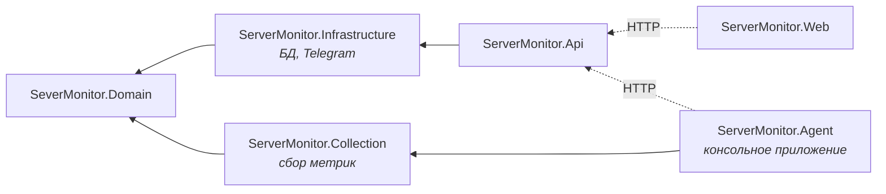

# Агент и мульти-сервер — концепция

**Дата:** 2026-09-06
**Ветка:** feature/redesign
**Этап дорожной карты:** 1 из 6 (агент → heartbeat → аутентификация → упаковка → retention → зрелость алертинга)

## Цель

Снять главное архитектурное ограничение проекта: сейчас сбор метрик работает внутри процесса
API и мониторит только ту машину, где этот процесс запущен. После этапа система следит за
парком серверов: на каждую машину ставится лёгкий агент, который сам регистрируется и шлёт
замеры в центральный API.

## Принятые решения

| Вопрос | Решение | Обоснование |
|--------|---------|-------------|
| Встроенный сбор в API | **убрать полностью** | один путь записи данных вместо двух; за локальной машиной следит такой же агент |
| Потеря связи с сервером | **буфер в памяти**, 720 замеров (≈1 час) | переживает сетевые сбои и перезапуск API; переживать перезапуск самого агента не требуется |
| Существующие 2021 замеров | **привязать к записи `this-machine`** | история и графики не обнуляются |
| Доступ агента к API | **саморегистрация по enrollment-токену** | сценарий «скопировал одну строку — сервер появился сам» |
| Интерфейс | **экран парка как главная**, дашборд — детальный вид | нужна общая картина по всем машинам |

## Структура проектов

Сбор метрик переезжает из `Infrastructure` в новый проект `ServerMonitor.Collection`.

Конечное состояние зависимостей:



На этапах 1–6 у `Api` временно остаётся ссылка на `Collection` — встроенный сбор ещё работает,
чтобы система не переставала собирать данные посреди переезда. Ссылка удаляется на этапе 7
вместе с `MetricsCollectorService`.

**Почему отдельный проект.** Агент ставится на каждую наблюдаемую машину и должен быть
маленьким самодостаточным бинарником. `Infrastructure` тянет EF Core, Npgsql и `Telegram.Bot`
— агенту не нужно ничего из этого.

Отвергнутые варианты: ссылка агента на `Infrastructure` целиком (лишние десятки мегабайт
зависимостей ради ничего) и копирование кода сбора в агента (гарантированное расхождение
реализаций).

Переезжают: `IMetricsCollector`, `MetricsCollector`, `ProcParser`, `CpuTimes` — вместе с
существующими тестами, которые подтверждают, что перенос ничего не сломал.

`MonitoringOptions` **не переезжает целиком**, а делится по принадлежности: интервал сбора
уходит в конфигурацию агента (`AgentOptions`), а интервал проверки порогов и число
подтверждающих замеров остаются в `Infrastructure`, где живёт алертинг. Иначе `Infrastructure`
пришлось бы ссылаться на `Collection` ради одного класса настроек — зависимость, которой
здесь не место.

`MetricsCollector` продолжает возвращать `MetricSnapshot`. Разделение на «замер» (без `Id`) и
«запись в БД» было бы чище, но требует правки существующих тестов ради косметики —
зафиксировано как кандидат на будущий рефакторинг.

## Модель данных

Новая сущность в `Domain`:

```csharp
public class Server
{
    public int Id { get; set; }
    public Guid PublicId { get; set; }          // идентификатор в URL и API
    public string Name { get; set; } = string.Empty;   // имя машины
    public string? OperatingSystem { get; set; }
    public string? AgentVersion { get; set; }
    public string ApiKeyHash { get; set; } = string.Empty;
    public DateTime RegisteredAtUtc { get; set; }
    public DateTime? LastSeenUtc { get; set; }
}
```

`PublicId` отдельно от `Id`: последовательные числа в адресах раскрывают количество серверов и
позволяют перебор. В API и ссылках используется только `PublicId`.

`MetricSnapshot` и `Alert` получают `public int ServerId { get; set; }` и внешний ключ на
`Servers` с каскадным удалением: удалили сервер — ушла и его история.

### Миграция существующих данных

Порядок операций в миграции обязателен именно такой:

1. Создать таблицу `Servers`.
2. Вставить запись с фиксированным именем `this-machine` и пустым `ApiKeyHash`. Имя намеренно
   не берётся из `Environment.MachineName`: миграция — это статический SQL, зашитый при
   генерации, и имя *моей* машины оказалось бы в базе у любого, кто развернёт проект.
   Настоящее имя запись получит при первой регистрации агента (см. усыновление ниже).
3. Добавить `ServerId` в `MetricSnapshots` и `Alerts` **со значением по умолчанию**, равным
   идентификатору вставленной записи.
4. Только после этого создать внешние ключи и индексы.

Если повесить внешний ключ раньше шага 3, база отвергнет 2021 существующую строку без
родителя.

## Контракты API

### Регистрация агента

```
POST /api/agents/register
X-Enrollment-Token: <общий токен установки>
{ "hostname": "home-server", "operatingSystem": "Linux 6.8", "agentVersion": "1.0.0" }

200 OK
{ "serverId": "<guid>", "apiKey": "<случайный ключ, показывается один раз>" }
```

Повторная регистрация с тем же `hostname` **создаёт новую запись** — это осознанное
упрощение: слияние по имени машины ненадёжно (имена повторяются), а переустановка агента с
новым ключом безопаснее. Дубликаты удаляются вручную на экране парка.

**Исключение — усыновление осиротевшей записи.** Миграция создаёт запись `this-machine` с
пустым `ApiKeyHash`: к ней привязана вся старая история, но агента у неё нет. Если бы правило
«всегда новая запись» работало без оговорок, первый же агент на этой машине завёл бы вторую
запись, и история разорвалась бы надвое.

Поэтому: **если в базе есть ровно одна запись с пустым `ApiKeyHash`, первая регистрация
занимает её** — обновляет имя, ОС и версию на присланные агентом и записывает хеш выданного
ключа. Ситуация возможна только сразу после миграции: как только запись получила ключ, она
перестаёт быть кандидатом, и дальше работает общее правило.

### Приём метрик

```
POST /api/ingest
X-Api-Key: <персональный ключ агента>
[ { "timestampUtc": "...", "cpuUsagePercent": 4.6, "memoryUsedMb": 8192,
    "memoryTotalMb": 16384, "diskUsedGb": 227.7, "diskTotalGb": 930.5,
    "uptimeSeconds": 348915 } ]

202 Accepted
```

**Всегда массив**, даже для одного замера: досылка из буфера не должна требовать второго
эндпоинта. Ограничение — не больше 1000 элементов в запросе.

Сервер при приёме обновляет `LastSeenUtc` и `AgentVersion`.

### Чтение

Существующие эндпоинты переезжают под сервер:

| Было | Стало |
|------|-------|
| `GET /api/metrics/status` | `GET /api/servers/{publicId}/metrics/status` |
| `GET /api/metrics/history` | `GET /api/servers/{publicId}/metrics/history` |
| `GET /api/metrics/history/paged` | `GET /api/servers/{publicId}/metrics/history/paged` |
| `GET /api/alerts` | `GET /api/alerts` (плюс необязательный `?serverId=`) |

Добавляется `GET /api/servers` — список для экрана парка: `publicId`, имя, ОС, версия агента,
`lastSeenUtc`, вычисленный статус и последние значения метрик.

## Аутентификация агентов

Два разных секрета:

- **Enrollment-токен** — один на всю установку, лежит в конфигурации API
  (`Agents:EnrollmentToken`), знает его скрипт установки. Разрешает только регистрацию.
- **API-ключ** — персональный для каждой машины, выдаётся при регистрации, отзывается
  удалением сервера.

Ключи хранятся **хешами SHA-256**. В отличие от паролей, медленный хеш (bcrypt) здесь не
нужен: ключ — 32 случайных байта, словарного перебора не существует. Сравнение токенов
выполняется `CryptographicOperations.FixedTimeEquals`, чтобы время ответа не подсказывало
атакующему, сколько символов угадано.

Если `Agents:EnrollmentToken` не задан, регистрация отключена и возвращает 503 — приложение не
должно молча принимать кого угодно.

## Агент

Консольное приложение на `Microsoft.Extensions.Hosting` с одним `BackgroundService`.

**Конфигурация** (`appsettings.json` + переменные окружения):

```json
{
  "Agent": {
    "ServerUrl": "https://monitor.example.com",
    "EnrollmentToken": "",
    "CollectIntervalSeconds": 5,
    "BufferCapacity": 720
  }
}
```

**Состояние** — файл `agent-state.json` рядом с бинарником: `publicId` и выданный `apiKey`.
При старте: если файл есть — работаем с ним; если нет — регистрируемся по enrollment-токену и
сохраняем. На Linux файл создаётся с правами `600`.

**Цикл работы:**

1. Собрать замер.
2. Положить в очередь.
3. Попытаться отправить всю очередь одним запросом.
4. Успех — очистить очередь; неудача — оставить и увеличить паузу до следующей попытки.

**Буфер** — ограниченная очередь на `BufferCapacity` элементов. При переполнении выбрасывается
**самый старый** замер: свежие данные ценнее исторических, а дыра в середине истории лучше,
чем отсутствие текущего состояния.

**Повторы** — экспоненциальная задержка от интервала сбора до 5 минут. Иначе лежащий сервер
получает запрос каждые 5 секунд от каждого агента.

## Интерфейс

**Экран парка** (`/`, он же новая главная) — серверы ячейками в существующей «стойке»:
имя, ОС, статус, текущие CPU/RAM/DISK, время последнего замера. Статус вычисляется из
`LastSeenUtc`:

| Статус | Условие | Цвет |
|--------|---------|------|
| `online` | данные свежее 60 секунд | `--status-ok` |
| `stale` | от 60 секунд до 5 минут | `--status-warn` |
| `offline` | больше 5 минут | `--status-crit` |

Порогов в настройках пока нет — константы в коде, потому что настоящий детект падения делает
следующий этап.

**Детальная страница** (`/servers/{publicId}`) — существующий дашборд без изменений внешнего
вида, но с данными выбранной машины.

**History и Alerts** получают выбор сервера. Визуальный язык не меняется.

## Тестирование

Новые модульные тесты:

- генерация и проверка API-ключа: хеш совпадает, ключ не хранится в открытом виде;
- буфер: соблюдает вместимость, при переполнении выбрасывает старейший, сохраняет порядок;
- вычисление статуса сервера по `LastSeenUtc` на границах 60 секунд и 5 минут;
- сохранение и чтение состояния агента;
- усыновление записи без ключа: при одной осиротевшей записи регистрация занимает её, при
  нескольких или ни одной — создаёт новую.

Существующие тесты сбора переезжают в новый проект без изменений — это и есть проверка того,
что перенос корректен.

## Этапы

| # | Этап | Проверка |
|---|------|----------|
| 1 | Выделить `ServerMonitor.Collection` | тесты проходят, приложение работает как раньше |
| 2 | `Server`, `ServerId`, миграция с привязкой старых данных | 2021 запись привязана, история цела |
| 3 | Разделение `MonitoringOptions` между агентом и алертингом | сборка и тесты зелёные |
| 4 | `POST /api/agents/register` и `POST /api/ingest` | регистрация и приём проверены запросами |
| 5 | Проект `ServerMonitor.Agent` | агент регистрируется и шлёт данные |
| 6 | Эндпоинты чтения под сервер + экран парка + детальная страница | обе машины видны в UI |
| 7 | Удалить встроенный сбор из API | данные идут только от агентов |
| 8 | Глава 10 гайда | описан агент и всё, что появилось |

После каждого этапа: сборка без предупреждений, `dotnet test`, проверка в браузере, коммит.

## Вне объёма

Отложено осознанно, каждое — отдельный этап дорожной карты:

- **heartbeat-алерты** (падение узла) — следующий этап; `LastSeenUtc` для них появляется здесь;
- **аутентификация людей** в веб-интерфейсе;
- **пороги алертов на каждый сервер** — остаются общими;
- **скрипт установки, Docker-образы, `/healthz`** — этап упаковки;
- **retention и прореживание истории**;
- **прощальный сигнал агента при остановке** — часть heartbeat.

## Критерии готовности

- Две машины (локальный агент и любая вторая) видны на экране парка с живыми данными.
- Существующая история за месяц доступна и привязана к `this-machine`.
- Внутри API сбора метрик не осталось: `MetricsCollectorService` удалён.
- Агент переживает остановку API: после восстановления досылает накопленное.
- Регистрация без корректного enrollment-токена отвергается.
- `dotnet test` зелёный, сборка без предупреждений.
- Глава 10 гайда не противоречит коду.
