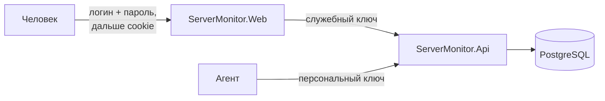
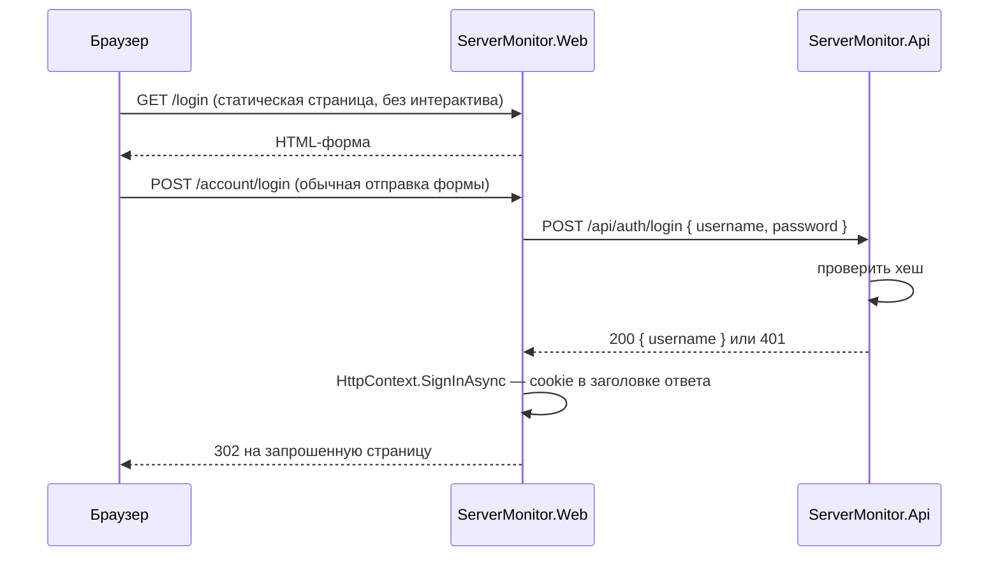

# Аутентификация — концепция

**Дата:** 2026-09-07
**Ветка:** feature/auth
**Этап дорожной карты:** 3 из 5 (агент → heartbeat → **аутентификация** → упаковка → retention)

## Цель

Сейчас систему может смотреть и настраивать кто угодно, кто дотянулся до порта. Открыты все
эндпоинты чтения, открыт веб-интерфейс, и — что хуже всего — открыт `PUT /api/settings`:
посторонний способен поднять пороги до 100% и тем самым выключить оповещения, ничего при этом
не сломав заметным образом.

После этапа: в интерфейс входят по логину и паролю, а API не отвечает никому, кроме своих.

## Кто с кем разговаривает

Разделение действующих лиц — половина решения. Их три, и защищаются они по-разному.



| Кто | Чем доказывает, что свой | Состояние |
|-----|--------------------------|-----------|
| Агент | персональный ключ, выданный при регистрации | **уже сделано** на этапе агента |
| Веб-приложение | служебный ключ из конфигурации | этот этап |
| Человек | логин и пароль, дальше cookie | этот этап |

> **Почему у человека и у веб-приложения разные механизмы.** Это не усложнение, а следствие
> того, что они находятся по разные стороны. Веб-приложение — **серверный** клиент API: оно
> ходит в API от своего имени, а не от имени пользователя. Человек в API напрямую вообще не
> ходит — он работает с веб-интерфейсом.
>
> Отсюда вывод, который стоит сказать явно: **веб-приложение становится границей доверия для
> людей**, а служебный ключ — границей доверия для машин. Если кто-то украдёт служебный ключ,
> он получит доступ к данным в обход входа; поэтому ключ живёт в User Secrets, а не в
> отслеживаемом файле.

## Принятые решения

| Вопрос | Решение | Обоснование |
|--------|---------|-------------|
| Учётные записи | **свои, в базе** | внешний провайдер (OIDC) — тяжёлая зависимость для домашнего сервиса |
| Хеш пароля | **`PasswordHasher<T>` из ASP.NET Core** | PBKDF2 с верными параметрами, самоописывающийся формат, встроенное перехеширование |
| Сессия человека | **cookie**, 7 дней со скользящим продлением | Blazor Server и так держит серверное состояние; JWT дал бы хранение и обновление токена без выгоды |
| Форма входа | **статическая страница + POST на эндпоинт** | из интерактивного компонента cookie выставить невозможно, см. ниже |
| Проверка пароля | **в API**, не в вебе | у веб-проекта нет и не должно быть доступа к базе |
| Первый запуск | **экран создания первой учётки** | иначе систему нельзя начать использовать |
| Регистрация | **закрыта** | это не публичный сервис; учётки заводит владелец |
| Защита API | **служебный ключ в заголовке** | простейшее, что решает задачу для одного доверенного клиента |

## Ловушка, определяющая конструкцию входа

В [`App.razor`](../../ServerMonitor.Web/Components/App.razor) всё приложение объявлено
интерактивным:

```razor
<Routes @rendermode="InteractiveServer" />
```

Это значит, что страницы живут внутри постоянного соединения SignalR, а не в цикле
«запрос — ответ». А cookie выставляется **заголовком HTTP-ответа**, которого в этот момент уже
нет: ответ отправлен, когда страница только загружалась.

Следствие: обработчик кнопки «Войти» в обычном интерактивном компоненте **физически не может**
залогинить пользователя. Попытка вызвать `HttpContext.SignInAsync` из компонента даёт
исключение про уже отправленные заголовки — классическая ошибка при переходе на Blazor Web App.

Решение — вернуть вход в обычный цикл «запрос — ответ»:



Страница входа помечается `@attribute [ExcludeFromInteractiveRouting]`, форма отправляется
обычным POST на минимальный эндпоинт, и уже он выставляет cookie. Дальше всё остальное
приложение работает интерактивно, как и работало.

## Хранение пароля

Новая сущность:

```csharp
public class User
{
    public int Id { get; set; }
    public string Username { get; set; } = string.Empty;
    public string PasswordHash { get; set; } = string.Empty;
    public DateTime CreatedAtUtc { get; set; }
    public DateTime? LastLoginUtc { get; set; }
}
```

> **Здесь наконец нужен медленный хеш.** В главе 10 мы разбирали, почему ключу агента хватает
> быстрого SHA-256: это 32 случайных байта, словаря вероятных значений не существует. Пароль
> придумывает человек, энтропии в нём мало, и перебор по словарю работает. Поэтому — PBKDF2 с
> десятками тысяч итераций.
>
> **Почему не пишем его руками.** `Rfc2898DeriveBytes` доступен в .NET, и соблазн реализовать
> самому велик. Но у готового `PasswordHasher<T>` есть три вещи, которые легко забыть сделать:
> случайная соль на каждый пароль, **версия формата** в самом хеше и `VerifyHashedPassword`,
> возвращающий «пароль верный, но хеш устарел» — то есть встроенный путь миграции на более
> сильные параметры без сброса паролей. Это ровно тот случай, когда «не изобретай своё» —
> не суеверие, а перечислимая выгода.

Защита от перебора: счётчик неудачных попыток по имени пользователя в памяти API, после пяти
подряд — отказ на пять минут. Простая мера, но она превращает перебор из «часы» в «годы».

## Первый запуск и риск запереть себя снаружи

Пользователей изначально нет, поэтому:

- `GET /api/auth/state` сообщает вебу, создана ли хоть одна учётка;
- пока их нет, любой заход перенаправляет на `/setup`, где создаётся первая;
- `POST /api/auth/setup` **отвечает только пока таблица пуста** — иначе это была бы открытая
  регистрация администратора.

Дальше учётки добавляются на странице настроек.

## Забытый пароль

Сброса по почте не будет: канала доставки в проекте нет, и заводить SMTP ради одной функции —
несоразмерно. Вместо этого — **команда сброса у самого API**, как это сделано в GitLab, Grafana
и Sentry:

```bash
dotnet run --project ServerMonitor.Api -- reset-password <username>
```

Команда просит новый пароль в консоли, пишет его хеш и завершает процесс, не поднимая
веб-сервер.

> **Почему это не дыра в безопасности.** У того, кто может выполнить команду на сервере, уже
> есть строка подключения к базе — то есть полный доступ к данным и возможность подменить хеш
> вручную. Команда не выдаёт новых прав, она лишь избавляет от возни с `PasswordHasher` в
> обход приложения.
>
> **Граница доступа здесь — доступ к машине, а не к приложению.** Это сознательный выбор,
> нормальный для self-hosted систем: администратор сервера и владелец системы — одно лицо.

Две детали реализации, которые легко сделать неправильно:

- **Пароль читается из стандартного ввода, а не из аргумента команды.** Аргументы попадают в
  историю оболочки и видны в списке процессов (`ps`) всем пользователям машины.
- **Ввод не отображается** — посимвольно через `Console.ReadKey(intercept: true)`, чтобы пароль
  не остался в прокрутке терминала и на плече у соседа.

> **Почему не восстановление через Telegram**, хотя бот уже знает нужный чат и это готовое
> подтверждение личности. Потому что этап heartbeat как раз развязал алертинг с Telegram, и
> вешать на канал доставки критичный путь восстановления доступа означало бы вернуть ту же
> связанность: не настроен бот — заперт снаружи. Канал уведомлений не должен быть условием
> входа в систему.

## Защита API

Все эндпоинты, кроме приёма данных и регистрации агентов, начинают требовать служебный ключ:

| Эндпоинт | Чем защищён |
|----------|-------------|
| `POST /api/ingest` | персональным ключом агента *(как было)* |
| `POST /api/agents/register` | enrollment-токеном *(как было)* |
| `GET /api/servers`, `/api/servers/{id}/metrics/*`, `/api/alerts` | служебным ключом |
| `PUT /api/settings` | служебным ключом |
| `POST /api/auth/*` | служебным ключом |

Ключ передаётся заголовком `X-Service-Key` и живёт в User Secrets по обе стороны: у API —
эталон, у веба — то, что он посылает.

> **Почему не переиспользовать `X-Api-Key` агентов.** Смысл разный: ключ агента отвечает на
> вопрос «какая это машина», служебный — «это наш веб». Один заголовок для двух смыслов
> заставил бы обработчик гадать, а гадание в проверке доступа — плохая идея.

## Границы этапа

**Входит:** сущность `User` и миграция, `PasswordHasher`, эндпоинты `api/auth/*`, служебный
ключ на API, cookie-аутентификация в вебе, страницы входа и первичной настройки, защита всех
страниц, добавление и удаление учёток в настройках, выход, **команда сброса пароля**, тесты,
глава 12 гайда.

**Не входит:**

- **Роли и права.** Все учётки равны. Разделение на «смотреть» и «менять» — отдельная задача,
  и до неё стоит дожить с реальной потребностью.
- **Внешние провайдеры входа** (OIDC, Google). Абстракция появится, если понадобится.
- **Ротация ключей агентов и срок жизни enrollment-токена.** Родственные задачи, но их место —
  на этапе упаковки, вместе со скриптом установки.
- **Сброс пароля по почте и через Telegram.** См. раздел «Забытый пароль»: вместо этого
  команда у API.
- **Двухфакторная аутентификация.**

## Проверка результата

1. Заход на любую страницу без входа перенаправляет на `/login`.
2. На чистой базе первый заход ведёт на `/setup`; после создания учётки `/setup` больше не
   отвечает.
3. Верный пароль пускает, неверный — нет; после пяти неудач подряд вход отвергается временно.
4. Прямой запрос к `GET /api/servers` без служебного ключа отвечает 401; с ключом — 200.
5. `POST /api/ingest` с ключом агента продолжает работать — агент не сломан.
6. Выход возвращает на `/login`, и защищённые страницы снова недоступны.
7. `reset-password` меняет пароль забывшему: старый перестаёт пускать, новый пускает, и всё
   это не поднимая веб-сервер.
8. `dotnet build` без предупреждений, `dotnet test` зелёный.
