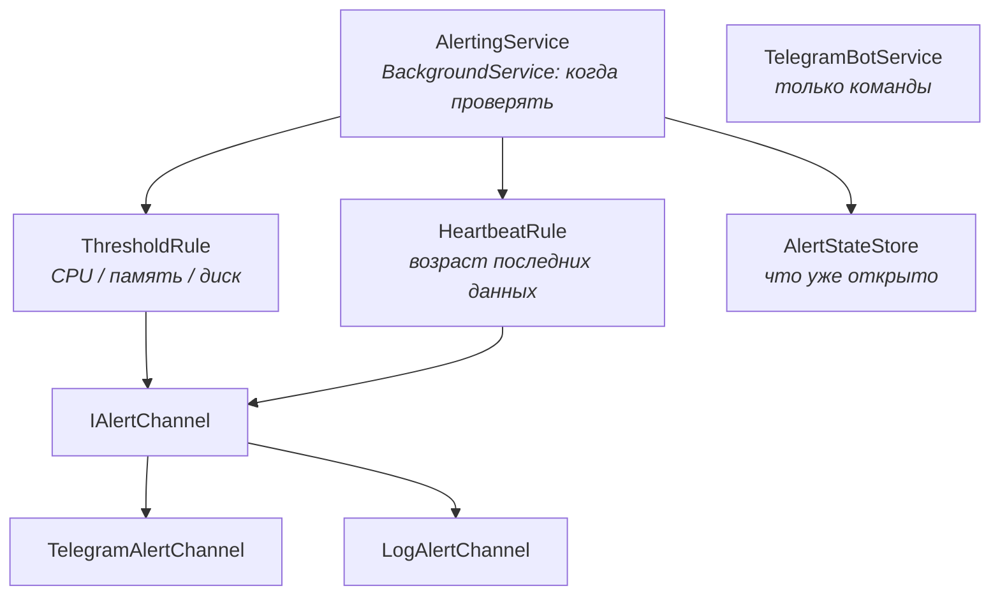
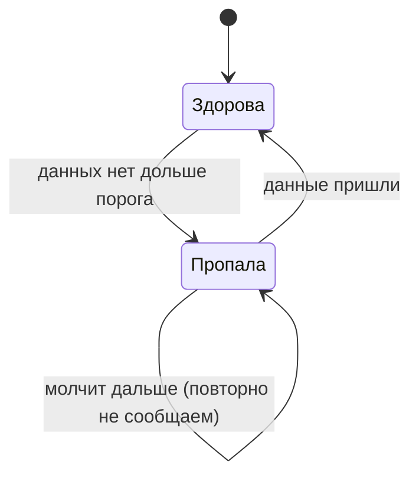

# Heartbeat — концепция

**Дата:** 2026-09-07
**Ветка:** feature/heartbeat
**Этап дорожной карты:** 2 из 6 (агент → **heartbeat** → аутентификация → упаковка → retention → зрелость алертинга)

## Цель

Сейчас пропажу машины видно только глазами: на экране парка строка гаснет и получает метку
`OFFLINE`, но никто об этом не сообщает. Мониторинг, который молчит именно тогда, когда сервер
умер, — бесполезен ровно в тот момент, ради которого он существует.

После этапа система сама сообщает, что машина перестала отчитываться, и сообщает, когда та
вернулась.

## Что здесь принципиально иначе, чем в пороговых алертах

Пороговый алерт — реакция на **пришедшие** данные. Heartbeat — реакция на **не пришедшие**.
Отсюда два следствия:

1. Проверку нельзя привязать к событию «получен замер»: событие, которого мы ждём, как раз не
   происходит. Нужен независимый таймер, который смотрит на возраст последних данных.
2. Агент не может сообщить о собственной смерти. Единственное место, где такую проверку можно
   выполнить, — центральный сервер.

## Принятые решения

| Вопрос | Решение | Обоснование |
|--------|---------|-------------|
| Где живёт проверка | **отдельный `AlertingService`**, вынесенный из `TelegramBotService` | сейчас проверка порогов запускается внутри бота и без настроенного Telegram не работает вовсе |
| Доставка уведомлений | **интерфейс `IAlertChannel`**, Telegram — одна из реализаций | появление второго канала (почта, webhook) не должно трогать логику правил |
| Тип события в журнале | **новое значение `MetricKind.Availability`** | переиспользует хранение, экран алертов и отправку без новой сущности |
| Порог «машина пропала» | **в `AppSettings`**, по умолчанию 5 минут | у экрана парка и у алертинга обязан быть один и тот же порог |
| Машина, которая никогда не отчитывалась | **не алертить** | это не авария, а незаконченная установка; видно на экране парка |
| Первые секунды после старта API | **окно тишины** | после простоя API все машины выглядят пропавшими, хотя отчитаются через секунды |
| Пороговые алерты для молчащей машины | **не проверять** (уже сделано) | судить о нагрузке по устаревшему замеру бессмысленно |

## Развязка алертинга — почему сейчас, а не потом

Это самое крупное изменение этапа, и его стоит обосновать отдельно.

Сегодня `TelegramBotService` делает три разные вещи: держит long polling и отвечает на команды,
проверяет пороги и отправляет сообщения. Пока источник правил был один, это сходило за
простоту. Heartbeat — **второй источник правил**, и если положить его туда же, получится класс,
который делает четыре вещи, а без токена бота не работает ни одна из них.

Разделение по обязанностям:



`TelegramBotService` остаётся, но худеет до одной обязанности — отвечать на команды `/start`,
`/help`, `/status`. Проверка правил переезжает в `AlertingService`, который работает независимо
от того, настроен ли Telegram: если каналов доставки нет, события всё равно пишутся в журнал и
видны на экране алертов.

**Что это даёт немедленно:** алертинг перестаёт зависеть от одного канала доставки — дефект,
записанный в главе 10 как слабое место. **Что откладываем:** сами каналы, кроме Telegram и
журнала, не пишем — интерфейс есть, реализации добавятся, когда понадобятся.

## Модель данных

### Новое значение перечисления

```csharp
public enum MetricKind
{
    Cpu,
    Memory,
    Disk,
    Availability   // новое
}
```

Событие пропажи записывается обычным `Alert`:

| Поле | Значение для heartbeat |
|------|------------------------|
| `MetricType` | `Availability` |
| `Value` | сколько минут машина молчит |
| `Threshold` | настроенный порог в минутах |
| `AlertType` | `Triggered` — пропала, `Recovered` — вернулась |

> **Почему не отдельная таблица.** Событие «машина пропала» по природе то же самое, что «CPU
> превысил порог»: у него есть машина, время, состояние «началось/закончилось» и место в общей
> ленте. Отдельная сущность заставила бы дублировать хранение, экран алертов, отправку и
> восстановление состояния после перезапуска — ради разницы в одном поле.
>
> Значения перечисления хранятся в базе строками (конвертер значений в `AppDbContext`), поэтому
> новое значение не требует миграции данных — только миграции для новой настройки.

### Настройки

`AppSettings` получает два поля:

```csharp
public int OfflineAfterSeconds { get; set; } = 300;   // 5 минут
public bool HeartbeatAlertsEnabled { get; set; } = true;
```

Порог перестаёт быть константой в `ServerHealthCalculator` и передаётся параметром — тогда
экран парка и алертинг заведомо согласованы. Текущие константы остаются значениями по
умолчанию, чтобы существующее поведение не изменилось.

```csharp
public static ServerHealth FromLastSeen(
    DateTime? lastSeenUtc,
    DateTime nowUtc,
    TimeSpan? staleAfter = null,
    TimeSpan? offlineAfter = null)
```

## Логика правила



Ключевое свойство — **сообщение на переход, а не на состояние**: одно при пропаже, одно при
возвращении. Тот же гистерезис, что у порогов, и по той же причине: иначе каждые тридцать
секунд приходило бы «машина всё ещё недоступна».

Состояние переживает перезапуск: восстанавливается из журнала по последнему событию с
`MetricType = Availability` для каждой машины, ровно как сейчас для порогов.

### Три случая, которые легко сделать неправильно

**1. Машина никогда не отчитывалась.** `LastSeenUtc` пуст. Алерт **не отправляется**: агент
зарегистрировался, но ни разу не прислал данные — это незавершённая установка, а не авария.
На экране парка такая машина и так помечена как `OFFLINE` с подписью «never».

**2. API только что запустился.** Если API лежал час, в первый же проход все машины выглядят
пропавшими, хотя каждая отчитается в течение секунд. Поэтому первый проход после старта
**пропускается** — окно тишины длиной в один интервал проверки. Машина, которая действительно
умерла, будет обнаружена на следующем проходе; лишний интервал задержки дешевле, чем шквал
ложных сообщений при каждом деплое.

**3. Машина удалена.** Правило работает по текущему списку серверов, поэтому удалённая машина
просто исчезает из проверки. Состояние в памяти для неё чистится.

## Что увидит пользователь

**В Telegram:**

```
🔌 Machine unreachable · build-runner-02
No data for 6 minutes (threshold 5 minutes)
```

```
🔄 Machine back online · build-runner-02
Reporting again after 12 minutes of silence
```

**На экране алертов** — те же события в общей ленте, отличаются меткой метрики
`Availability` и иконкой. Экран парка не меняется: он уже показывает состояние.

## Границы этапа

**Входит:** `AlertingService` с двумя правилами, `IAlertChannel` с реализациями Telegram и
журнал, `MetricKind.Availability`, настройки порога и включения, миграция, тесты на правило и
на расчёт состояния, глава 11 гайда.

**Не входит:**

- **Разные пороги на срабатывание и восстановление** — отдельная задача зрелости алертинга.
- **Уровни warn/crit** — там же.
- **Новые каналы доставки** — интерфейс появится, реализации по потребности.
- **Оповещение о том, что упал сам центральный сервер.** Это принципиально нерешаемо изнутри:
  система не может сообщить о собственной смерти. Нужен внешний наблюдатель (uptime-сервис,
  пингующий `/healthz`), и это задача этапа упаковки.

## Слабое место, которое останется

Проверка идёт по расписанию, а не по событию, поэтому обнаружение запаздывает в пределах
одного интервала проверки. При интервале 30 секунд и пороге 5 минут сообщение придёт через
5–5,5 минуты после последнего замера. Для парка из нескольких машин это приемлемо; уменьшать
задержку имеет смысл только вместе с уменьшением самого порога.

## Проверка результата

Этап считается сделанным, когда:

1. Остановленный агент приводит к сообщению в Telegram и записи в журнале — проверяется живьём,
   остановкой реального агента.
2. Запуск агента обратно даёт сообщение о возвращении.
3. Перезапуск API при уже пропавшей машине **не** приводит к повторному сообщению.
4. Перезапуск API при здоровых машинах не приводит к ложным сообщениям о пропаже.
5. Алертинг работает без настроенного Telegram: события пишутся в журнал и видны на экране.
6. `dotnet build` без предупреждений, `dotnet test` зелёный.
